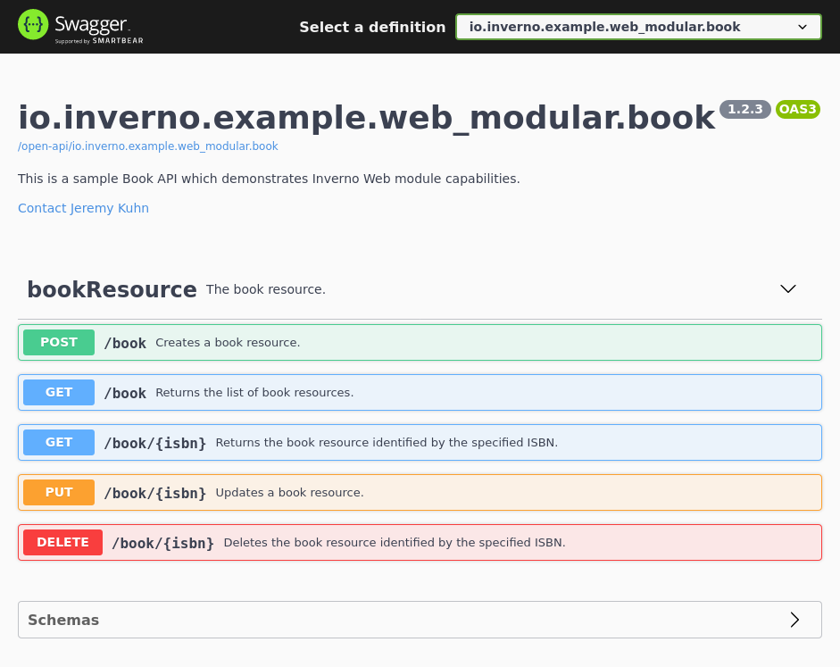
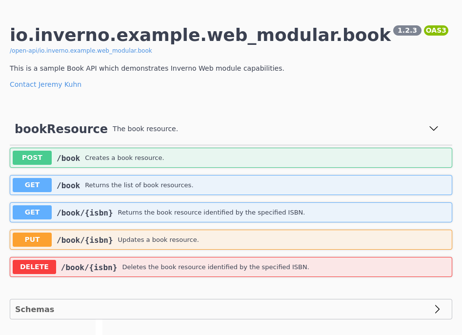

[inverno-javadoc]: https://inverno.io/docs/release/api/index.html
[inverno-tools-root]: https://github.com/inverno-io/inverno-tools

[webjars]: https://www.webjars.org/
[open-api]: https://www.openapis.org/
[swagger-ui]: https://swagger.io/tools/swagger-ui/
[form-urlencoded]: https://url.spec.whatwg.org/#application/x-www-form-urlencoded
[ndjson]: http://ndjson.org/
[yaml]: https://en.wikipedia.org/wiki/YAML
[server-sent-events]: https://en.wikipedia.org/wiki/Server-sent_events

[rfc-7231-5.1.1]: https://tools.ietf.org/html/rfc7231#section-5.1.1
[rfc-7231-5.3]: https://tools.ietf.org/html/rfc7231#section-5.3
[rfc-7231-5.3.1]: https://tools.ietf.org/html/rfc7231#section-5.3.1
[rfc-7231-5.3.2]: https://tools.ietf.org/html/rfc7231#section-5.3.2
[rfc-7231-5.3.5]: https://tools.ietf.org/html/rfc7231#section-5.3.5
[rfc-7231-7.1.2]: https://tools.ietf.org/html/rfc7231#section-7.1.2
[rfc-6455]: https://datatracker.ietf.org/doc/html/rfc6455
[rfc-6455-1.9]: https://datatracker.ietf.org/doc/html/rfc6455#section-1.9

# Web Server

The Inverno *web-server* module provides extended functionalities on top of the *http-server* module for developing high-end Web and RESTfull servers.

It especially provides:

- advanced HTTP request routing and interception
- content negotiation
- automatic message payload conversion
- path parameters
- static handler for serving static resources
- version agnostic [WebJars][webjars] support
- declarative Web/REST controller
- [OpenAPI][open-api] specifications generation using Web/REST controllers JavaDoc comments
- SwaggerUI integration
- an Inverno compiler plugin for generating modules Web servers for statically validating and registering routes

The *web-server* module composes the *http-server* module and therefore starts an HTTP server. Just like the *http-server* module, it requires a net service and a resource service as well as a list of [media type converters](#media-type-converter) for message payload conversion. Basic implementations of these services are provided by the *boot* module which provides `application/json`, `application/x-ndjson` and `text/plain` media type converters. Additional media type converters can also be provided by implementing the `MediaTypeConverter` interface.

In order to use the Inverno *web-server* module, we should declare the following dependencies in the module descriptor:

```java
@io.inverno.core.annotation.Module
module io.inverno.example.app_web_server {
    requires io.inverno.mod.boot;
    requires io.inverno.mod.web.server;
}
```

We also need to declare these dependencies in the build descriptor:

Using Maven:

```xml
<project>
    <dependencies>
        <dependency>
            <groupId>io.inverno.mod</groupId>
            <artifactId>inverno-boot</artifactId>
        </dependency>
        <dependency>
            <groupId>io.inverno.mod</groupId>
            <artifactId>inverno-web-server</artifactId>
        </dependency>
    </dependencies>
</project>
```

Using Gradle:

```groovy
compile 'io.inverno.mod:inverno-boot:${VERSION_INVERNO_MODS}'
compile 'io.inverno.mod:inverno-web-server:${VERSION_INVERNO_MODS}'
```

## Web Routing API

The *web-server* module defines an API for intercepting and routing HTTP requests based on the details of the request (e.g. path, method, content type...).

Considering the *http-server* module semantics we can define:

- the **router** whose role is to route an exchange to a specific handler based on a set of rules applied to the exchange.
- the **route** which is defined in the router and specifies the rules an exchange must match to be routed to a particular handler.
- the **route manager** which is used to manage the routes in a router or, more explicitly, to list, create, enable, disable or remove route in a router.
- the **route interceptor** which specifies the rules a route must match to be intercepted by a specific exchange interceptor.
- the **route interceptor manager** which is used to configure the route interceptors in the Web server.

> Internally the Web server uses the HTTP router API specified in the *http-base* module to implement the Web router and error Web router.

The `WebServer` is the entry point for configuring interceptors and routes, it implements the `WebRouter`, the `ErrorWebRouter`, the `WebRouteInterceptor` and the `ErrorWebRouteInterceptor` interfaces for configuring Web routes, error Web routes, Web interceptors and error Web interceptors respectively.

A `WebServer` instance is not directly exposed by the module which exposes a `WebServer.Boot` bean used to initialize the root `WebServer` with an `ExchangeContext` factory required by the *http-server* to create the `ExchangeContext`. In a module composing the *web-server* module, a wrapper bean shall be provided to expose the `WebServer` from the `WebServer.Boot` bean in order to be able to configure interceptors and routes otherwise a *blank* Web server is started responding with (404) errors on every request.

```java
@Wrapper @Bean( name = "webServer", visibility = Bean.Visibility.PRIVATE )
public final class RootWebServer implements Supplier<WebServer<ApplicationExchangeContext>> {
    private final WebServer.Boot webServerBoot;
    private WebServer<Server2_WebServer.Context> webServer;

    public RootWebServer(WebServer.Boot webServerBoot) {
        this.webServerBoot = webServerBoot;
    }

    @Init
    public void init() {
        this.webServer = this.webServerBoot.webServer(() -> new ApplicationExchangeContext());
        this.webServer
            .configureInterceptors(...)
            .configureErrorInterceptors(...)
            .intercept(...)
            .interceptError(...)
            .configure(...)
            .configureRoutes(...)
            .configureErrorRoutes(...)
            .route(...)
            .webSocketRoute(...)
            .routeError(...)
            ...
    }

    @Override
    public WebServer<Server2_WebServer.Context> get() {
        return this.webServer;
    }
}
```

> One could think that it would be easier to rather inject an `ExchangeContext` factory into the *web-server* module which could then directly expose the root Web server. Unfortunately a module bean can't be of a generic type. Relying on an intermediary wrapper bean is the simplest and probably the safest solution to that issue. Hopefully the Inverno Web compiler plugin automatically generates above bean aggregating all Web configurers and Web controllers exposed in the module so this shouldn't be a concern. Please refer to [Web server](#web-server-1) section to better understand how the Web server is initialized and configured in a Web application. 

A `WebRoute` or an `ErrorWebRoute` respectively specifies the criteria a `WebExchange` or an `ErrorWebExchange` must match to be handled by a particular exchange handler. These are configured fluently using a `RouteManager` or an `ErrorRouteManager` directly obtained from the `WebServer`.

The following code shows how to define a simple route to handle `GET` requests to `/hello`:

```java
WebServer<ExchangeContext> webServer = ...

webServer
    .route()
        .path("/hello")
        .method(Method.GET)
        .handler(exchange -> exchange.response().body().string().value("Hello"));
```

Web interceptors or error Web interceptors are respectively configured fluently using a `WebRouteInterceptorManager` or an `ErrorWebRouteInterceptorManager` directly obtained from the `WebServer`. 

The following code shows how to intercept all requests to `/hello`:

```java
WebServer<ExchangeContext> webServer = ...

webServer
    .intercept()
        .path("/hello")
        .handler(exchange -> {
            LOGGER.info("Intercepting /hello");
            return Mono.just(exchange);
        });
```

### Web exchange

The *web-server* module API extends the [server exchange API](#http-server-api) defined in the *http-server* module. It defines the server `WebExchange` composed of a `WebRequest`/`WebResponse` pair in an HTTP communication between a client and a server. These interfaces respectively extends `Exchange`, `Request` and `Response` defined in the *http-server* module. A Web exchange handler (i.e. `ExchangeHandler<ExchangeContext, WebExchange<ExchangeContext>>`) is typically attached to one or more Web routes defined in the `WebRouter`.

The Web exchange provides additional functionalities on top of the exchange including support for path parameters, request/response body decoder/encoder based on the content type or WebSocket inbound/outbound data decoder/encoder based on the negotiated subprotocol.

#### Path parameters

Path parameters are exposed in the `WebRequest`, they are extracted from the requested path by the router when the handler is attached to a route matching a parameterized path defined as in a [URI builder](#uris).

For instance, if the handler is attached to a route matching `/book/{id}`, the `id` path parameter can be retrieved as follows:

```java
ExchangeHandler<ExchangeContext, WebExchange<ExchangeContext>> handler = exchange -> {
    exchange.request().pathParameters().get("id")
        .ifPresentOrElse(
            id -> {
                ...
            },
            () -> exchange.response().headers(headers -> headers.status(Status.NOT_FOUND)).body().empty()
        );
};
```

#### Request body decoder

The request body can be decoded based on the content type defined in the request headers.

```java
ExchangeHandler<ExchangeContext, WebExchange<ExchangeContext>> handler = exchange -> {
    Mono<Result> storeBook = exchange.request().body().get()
        .decoder(Book.class)
        .one()
        .map(book -> storeBook(book));
    exchange.response().body()
        .string().stream(storeBook.map(result -> result.getMessage()));
};
```

When invoking the `decoder()` method, a [media type converter](#media-type-converter) corresponding to the request content type is selected to decode the payload. The `content-type` header MUST be specified in the request, otherwise (400) bad request error is returned indicating an empty media type. If there is no converter corresponding to the media type, a (415) unsupported media type error is returned indicating that no decoder was found matching the content type.

A decoder is obtained by specifying the type of the object to decode in the `decoder()` method, the type can be a `Class<T>` or a `java.lang.reflect.Type` which allows to decode parameterized types at runtime bypassing type erasure. Parameterized Types can be built at runtime using the [reflection API](#reflection-api).

As you can see in the above example the decoder is fully reactive, a request payload can be decoded in a single object by invoking method `one()` on the decoder which returns a `Mono<T>` publisher or in a stream of objects by invoking method `many()` on the decoder which returns a `Flux<T>` publisher.

Decoding multiple payload objects is indicated when a client streams content to the server. For instance, it can send a request with `application/x-ndjson` content type in order to send multiple messages in a single request. Since everything is reactive the server doesn't have to wait for the full request, and it can process a message as soon as it is received. What is remarkable is that the code is widely unchanged.

```java
ExchangeHandler<ExchangeContext, WebExchange<ExchangeContext>> handler = exchange -> {
    Flux<Result> storeBook = exchange.request().body().get()
        .decoder(Book.class)
        .many()
        .map(book -> storeBook(book));
    exchange.response().body()
        .string().stream(storeBook.map(result -> result.getMessage()));
};
```

Conversion of a multipart form data request body is also supported, the payload of each part being decoded independently based on the content type of the part. For instance, we can upload multiple books in multiple files in a `multipart/form-data` request and decode them on the fly as follows:

```java
ExchangeHandler<ExchangeContext, WebExchange<ExchangeContext>> handler = exchange -> {
    exchange.response()
        .body().string().stream(Flux.from(exchange.request().body().get().multipart().stream()) // 1
            .flatMap(part -> part.decoder(Book.class).one())                                    // 2
            .map(book -> storeBook(book))                                                       // 3
            .map(result -> result.getMessage())                                                 // 4
        );
};
```

In the previous example:

1. A stream of files is received in a `multipart/form-data` request (note that we assume all parts are file parts).
2. Each part is decoded to a `Book` object, the media type must be specified in the `content-type` header field of the part.
3. The book object so obtained is processed.
4. The result for each upload is returned to the client.

All this process is done in a reactive way, the first chunk of response can be sent before all parts have been processed.

#### Response body encoder

As for the request body, the response body can be encoded based on the content type defined in the response headers. Considering previous example we can do the following:

```java
ExchangeHandler<ExchangeContext, WebExchange<ExchangeContext>> handler = exchange -> {
    Mono<Result> storeBook = exchange.request().body().get()
        .decoder(Book.class)
        .one()
        .map(book -> storeBook(book));
    exchange.response()
        .headers(headers -> headers.contentType(MediaTypes.APPLICATION_JSON))
        .body()
            .encoder(Result.class)
            .one(storeBook);
};
```

When invoking the `encoder()` method, a [media type converter](#media-type-converter) corresponding to the response content type is selected to encode the payload. The `content-type` header MUST be specified in the response, otherwise a (500) internal server error is returned indicating an empty media type. If there is no converter corresponding to the media type, a (500) internal server error is returned indicating that no encoder was found matching the content type.

A single object is encoded by invoking method `one()` on the encoder or multiple objects can be encoded by invoking method `many()` on the encoder. Returning multiple objects in a stream is particularly suitable to implement progressive display in a Web application, for example to display search results as soon as some are available.

```java
ExchangeHandler<ExchangeContext, WebExchange<ExchangeContext>> handler = exchange -> {
    Flux<SearchResult> searchResults = ...;
    exchange.response()
        .headers(headers -> headers.contentType(MediaTypes.APPLICATION_X_NDJSON))
        .body()
            .encoder(SearchResult.class)
            .many(searchResults);
};
```

### Web route

A Web route specifies the routing rules and the Web exchange handler that shall be invoked to handle a matching exchange. It can combine the following routing rules which are matched in that order: the path, method and content type of the request, the media ranges and language ranges accepted by the client. For instance, a Web exchange is matched against the path routing rule first, then the method routing rule... Multiples routes can then match a given exchange but only one will be retained to actually process the exchange which is the one matching the highest routing rules.

If a route doesn't define a particular routing rule, the routing rule is simply ignored and matches all exchanges. For instance, if a route doesn't define any method routing rule, exchanges are matched regardless of the method.

The `WebRouter` interface, implemented by the `WebServer`, defines a fluent API for the definition of Web routes. The following is an example of the definition of a Web route which matches all exchanges, this is the simplest route that can be defined:

```java
webServer
    .route()                                                   // 1
        .handler(exchange -> {                                 // 2
            exchange.response()
                .headers(headers ->
                    headers.contentType(MediaTypes.TEXT_PLAIN)
                )
                .body()
                .encoder()
                .value("Hello, world!");
        });
```

1. A new `WebRouteManager` instance is obtained to configure a Web route
2. We only define the handler of the route as a result any exchange might be routed to that particular route unless a more specific route matching the exchange exists.

An exchange handler can be attached to multiple routes at once by providing multiple routing rules to the route manager, the following example actually results in 8 individual routes being defined:

```java
webServer
    .route()
        .path("/doc")
        .path("/document")
        .method(Method.GET)
        .method(Method.POST)
        .consume(MediaTypes.APPLICATION_JSON)
        .consume(MediaTypes.APPLICATION_XML)
        .handler(exchange -> {
            ...
        });
```

The `WebRouteManager` can also be used to list all routes matching specific rules using the `findRoutes()` method. In the following example, all routes matching `GET` method are returned:

```java
Set<WebRoute<ExchangeContext>> routes = webServer
    .route()
        .method(Method.GET)
        .findRoutes();
```

It is also possible to enable, disable or remove a set of routes matching particular criteria in a similar way:

```java
// Disables all GET routes
webServer
    .route()
        .method(Method.GET)
        .disable();

// Enables all GET routes
webServer
    .route()
        .method(Method.GET)
        .enable();

// remove all GET routes
webServer
    .route()
        .method(Method.GET)
        .remove();
```

Individual routes can be enabled, disabled or removed as follows:

```java
// Disables all GET routes producing 'application/json'
webServer
    .route()
        .method(Method.GET)
        .findRoutes()
        .stream()
        .filter(route -> route.getProduce().equals(MediaTypes.APPLICATION_JSON))
        .forEach(WebRoute::disable);

// Enables all GET routes producing 'application/json'
webServer
    .route()
        .method(Method.GET)
        .findRoutes()
        .stream()
        .filter(route -> route.getProduce().equals(MediaTypes.APPLICATION_JSON))
        .forEach(WebRoute::enable);

// Removes all GET routes producing 'application/json'
webServer
    .route()
        .method(Method.GET)
        .findRoutes()
        .stream()
        .filter(route -> route.getProduce().equals(MediaTypes.APPLICATION_JSON))
        .forEach(WebRoute::remove);
```

Routes can also be configured as blocks in reusable `WebRouter.Configurer` by invoking `configureRoutes()` methods:

```java
WebRouter.Configurer<ExchangeContext> public_routes_configurer = router -> {
    router
        .route()
        ...
};

WebRouter.Configurer<ExchangeContext> private_routes_configurer = router -> {
    router
        .route()
        ...
};

webServer
    .configureRoutes(public_routes_configurer)
    .configureRoutes(private_routes_configurer)
    .route()
    ...
```

#### Path routing rule

The path routing rule matches exchanges whose request targets a specific path or a path that matches against a particular pattern. The path or path pattern of a routing rule must be absolute (i.e. start with `/`).

We can for instance define a route to handle all requests to `/bar/foo` as follows:

```java
webServer
    .route()
        .path("/foo/bar")
        .handler(exchange -> {
            ...
        });
```

The route in the preceding example specifies an exact match for the exchange request path, it is also possible to make the route match the path with or without a trailing slash as follows:

```java
webServer
    .route()
        .path("/foo/bar", true)
        .handler(exchange -> {
            ...
        });
```

A path pattern following the parameterized or path pattern [URIs notation](#uris) can also be specified to create a routing rule matching multiple paths. This also allows to specify [path parameters](#path-parameters) that can be retrieved from the `WebExchange` in an interceptor or the handler.

In the following example, the route will match all exchanges whose request path is `/book/1`, `/book/abc`... and store the extracted parameter value in path parameter named `id`:

```java
webServer
    .route()
        .path("/book/{id}")
        .handler(exchange -> {
            exchange.request().pathParameters().get("id")...
        });
```

A parameter is matched against a regular expression set to `[^/]*` by default which is why previous route does not match `/book/a/b`. Parameterized URIs allow to specify the pattern matched by a particular path parameter using `{[<name>][:<pattern>]}` notation, we can then put some constraints on path parameters value. For instance, we can make sure the `id` parameter is a number between 1 and 999:

```java
webServer
    .route()
        .path("/book/{id:[1-9][0-9]{0,2}}")
        .handler(exchange -> {
            ...
        });
```

If we just want to match a particular path without extracting path parameters, we can omit the parameter name and simply write:

```java
webServer
    .route()
        .path("/book/{}")
        .handler(exchange -> {
            ...
        });
```

Wildcards can also be used to match all paths:

```java
webServer
    .route()
        .path("/book/**/*")
        .handler(exchange -> {
            ...
        });
```

#### Method routing rule

The method routing rule matches exchanges that have been sent with a particular HTTP method.

In order to handle all `GET` exchanges, we can do:

```java
webServer
    .route()
        .method(Method.GET)
        .handler(exchange -> {
            ...
        });
```

#### Consume routing rule

The consume routing rule matches exchanges whose request body content type matches a particular media range as defined by [RFC 7231 Section 5.3.2][rfc-7231-5.3.2].

For instance, in order to match all exchanges with an `application/json` request payload, we can do:

```java
webServer
    .route()
        .method(Method.POST)
        .consume(MediaTypes.APPLICATION_JSON)
        .handler(exchange -> {
            ...
        });
```

We can also specify a media range to match, for example, all exchanges with a `*/json` request payload:

```java
webServer
    .route()
        .method(Method.POST)
        .consume("*/json")
        .handler(exchange -> {
            ...
        });
```

The two previous routes are different and as a result they can be both defined, a content negotiation algorithm is used to determine which route should process a particular exchange as defined in [RFC 7231 Section 5.3][rfc-7231-5.3].

Routes are sorted by consumed media ranges as follows:

- quality value is compared first as defined by [RFC7231 Section 5.3.1][rfc-7231-5.3.1], the default quality value is 1.
- type and subtype wildcards are considered after: `a/b` > `a/*` > `*/b` > `*/*`
- parameters are considered last, the most precise media range which is the one with the most parameters with matching values gets the highest priority (e.g. `application/json;p1=a;p2=2` > `application/json;p1=b` > `application/json;p1`)

The first route whose media range matches the request's `content-type` header field is selected.

If we consider previous routes, an exchange with an `application/json` request payload will be matched by the first route while an exchange with a `text/json` request will be matched by the second route.

A media range can also be parameterized which allows for interesting setup such as:

```java
webServer
    .route()
        .path("/document")
        .method(Method.POST)
        .consume("application/json;version=1")
        .handler(exchange -> {
            ...
        })
    .route()
        .path("/document")
        .method(Method.POST)
        .consume("application/json;version=2")
        .handler(exchange -> {
            ...
        })
    .route()
        .path("/document")
        .method(Method.POST)
        .consume("application/json")
        .handler(exchange -> {
            ...
        });
```

In the above example, an exchange with a `application/json;version=1` request payload is matched by the first route, `application/json;version=2` request payload is matched by the second route and any other `application/json` request payload is matched by the third route.

If there is no route matching the request content type matched by previous routing rules, a (415) unsupported media type error is returned.

> As described before, if no route is defined with a consume routing rule, exchanges are matched regardless of the request content type, content negotiation is then eventually delegated to the handler which must be able to process the payload whatever the content type.

#### Produce routing rule

The produce routing rule matches exchanges based on the acceptable media ranges supplied by the client in the `accept` header field of the request as defined by [RFC 7231 Section 5.3.2][rfc-7231-5.3.2].

An HTTP client (e.g. Web browser) typically sends an `accept` header to indicate the server which response media types are acceptable in the response. The best matching route is determined based on the media types produced by the routes matching previous routing rules.

We can for instance define the following routes:

```java
webServer
    .route()
        .path("/doc")
        .produce(MediaTypes.APPLICATION_JSON)
        .handler(exchange -> {
            ...
        })
    .route()
        .path("/doc")
        .produce(MediaTypes.TEXT_XML)
        .handler(exchange -> {
            ...
        });
```

Now let's consider the following `accept` request header field:

```plaintext
accept: application/json, application/xml;q=0.9, */xml;q=0.8
```

This field basically tells the server that the client wants to receive first an `application/json` response payload, if not available an `application/xml` response payload and if not available any `*/xml` response payload.

The content negotiation algorithm is similar as the one described in the [consume routing rule](#consume-routing-rule), it is simply reversed in the sense that it is the acceptable media ranges defined in the `accept` header field that are sorted and the route producing the media type matching the media range with the highest priority is selected.

Considering previous routes, a request with previous `accept` header field is then matched by the first route.

A request with the following `accept` header field is matched by the second route:

```plaintext
accept: application/xml;q=0.9, */xml;q=0.8
```

The exchange is also matched by the second route with the following `accept` header field:

```plaintext
accept: application/json;q=0.5, text/xml;q=1.0
```

If there is no route producing a media type that matches any of the acceptable media ranges, then a (406) not acceptable error is returned.

> As described before, if no route is defined with a produce routing rule, exchanges are matched regardless of the acceptable media ranges, content negotiation is then eventually delegated to the handler which becomes responsible to return an acceptable response to the client.

#### Language routing rule

The language routing rule matches exchanges based on the acceptable languages supplied by client in the `accept-language` header field of the request as defined by [RFC 7231 Section 5.3.5][rfc-7231-5.3.5].

An HTTP client (e.g. Web browser) typically sends a `accept-language` header to indicate the server which languages are acceptable for the response. The best matching route is determined based on the language tags produced by the routes matching previous routing rules.

We can define the following routes to return a particular resource in English or in French:

```java
webServer
    .route()
        .path("/doc")
        .language("en-US")
        .handler(exchange -> {
            ...
        })
    .route()
        .path("/doc")
        .language("fr-FR")
        .handler(exchange -> {
            ...
        });
```

The content negotiation is similar to the one described in the [produce routing rule](#produce-routing-rule) but using language ranges and language types instead of media ranges and media types. Acceptable language ranges are sorted as follows:

- quality value is compared first as defined by [RFC 7231 Section 5.3.1][rfc-7231-5.3.1], the default quality value is 1.
- primary and secondary language tags and wildcards are considered after: `fr-FR` > `fr` > `*`

The route whose produced language tag matches the language range with the highest priority is selected.

As for the produce routing rule, if there is no route defined with a language tag that matches any of the acceptable language ranges, then a (406) not acceptable error is returned. However, unlike the produce routing rule, a default route can be defined to handle such unmatched exchanges.

For instance, we can add the following default route to the router:

```java
webServer
    .route()
        .path("/doc")
        .handler(exchange -> {
            ...
        });
```

A request with the following `accept-language` header field is then matched by the default route:

```plaintext
accept-language: it-IT
```

### WebSocket exchange

A Web exchange can be upgraded to a Web WebSocket exchange. The `Web2SocketExchange` thus created extends `WebSocketExchange` and allows to respectively decode/encode WebSocket inbound and outbound messages based on the subprotocol negotiated during the opening handshake.

As for request and response payloads, a [media type converter](#media-type-converter) corresponding to the subprotocol is selected to decode/encode inbound and outbound messages. If there is no converter corresponding to the subprotocol, a `WebSocketException` is thrown resulting in a (500) internal server error returned to the client indicating that no converter was found matching the subprotocol.

The subprotocol must then correspond to a valid media type. Unlike request and response payloads which expect strict media type representation, compact `application/` media type representation can be specified as subprotocol. In practice, it is possible to open a WebSocket connection with subprotocol `json` to select the `application/json` media type converter.

> As defined by [RFC 6455][rfc-6455], a WebSocket subprotocol is not a media type and is registered separately. However, using media type is very handy in this case as it allows to reuse the data conversion facility. Using compact `application/` media type representation mitigates this specification violation as it is then possible to specify a valid subprotocol while still being able to select a media type converter. Let's consider the registered subprotocol `v2.bookings.example.net` (taken from [RFC 6455 Section 1.9][rfc-6455-1.9]), we can then create a media type converter for `application/v2.bookings.example.net` that will be selected when receiving connection using that particular subprotocol.

The following example is a variant of the [simple chat server](#a-simple-chat-server) which shows how JSON messages can be automatically decoded and encoded:

```java
ExchangeHandler<ExchangeContext, WebExchange<ExchangeContext>> handler = exchange -> {
    exchange.webSocket("json")
        .orElseThrow(() -> new InternalServerErrorException("WebSocket not supported"))
        .handler(webSocketExchange -> {
            Flux.from(webSocketExchange.inbound().decodeTextMessages(Message.class)).subscribe(message -> this.chatSink.tryEmitNext(message));
            webSocketExchange.outbound().encodeTextMessages(this.chatSink.asFlux());
        })
        .or(() -> exchange.response()
            .body().string().value("Web socket handshake failed")
        );
};
```

### WebSocket route

The `WebRouter` interface also exposes `webSocketRoute()` which returns a `WebSocketRouteManager` for defining WebSocket routes. A WebSocket route specifies the routing rules and the WebSocket exchange handler that shall be invoked after upgrading a matching exchange to a WebSocket exchange. it can combine the following routing rules which are matched in that order: the path of the request, the language ranges accepted by the client and the supported subprotocol. Unlike a regular Web route, a WebSocket exchange does not support method, consume and produce routing rules, this difference can be explained by the fact that a WebSocket upgrade request is always a `GET` request and that consumed and produced media types have just no meaning in the context of a WebSocket.

When an exchange matches a WebSocket route, the Web router automatically handle the upgrade and set up the WebSocket exchange handler specified in the route. If the WebSocket upgrade is not supported, a `WebSocketException` is thrown resulting in a (500) internal server error returned to the client.

A WebSocket endpoint can then be easily defined as follows:

```java
webServer
    .webSocketRoute()
        .path("/ws")
        .subprotocol("json")
        .handler(webSocketExchange -> {
            webSocketExchange.outbound().messages(factory -> webSocketExchange.inbound().messages());
        });
```

Just like Web routes WebSocket routes matching particular rules can be selected, enabled, disabled or removed:

```java
// Disables all WebSocket routes supporting subprotocol 'json'
webServer
    .webSocketRoute()
        .subprotocol("json")
        .findRoutes()
        .stream()
        .forEach(WebSocketRoute::disable);

// Enables all routes (including WebSocket routes) with path matching '/ws'
webServer
    .route()
        .path("/ws")
        .enable();
```

#### Subprotocol routing rule

The subprotocol routing rule matches exchanges based on the supported subprotocols supplied by the client in the `sec-websocket-version` header field of the request as defined by [RFC 6455][rfc-6455].

An HTTP client (e.g. Web browser) wishing to open a WebSocket connection typically sends a `sec-websocket-version` header to indicate the server which subprotocols it supports by order of preference. The best matching route is determined based on the subprotocol supported by the routes matching previous routing rules.

We can then define the following WebSocket routes that handle different subprotocols:

```java
webServer
    .webSocketRoute()
        .path("/ws")
        .subprotocol("json")
        .handler(webSocketExchange -> {
            ...
        })
    .webSocketRoute()
        .path("/ws")
        .subprotocol("xml")
        .handler(webSocketExchange -> {
            ...
        })
    .webSocketRoute()
        .path("/ws")
        .handler(webSocketExchange -> {
            ...
        });
```

Let's consider a request with the following `sec-websocket-version` header field:

```plaintext
sec-websocket-version: xml, json
```

This field basically tells the server that the client wants to open a WebSocket connection using the `xml` subprotocol and if not supported the `json` subprotocol. As a result the request is matched by the second route in above example.

If there is no route supporting any of the subprotocols provided by the client, an `UnsupportedProtocolException` is thrown resulting in a (500) internal server error returned to the client. The last route in above example is therefore not a default route, it is only matched when the client open a WebSocket connection with no subprotocol.

### Error Web exchange

The *web-server* module API extends the [server exchange API](#http-server-api) defined in the *http-server* module. It defines the server `ErrorWebExchange` composed of a `WebRequest`/`WebResponse` pair in an HTTP communication between a client and a server. These interfaces respectively extends the `ErrorExchange`, `Request` and `Response` interfaces defined in the *http-server* module. An error Web exchange handler (i.e. `ExchangeHandler<ExchangeContext, ErrorWebExchange<ExchangeContext>>`) is typically attached to one or more error Web routes defined in an `ErrorWebRouter`.

The Error Web exchange provides additional functionalities on top of the error exchange such response body encoding based on the content type.

As the `WebExchange`, the `ErrorWebExchange` exposes a `WebResponse` which supports automatic response payload encoding based on the content type specified in the response headers. The usage is exactly the same as for the Web server exchange [response body encoder](#response-body-encoder).

The following error Web route matches `IllegalArgumentException` errors for client accepting `application/json` media type in the response:

```java
ExchangeHandler<ExchangeContext, ErrorWebExchange<ExchangeContext>> errorHandler = errorExchange -> {
    errorExchange.response()
        .headers(headers -> headers.status(Status.INTERNAL_SERVER_ERROR))
        .body()
        .encoder(Message.class)
        .value(new Message(errorExchange.getError().getMessage()));
};
```

### Error Web route

An error Web route specifies the routing rules and the error Web exchange handler that shall be invoked to handle a matching error exchange. Similar to a [Web route](#web-route), it can combine the following routing rules which are matched in that order: the type of error, the path and content type of the request of the request, the media ranges and language ranges accepted by the client.

The `ErrorWebRouter` interface, implemented by the `WebServer`, defines a fluent API for the definition of Error Web routes. The following is an example of the definition of an Error Web route which matches `IllegalArgumentException` errors for client accepting `application/json` media type:

```java
webServer
    .routeError()
        .error(IllegalArgumentException.class)
        .produce(MediaTypes.APPLICATION_JSON)
        .handler(errorExchange ->
            errorExchange.response()
                .body()
                .encoder(Message.class)
                .value(new Message("IllegalArgumentException"))
        );
```

As with a Web router, an `ErrorWebRouteManager` can also be used to list error Web routes matching specific rules that can then be enabled, disabled or removed individually. The following example disables all routes matching `SomeCustomException` error type:

```java
webServer
    .routeError()
        .error(SomeCustomException.class)
        .disable();
```

Error routes can also be configured as blocks in reusable `ErrorWebRouter.Configurer` by invoking `configureErrorRoutes()` methods:

```java
ErrorWebRouter.Configurer<ExchangeContext> public_error_routes_configurer = router -> {
    router
        .route()
    routeError
};

ErrorWebRouter.Configurer<ExchangeContext> private_error_routes_configurer = router -> {
    router
        .routeError()
        ...
};

webServer
    .configureErrorRoutes(public_error_routes_configurer)
    .configureErrorRoutes(private_error_routes_configurer)
    .routeError()
    ...
```

#### Error type routing rule

The error type routing rule matches error exchanges whose error is of a particular type.

For instance, in order to handle all error exchanges whose error is an instance of `SomeCustomException`, we can do:

```java
webServer
    .routeError()
        .error(SomeCustomException.class)
        .handler(exchange -> {
            ...
        });
```

#### Consume routing rule

The consume routing rule, when applied to an error route behaves exactly the same as for a [Web route](#consume-routing-rule). It allows to define specific error handlers when the original request body content type matches a particular media range.

#### Produce routing rule

The produce routing rule, when applied to an error route behaves exactly the same as for a [Web route](#produce-routing-rule). It allows to define error handlers that produce responses of different types based on the set of media range accepted by the client.

This is particularly useful to returned specific error responses to a particular client in a particular context. For instance, a backend application might want to receive errors in a parseable format like `application/json` whereas a Web browser might want to receive errors in a human-readable format like `text/html`.

#### Language routing rule

The language routing rule, when applied to an error route behaves exactly the same as for a [Web route](#language-routing-rule). It allows to define error handlers that produce responses with different languages based on the set of language range accepted by the client fall-backing to the default route when content negotiation did not give any match.

### Web route interceptor

A Web route interceptor specifies the rules and the exchange interceptor that shall be applied to a matching route. It can combine the same rules as for the definition of a route: the path and method of the route, media range matching the content consumed by the route, media range and language range matching the media type and language produced by the route.

Multiple Web exchange interceptors (i.e. `ExchangeInterceptor<ExchangeContext, WebExchange<ExchangeContext>>`) can be applied to one or more Web routes.

The `WebRouteInterceptor` interface, implemented by the `WebServer`, defines a fluent API similar to the `WebRouter` for the definition of Web interceptors. The following is an example of the definition of a Web route interceptor that is applied to routes matching `GET` method and consuming `application/json` response:

```java
webServer.
    .intercept()
        .method(Method.GET)
        .consume(MediaTypes.APPLICATION_JSON)
        .interceptor(exchange -> {
            LOGGER.info("Intercepted!");
            return Mono.just(exchange);
        });
```

When defining an interceptor, an intercepted Web server is returned which contains that interceptor definition as well as all interceptors previously defined in the chain. In order to be intercepted, a route must be defined on an intercepted Web server.

In the following example, the first route defined on the original Web server won't be intercepted:

```java
webServer
    .route()
        .path("/route1")
        .handler(exchange -> exchange.response().body().string().value("I'm not intercepted"))
    .intercept()
        .interceptor(exchange -> { // returns an intercepted Web server
            LOGGER.info("intercepted");
            return Mono.just(exchange);
        })
    .route()
        .path("/route2")
        .handler(exchange -> exchange.response().body().string().value("I'm intercepted"))
```

> Arranging interceptors in chains of Web servers allows to isolate interceptor and route definitions which is particularly appreciated in a multi-module application. For instance, global interceptors and routes can be defined in an application module and the resulting intercepted Web server injected into multiple submodules defining their own interceptors and routes in perfect isolation.

As for an exchange handler, an exchange interceptor can be applied to multiple routes at once by providing multiple rules to the route interceptor manager, the following example is used to apply a route interceptor to `/doc` and `/document` routes consuming `application/json` or `application/xml` payloads:

```java
webServer
    .intercept()
        .path("/doc")
        .path("/document")
        .consume(MediaTypes.APPLICATION_JSON)
        .consume(MediaTypes.APPLICATION_XML)
        .interceptor(exchange -> {
            ...
        });
```

Multiple interceptors can be applied to a route at once using the `interceptors()` methods. The following example is equivalent as applying `interceptor1` then `interceptor2` on all routes matching `/some_path` (i.e. `interceptor2` is then invoked before `interceptor1`):

```java
ExchangeInterceptor<ExchangeContext, WebExchange<ExchangeContext>> interceptor1 = ...;
ExchangeInterceptor<ExchangeContext, WebExchange<ExchangeContext>> interceptor2 = ...;

webServer
    .intercept()
        .path("/some_path")
        .interceptors(List.of(interceptor1, interceptor2));
```

The list of exchange interceptors applied to a route can be obtained from a `WebRoute` or `WebSocketRoute` instance:

```java
// Use a WebRouteManager to find a WebRoute
WebRoute<ExchangeContext> route = ...

List<? extends ExchangeInterceptor<ExchangeContext, WebExchange<ExchangeContext>> routeInterceptors = route.getInterceptors();
```

In a similar way, it is possible to explicitly set exchange interceptors on a specific `WebRoute` instance:

```java
Set<WebRoute<ExchangeContext>> routes = router.getRoutes();

ExchangeInterceptor<ExchangeContext, WebExchange<ExchangeContext>> serverHeaderInterceptor = exchange -> {
    exchange.response()
        .headers(headers -> headers.set(Headers.NAME_SERVER, "Inverno Web Server");

    return Mono.just(exchange);
};

ExchangeInterceptor<ExchangeContext, WebExchange<ExchangeContext>> securityInterceptor = exchange -> {...};

routes.stream().forEach(route -> route.setInterceptors(List.of(serverHeaderInterceptor, securityInterceptor));
```

Route interceptors can also be configured as blocks in reusable `WebRouteInterceptor.Configurer` by invoking `configureInterceptors()` methods:

```java
WebRouteInterceptor.Configurer<ExchangeContext> public_interceptors_configurer = interceptors -> {
    interceptors
        .intercept()
        ...
};

WebRouteInterceptor.Configurer<ExchangeContext> private_interceptors_configurer = interceptors -> {
    interceptors
        .intercept()
        ...
};

webServer
    .configureInterceptors(public_interceptors_configurer)
    .configureInterceptors(private_interceptors_configurer)
    .intercept()
    ...
```

The definition of an interceptor is very similar to the definition of a route, but there are some peculiarities. For instance, a route can only produce one particular type of content in one particular language that are matched by a route interceptor with matching media and language ranges.

For performance reasons, route interceptor's rules should not be evaluated each time an exchange is processed but once when a route is defined. Unfortunately, this is not always possible and sometimes some rules have to be evaluated when processing the exchange. This happens when the difference between the set of exchanges matched by a route and the set of exchanges matched by a route interceptor is not empty which basically means that the route matches more exchanges than the route interceptor.

In these situations, the actual exchange interceptor is wrapped in order to evaluate the problematic rule on each exchange. A typical example is when a route defines a path pattern (e.g. `/path/*.jsp`) matching the specific path of a route interceptor (e.g. `/path/private.jsp`), the exchange interceptor must only be invoked on an exchange that matches the route interceptor's path. This can also happen with method and consumes rules.

> Path patterns are actually very tricky to match *offline*, the internal `Router` uses the `URIPattern#includes()` to determine whether a given URIs set is included into another, when this couldn't be determined with certainty, the exchange interceptor is wrapped. Please refer to the [URIs](#uris) documentation for more information.

> Particular care must be taken when listing the exchange interceptor attached to a route as these are the actual interceptors and not the wrappers. If you set interceptors explicitly on a `WebRoute` instance, they will be invoked whenever the route is invoked.

When a route interceptor is defined with specific produce and language rules, it can only be applied on routes that actually specify matching produce and language rules. Since there is no way to determine which content type and language will be produced by an exchange handler, it is not possible to determine whether an exchange interceptor should be invoked prior to the exchange handler unless specified explicitly on the route. In such case, a warning is logged to indicate that the interceptor is ignored for the route due to missing produce or language rules on the route.

### Error Web route interceptor

Error Web routes can be intercepted in a similar way as for [Web route](#web-route-interceptor) by combining the same rules as for the definition of an error Web route.

Multiple Error Web exchange interceptors (i.e. `ExchangeInterceptor<ExchangeContext, ErrorWebExchange<ExchangeContext>>`) can be applied to one or more error Web routes.

The `ErrorWebRouteInterceptor` interface, implemented by the `WebServer`, defines a fluent API similar to the `ErrorWebRouter` for the definition of Error Web interceptors. The following is an example of the definition of an error Web route interceptor for intercepting error Web exchange with `SomeCustomException` errors and `/some_path` path:

```java
webServer
    .interceptError()
        .path("/some_path")
        .error(SomeCustomException.class)
        .interceptor(errorExchange -> ...)
    .routeError()
        .handler(errorExchange -> ...);
```

As for route interceptors, error interceptors are chained in a tree of Web servers which allows to define interceptors and routes in isolation. In order to be intercepted, an error Web route must be defined on an intercepted Web server.

In the following example, `NotFoundException` error won't be intercepted:

```java
webServer
    .routeError()
        .error(NotFoundException.class)
        .handler(exchange -> exchange.response().body().string().value("I'm not intercepted"))
    .interceptError()
        .interceptor(exchange -> { // returns an intercepted Web server
            LOGGER.info("intercepted");
            return Mono.just(exchange);
        })
    .routeError()
        .error(BadRequestException.class)
        .handler(exchange -> exchange.response().body().string().value("I'm intercepted"))
```

As for `WebRoute`, it is possible to list or explicitly set the error interceptors applied to an error route. 

```java
// Use an ErrorWebRouteManager to find an ErrorWebRoute
ErrorWebRoute<ExchangeContext> errorRoute = ...

List<ExchangeInterceptor<ExchangeContext, ErrorWebExchange<ExchangeContext>>> errorRouteInterceptors = new ArrayList<>(errorRoute.getInterceptors());
errorRouteInterceptors.add(errorExchange -> {
    ...
});

errorRoute.setInterceptors(errorRouteInterceptors);
```

The `ErrorWebRouteInterceptor` offers the same features as the `WebRouteInterceptor` and allows configuring error interceptors as blocks in reusable `ErrorWebRouteInterceptor.Configurer` by invoking `configureErrorInterceptors()` methods:

```java
ErrorWebRouteInterceptor.Configurer<ExchangeContext> public_error_interceptors_configurer = interceptors -> {
    interceptors
        .interceptError()
        ...
};

ErrorWebRouteInterceptor.Configurer<ExchangeContext> private_error_interceptors_configurer = interceptors -> {
    interceptors
        .interceptError()
        ...
};

webServer
    .configureErrorInterceptors(public_error_interceptors_configurer)
    .configureErrorInterceptors(private_error_interceptors_configurer)
    .interceptError()
    ...
```

It is important to remember that an interceptor only applies to matching routes defined in the intercepted Web server where it is defined, so basically routes defined *after* the interceptor. In the particular case of error Web routes, an error Web route interceptor defined on a Web server without any subsequent error Web route will never be invoked, that doesn't mean errors won't be handled as the HTTP server has a default error exchange handler but this can be easily misleading: since the error is handled, one can expect the error interceptor to be invoked but interceptors only applies to routes and the default error exchange handler is not a route.

In order to circumvent this issue, it is recommended to always define error Web routes right after error Web interceptors. For instance, [white labels error routes][#white-labels-error-routes] can be easily configured using the `WhiteLabelErrorRoutesConfigurer`. In the following example, the error interceptor is invoked since error routes are defined:

```java
webServer
    .interceptError()
        .interceptor(exchange -> {
            LOGGER.info("intercepted");
            return Mono.just(exchange);
        })
    .configureErrorRoutes(new WhiteLabelErrorRoutesConfigurer<>())
    ...
```

> This is less of an issue when considering Web route interceptors since requests targeting undefined route resulting in 404 errors are not expected to be intercepted anyway.

## Web Server

The *web-server* module composes the *http-server* module and as a result requires a `NetService` and a `ResourceService`. A set of [media type converters](#media-type-converter) is also required for message payload conversion. All these services are provided by the *boot* module, so one way to create an application with a Web server is to create an Inverno module composing *boot* and *web-server* modules.

```java
@io.inverno.core.annotation.Module
module io.inverno.example.app_web_server {
    requires io.inverno.mod.boot;
    requires io.inverno.mod.web.server;
}
```

The resulting *app_web_server* module, thus created, can then be started as an application as follows:

```java
package io.inverno.example.app_web_server;

import io.inverno.core.v1.Application;

public class Main {

    public static void main(String[] args) {
        Application.with(new App_web_server.Builder()).run();
    }
}
```

The above example starts a *blank* Web server using default configuration which is an HTTP/1.x server with a Web router as root handler and an error router as error handler.

```plaintext
2021-04-14 11:00:18,308 INFO  [main] i.w.c.v.Application - Inverno is starting...


     ╔════════════════════════════════════════════════════════════════════════════════════════════╗
     ║                      , ~~ ,                                                                ║
     ║                  , '   /\   ' ,                                                            ║
     ║                 , __   \/   __ ,      _                                                    ║
     ║                ,  \_\_\/\/_/_/  ,    | |  ___  _    _  ___   __  ___   ___                 ║
     ║                ,    _\_\/_/_    ,    | | / _ \\ \  / // _ \ / _|/ _ \ / _ \                ║
     ║                ,   __\_/\_\__   ,    | || | | |\ \/ /|  __/| | | | | | |_| |               ║
     ║                 , /_/ /\/\ \_\ ,     |_||_| |_| \__/  \___||_| |_| |_|\___/                ║
     ║                  ,     /\     ,                                                            ║
     ║                    ,   \/   ,                                  -- ${VERSION_INVERNO_CORE} --                 ║
     ║                      ' -- '                                                                ║
     ╠════════════════════════════════════════════════════════════════════════════════════════════╣
     ║ Java runtime        : OpenJDK Runtime Environment                                          ║
     ║ Java version        : 16+36-2231                                                           ║
     ║ Java home           : /home/jkuhn/Devel/jdk/jdk-16                                         ║
     ║                                                                                            ║
     ║ Application module  : io.inverno.example.app_web_server                                    ║
     ║ Application version : 1.0.0-SNAPSHOT                                                       ║
     ║ Application class   : io.inverno.example.app_web_server.Main                               ║
     ║                                                                                            ║
     ║ Modules             :                                                                      ║
     ║  ...                                                                                       ║
     ╚════════════════════════════════════════════════════════════════════════════════════════════╝


2021-04-14 11:00:18,313 INFO  [main] i.w.e.a.App_web_server - Starting Module io.inverno.example.app_web_server...
2021-04-14 11:00:18,313 INFO  [main] i.w.m.b.Boot - Starting Module io.inverno.mod.boot...
2021-04-14 11:00:18,494 INFO  [main] i.w.m.b.Boot - Module io.inverno.mod.boot started in 181ms
2021-04-14 11:00:18,494 INFO  [main] i.w.m.w.Web - Starting Module io.inverno.mod.web.server...
2021-04-14 11:00:18,495 INFO  [main] i.w.m.h.s.Server - Starting Module io.inverno.mod.http.server...
2021-04-14 11:00:18,495 INFO  [main] i.w.m.h.b.Base - Starting Module io.inverno.mod.http.base...
2021-04-14 11:00:18,499 INFO  [main] i.w.m.h.b.Base - Module io.inverno.mod.http.base started in 4ms
2021-04-14 11:00:18,570 INFO  [main] i.w.m.h.s.i.HttpServer - HTTP Server (nio) listening on http://0.0.0.0:8080
2021-04-14 11:00:18,570 INFO  [main] i.w.m.h.s.Server - Module io.inverno.mod.http.server started in 75ms
2021-04-14 11:00:18,571 INFO  [main] i.w.m.w.Web - Module io.inverno.mod.web.server started in 76ms
2021-04-14 11:00:18,571 INFO  [main] i.w.e.a.App_web_server - Module io.inverno.example.app_web_server started in 259ms
```

By default, no routes are defined and if we hit the server, a (404) not found error shall be returned:

```plaintext
$ curl -i 'http://127.0.0.1:8080/'
HTTP/1.1 404 Not Found
content-length: 0

```

### Configuration

The Web server configuration is done in the *web-server* module configuration `WebServerConfiguration` which includes the *http-server* module configuration `HttpServerConfiguration`. As for the *http-server* module, the net service configuration can also be considered to set low level network configuration in the *boot* module.

Let's create the following configuration in the *app_web_server* module:

```java
package io.inverno.example.app_web_server;

import io.inverno.core.annotation.NestedBean;
import io.inverno.mod.boot.BootConfiguration;
import io.inverno.mod.configuration.Configuration;
import io.inverno.mod.web.server.WebServerConfiguration;

@Configuration
public interface App_web_serverConfiguration {

    @NestedBean
    BootConfiguration boot();

    @NestedBean
    WebServerConfiguration web();
}
```

The Web server can then be configured. For instance, we can enable HTTP/2 over cleartext, TLS, HTTP compression... as described in the [http-server module documentation](#http-server).

```java
package io.inverno.example.app_web_server;

import io.inverno.core.v1.Application;

public class Main {

    public static void main(String[] args) {
        Application.with(new App_web_server.Builder()
            .setApp_web_serverConfiguration(
                    App_web_serverConfigurationLoader.load(configuration -> configuration
                        .web(web -> web
                            .http_server(server -> server
                                .server_port(8081)
                                .h2_enabled(true)
                                .server_event_loop_group_size(4)
                            )
                        )
                    )
                )
        ).run();
    }
}
```

Please refer to the [API documentation][inverno-javadoc] to have an exhaustive description of the different configuration properties.

> You can also refer to the [configuration module documentation](#configuration-1) to get more details on how configuration works and more especially how you can from here define the server configuration in command line arguments, property files...

### Configuring interceptors and routes 

The module internally exposes a `ServerController` bean as defined by the [*http-server* module](#http-server) and wired to the HTTP server to override the default server controller. This bean routes exchanges to the right handlers based on the routes defined in the Web server. It actually relies on internal `Router` instances for errors and routes to resolve exchange handlers based on exchange details.

The [Web routing API](#web-routing-api) is used to define interceptors and routes on the root `WebServer` instance which is obtained from the `WebServer.Boot` bean exposed by the module. The Inverno Web compiler plugin is responsible for generating a root `WebServer` bean by aggregating all configurers and providing an aggregated `ExchangeContext` factory required to initialize the `WebServer` and eventually to create the context when receiving requests in the HTTP server.

Depending on whether the *web-server* module is included or excluded from the module, the Inverno Web compiler plugin generates different `WebServer` kind beans. When the *web-server* is included, a wrapper bean initializing the root `WebServer` from the `WebServer.Boot` bean, configuring it and exposing the resulting `WebServer` inside the module is created. Otherwise, a mutating socket bean is created to indicate that the component module requires a `WebServer` bean with a specific exchange context type (e.g. `WebServer<? extends CustomExchangeContext>`). As a reminder, a mutating socket bean is able to transform a bean injected into a module, in our case to configure the `WebServer` coming from the enclosing module.

This approach allows to compose multiple Web server modules configuring their own interceptors and routes in complete isolation.

#### Web configurers

In a complex application with many route definitions sometimes dispatched into multiple modules and using complex interceptor setup, having a single configuration might not always be ideal, and we should prefer defining multiple consistent configurers aggregated into one single WebServer initialization bean. Following [Web routing API documentation](#web-routing-api), we know interceptors and routes can be configured using a combination of `WebRouter.Configurer`, `ErrorWebRouter.Configurer`, `WebRouteInterceptor.Configurer`, `ErrorWebRouteInterceptor.Configurer` or `WebServer.Configurer` beans. At compile time, the Inverno Web compiler plugin automatically generates a wrapper bean initializing the Web server with an aggregated exchange context and applying all these configurers. It is then easy to compose multiple configurers within a module which offers more flexibility, particularly in relation to the exchange context.

For instance, the Web router and the error Web router can be configured into separate configurer beans in the *app_web_server* module as follows:

```java
package io.inverno.example.app_web_server;

import io.inverno.core.annotation.Bean;
import io.inverno.mod.base.resource.MediaTypes;
import io.inverno.mod.http.base.ExchangeContext;
import io.inverno.mod.web.server.WebRouter;

@Bean( visibility = Bean.Visibility.PRIVATE )
public class App_web_serverWebRouterConfigurer implements WebRouter.Configurer<ExchangeContext> {

    @Override
    public void configure(WebRouter<ExchangeContext> router) {
        router
            .route()
                .path("/hello")
                .produce(MediaTypes.TEXT_PLAIN)
                .language("en-US")
                .handler(exchange -> exchange
                    .response()
                        .body()
                        .encoder(String.class)
                        .value("Hello!")
                )
            .route()
                .path("/hello")
                .produce(MediaTypes.TEXT_PLAIN)
                .language("fr-FR")
                .handler(exchange -> exchange
                    .response()
                        .body()
                        .encoder(String.class)
                        .value("Bonjour!")
                )
            .route()
                .path("/custom_exception")
                .handler(exchange -> {
                    throw new SomeCustomException();
                });
    }
}
```

```java
package io.inverno.example.app_web_server;

import io.inverno.core.annotation.Bean;
import io.inverno.mod.base.resource.MediaTypes;
import io.inverno.mod.http.base.ExchangeContext;
import io.inverno.mod.http.base.Status;
import io.inverno.mod.http.base.UnauthorizedException;
import io.inverno.mod.http.base.header.Headers;
import io.inverno.mod.web.server.ErrorWebRouter;
import reactor.core.publisher.Mono;

@Bean( visibility = Bean.Visibility.PRIVATE )
public class App_web_serverErrorWebRouterConfigurer implements ErrorWebRouter.Configurer<ExchangeContext> {

    @Override
    public void configure(ErrorWebRouter<ExchangeContext> errorRouter) {
        errorRouter
            .routeError()
                .error(SomeCustomException.class)
                .handler(errorExchange -> errorExchange
                    .response()
                    .headers(headers -> headers
                        .status(Status.BAD_REQUEST)
                        .contentType(MediaTypes.TEXT_PLAIN)
                    )
                    .body()
                    .encoder()
                    .value("A custom exception was raised")
                );
    }
}
```

After compilation, `App_web_server_WebServer` bean aggregating the two configurer beans should have been generated exposing the configured `WebServer` bean into the module.

Now we can test the application:

```plaintext
$ curl -i http://locahost:8080/
HTTP/1.1 404 Not Found
content-length: 0
```

```plaintext
$ curl -i http://locahost:8080/hello
HTTP/1.1 200 OK
content-type: text/plain
content-length: 6

Hello!
```

```plaintext
$ curl -i -H 'accept-language: fr' http://locahost:8080/hello
HTTP/1.1 200 OK
content-type: text/plain
content-length: 8

Bonjour!
```

```plaintext
$ curl -i -H 'accept: application/json' http://locahost:8080/hello
HTTP/1.1 406 Not Acceptable
content-type: application/json
content-length: 81

{"status":"406","path":"/hello","error":"Not Acceptable","accept":["text/plain"]}
```

```plaintext
$ curl -i http://locahost:8080/custom_exception
HTTP/1.1 400 Bad Request
content-type: text/plain
content-length: 29

A custom exception was raised
```

> Since all configurers are defined as interfaces, you can easily centralize configuration by implementing one or more configurers. For instance, previous configurers could have been defined in one single bean implementing `WebRouter.Configurer<ExchangeContext>` and `ErrorWebRouter.Configurer<ExchangeContext>`. You might also consider defining a `WebServer.Configurer` which allows to configure the whole Web server.

When defining Web configurer beans, it is important to make them private inside the module in order to avoid side effects when composing the module as they may interfere with the generated Web server bean, which already aggregates module's Web configurer beans, resulting in routes being configured twice. Compilation warnings shall be raised when a Web configurer is defined as a public bean.

Web configurers are applied by the generated Web server bean in the following order starting by `WebRouteInterceptor.Configurer` and `ErrorWebRouteInterceptor.Configurer` beans, then `WebServer.Configurer` beans and finally `WebRouter.Configurer` and `ErrorWebRouter.Configurer` beans. This basically means that the interceptors defined in `WebRouteInterceptor.Configurer` beans in the module will be applied to all routes defined in the module including those provided in component modules. Although it is possible to define multiple `WebRouteInterceptor.Configurer` beans, it is recommended to have only one because the order in which they are injected in the generated Web server bean is not guaranteed which might be problematic under certain circumstances.

> Note that injection order can be specified explicitly by declaring a `@Wire` annotation on the module with the configurers in the desired order.

#### Exchange context

The exchange context is global to all routes and interceptors, and basically specific to any application as it directly depends on what is expected by the routes and interceptors. Considering a complex application, this can quickly become very tricky. A safe approach would be to define a single global context type for the whole application and use it in all routes and interceptors definitions. Unfortunately we might have to include routes provided by third party modules that can't possibly use a specific context type. Besides, we might not want to expose the whole context to every interceptor and every route. The exchange context is unique and therefore necessarily global, but ideally it should be possible to define different context types corresponding to the routes being defined. For instance, a secured route might require some kind of security context unlike a public route.

The Inverno Web compiler plugin generates this global context based on the interceptor and route configurers aggregated into the generated `WebServer` bean.

> The fact that the root `WebServer` can only be initialized once with a single `ExchangeContext` factory guarantees that there will be only one context provider and therefore one global context type.

Let's consider the case of an application which defines interceptors and routes that can use different exchange context depending on their functional area. For instance, we can imagine an application exposing front office and back office services using `FrontOfficeContext` and `BackOfficeContext` respectively.

Front office routes are then defined to handle exchanges exposing the `FrontOfficeContext` and back office routes, that may be specified in a completely different module, are defined to handle exchanges exposing the `BackOfficeContext`.

Let's start by defining these contexts and see how the global context is generated by the Inverno Web compiler plugin.

Exchange contexts must be defined as interfaces extending `ExchangeContext`:

```java
package io.inverno.example.app_web_server.test;

import io.inverno.mod.http.base.ExchangeContext;

public interface FrontOfficeContext extends ExchangeContext {

    void setMarket(String market);

    String getMarket();
}
```

```java
package io.inverno.example.app_web_server.test;

import io.inverno.mod.http.base.ExchangeContext;

public interface BackOfficeContext extends ExchangeContext {

    void setVar(double var);

    double getVar();
}
```

Then we can define different beans to configure front office and back office routers:

```java
package io.inverno.example.app_web_server;

import io.inverno.core.annotation.Bean;
import io.inverno.mod.base.resource.MediaTypes;
import io.inverno.mod.http.base.Method;
import io.inverno.mod.web.server.WebRouteInterceptor;
import io.inverno.mod.web.server.WebRouter;
import reactor.core.publisher.Mono;

@Bean( visibility = Bean.Visibility.PRIVATE )
public class FrontOfficeRouterConfigurer implements WebRouter.Configurer<FrontOfficeContext>, WebRouteInterceptor.Configurer<FrontOfficeContext>  {

    @Override
    public void configure(WebRouter<FrontOfficeContext> router) {
        router
            .route()
                .path("/frontOffice")
                .method(Method.GET)
                .handler(exchange -> {
                    exchange.response()
                        .headers(headers -> headers.contentType(MediaTypes.TEXT_PLAIN))
                        .body().string().value("I've done some stuff on market: " + exchange.context().getMarket());
                });
    }

    @Override
    public WebRouteInterceptor<FrontOfficeContext> configure(WebRouteInterceptor<FrontOfficeContext> interceptors) {
        return interceptors
            .intercept()
                .path("/frontOffice/**")
                .interceptor(exchange -> {
                    // Resolve the market from the request, session or else
                    exchange.context().setMarket("market");
                    return Mono.just(exchange);
                });
    }
}
```

```java
package io.inverno.example.app_web_server;

import io.inverno.core.annotation.Bean;
import io.inverno.mod.base.resource.MediaTypes;
import io.inverno.mod.http.base.Method;
import io.inverno.mod.web.server.WebRouteInterceptor;
import io.inverno.mod.web.server.WebRouter;
import reactor.core.publisher.Mono;

@Bean( visibility = Bean.Visibility.PRIVATE )
public class BackOfficeRouterConfigurer implements WebRouter.Configurer<BackOfficeContext>, WebRouteInterceptor.Configurer<BackOfficeContext> {

    @Override
    public void configure(WebRouter<BackOfficeContext> router) {
        router
            .route()
                .path("/backOffice")
                .method(Method.GET)
                .handler(exchange -> {
                    exchange.response()
                        .headers(headers -> headers.contentType(MediaTypes.TEXT_PLAIN))
                        .body().string().value("VaR is: " + exchange.context().getVar());
                });
    }

    @Override
    public WebRouteInterceptor<BackOfficeContext> configure(WebRouteInterceptor<BackOfficeContext> interceptors) {
        return interceptors
            .intercept()
                .path("/backOffice/**")
                .interceptor(exchange -> {
                    // Resolve the VaR from the request, session or else
                    exchange.context().setVar(1234.5678);
                    return Mono.just(exchange);
                });
    }
}
```

Now if we compile the module, the Inverno Web compiler plugin generates interface `App_web_server_WebServer.Context` inside the generated `App_web_server_WebServer` which extends all context types encountered while aggregating the configurer beans. When the *web-server* module is included, it will also provide a concrete implementation of the context to initialize the root `WebServer`:

- Getter and setter methods (i.e. `T get*()` and `void set*(T value)` methods) are implemented in order be able to set and get data on the context.
- Other methods with no default implementation gets a blank implementation (i.e. no-op).

If we open the generated `App_web_server_WebServer` we should see:

```java
...

public interface Context extends BackOfficeContext, ExchangeContext, FrontOfficeContext {}

private static class ContextImpl implements App_web_server_WebServer.Context {

    private String market;
    private double var;

    @Override
    public String getMarket() {
        return this.market;
    }

    @Override
    public void setMarket(String market) {
        this.market = market;
    }

    @Override
    public double getVar() {
        return this.var;
    }

    @Override
    public void setVar(double var) {
        this.var = var;
    }
}
```

Using such generated context guarantees that the context eventually created by the `ServerController` complies with what is expected by route handlers and interceptors. This allows to safely compose multiple Web server modules in an application, developed by separate teams and using different context types.

This doesn't come without limitations. For instance, contexts must be defined as interfaces since multiple inheritance is not supported in Java. If you try to use a class, a compilation error will be raised.

Another limitation comes from the fact that it might be difficult to define a route that uses many context types, using configurers the only way to achieve this is to create an intermediary type that extends the required context types. Although this is acceptable, it is not ideal semantically speaking. Hopefully this issue can be mitigated, at least for route definition, when routes are defined in a declarative way, for instance in a [Web controller](#web-controller) which allows to specify context type using intersection types on the route method (e.g. `<T extends FrontOfficeContext & BackOfficeContext>`).

Finally, the Inverno Web compiler plugin only generates concrete implementations for getter and setter methods which might seem simplistic but actual logic can still be provided using default implementations in the context interface. For example, role based access control can be implemented in a security context as follows:

```java
package io.inverno.example.app_web_server;

import io.inverno.mod.http.base.ExchangeContext;
import java.util.Set;

public interface SecurityContext extends ExchangeContext {

    void setRoles(Set<String> roles);

    Set<String> getRoles();

    default boolean hasRole(String role) {
        return this.getRoles().contains(role);
    }
}
```

Exposing `setRoles()` methods to actual services which should only be concerned by controlling access might not be ideal. There are two concerns to consider here: first resolving the roles of the authenticated user and set them into the context which is the responsibility of a security interceptor and then controlling the access to a secured service or resource which is the responsibility of a service or another security interceptor. Since we can compose multiple configurers using multiple context types automatically aggregated into the `WebServer` bean we can easily solve that issue by splitting previous security context:

```java
package io.inverno.example.app_web_server;

import io.inverno.mod.http.base.ExchangeContext;
import java.util.Set;

public interface SecurityContext extends ExchangeContext {

    Set<String> getRoles();

    default boolean hasRole(String role) {
        return this.getRoles().contains(role);
    }
}
```

```java
package io.inverno.example.app_web_server;

import java.util.Set;

public interface ConfigurableSecurityContext extends SecurityContext {

    void setRoles(Set<String> roles);
}
```

Particular care must be taken when declaring context types with generics (e.g. `Context<A>`), we must always make sure that for a given erased type (e.g. `Context`) there is one type that is assignable to all others which will then be retained during the context type generation. This basically follows Java language specification which prevents from implementing the same interface twice with different arguments as a result the generated context can only implement one which must obviously be assignable to all others. A compilation error shall be reported if inconsistent exchange context types have been defined.

> In order to avoid any misuse and realize the benefits of the context generation, it is important to understand the purpose of the exchange context and why we choose to have it strongly typed.
> 
> The exchange context is mainly used to propagate contextual information across the routing chain composed by interceptors and the exchange handler, it is not necessarily meant to expose any logic.
> 
> Unlike many other frameworks which use untyped map, the exchange context is strongly typed which has many advantages:
> 
> - static checking can be performed by the compiler,
> - a handler or an interceptor have guarantees over the information exposed in the context (`ClassCastException` are basically impossible),
> - as we just saw it is also possible to expose some logic using default interface methods,
> - actual services can be exposed right away in the context without having to use error-prone string keys or explicit cast.
> 
> The generation of the context by the Inverno Web compiler plugin is here to reduce the complexity induced by strong typing as long as above rules are respected.

### White labels error routes

By default, no error routes are defined in the Web server and the basic HTTP error handler provided by the HTTP server module is then used. The `WhiteLabelErrorRoutesConfigurer` can be used to configure advanced error handling with white label text, JSON and HTML handlers.

The configurer can be applied in an `ErrorWebRouter.Configurer` bean as follows:

```java
package io.inverno.example.app_web_server;

import io.inverno.core.annotation.Bean;
import io.inverno.mod.http.base.ExchangeContext;
import io.inverno.mod.web.server.ErrorWebRouter;
import io.inverno.mod.web.server.WhiteLabelErrorRoutesConfigurer;

@Bean( visibility = Bean.Visibility.PRIVATE )
public class App_web_serverErrorWebRouterConfigurer implements ErrorWebRouter.Configurer<ExchangeContext> {

    @Override
    public void configure(ErrorWebRouter<ExchangeContext> errorRouter) {
        errorRouter
            .configureErrorRoutes(new WhiteLabelErrorRoutesConfigurer<>());
    }
}
```

If you now try to send a JSON request to an unknown location, you should get the following result:

```plaintext
$ curl -i -H 'accept: application/json' http://locahost:8080
HTTP/1.1 404 Not Found
content-type: application/json
content-length: 47

{"status":"404","path":"/","error":"Not Found"}
```

If you now open the unknown location `http://locahost:8080` in a Web browser, you should see the following (404) whitelabel error page:


> Note that white label error pages display the error stacktrace which might be interesting on some testing environment but do not necessarily comply with the security policies expected on a production environment. The white label configurer is a convenient way to quickly provide error handling in a Web server, but you should prefer defining custom error routes that comply with your security policies.  

### Static handler

The `StaticHandler` is a built-in exchange handler that can be used to define routes for serving static resources resolved with the [Resource API](#resource-api).

For instance, we can create a route to serve files stored in a `web-root` directory as follows:

```java
webServer
    .route()
        .path("/static/{path:.*}")                                   // 1
        .handler(new StaticHandler<>(new FileResource("web-root/"))) // 2
```

1. The path must be parameterized with a `path` parameter which can include `/`, for the static handler to be able to determine the relative path of the resource in the `web-root` directory
2. The base resource is defined directly as a `FileResource`, although it is also possible to use a `ResourceService` to be more flexible in terms of the kind of resource

The static handler relies on the resource abstraction to resolve resources, as a result, these can be located on the file system, on the class path, on the module path...

The static handler also looks for a welcome page when a directory resource is requested. For instance considering the following `web-root` directory:

```plaintext
web-root/
├── index.html
└── snowflake.svg
```

A request to `http://127.0.0.1/static/` would return the `index.html` file.

### 100-continue interceptor

The `ContinueInterceptor` class which can be used to automatically handles `100-continue` as defined by [RFC 7231 Section 5.1.1][rfc-7231-5.1.1].

```java
router
    .intercept()
        .interceptor(new ContinueInterceptor())
    .route()
    ...
```

> Note that in order to comply with RFC 7231, an HTTP server must respond with a (100) status to a request with a 100-continue expectation. The `ContinueInterceptor` allows to automatize this, otherwise it must be done explicitly:
> 
> ```java
> ...
> if(exchange.request().headers().contains(Headers.NAME_EXPECT, Headers.VALUE_100_CONTINUE)) {
>     exchange.response().sendContinue();
> }
> ...
> ```

### WebJars

The `WebJarsRoutesConfigurer` is a `WebRouter.Configurer` implementation used to configure routes to WebJars static resources available on the module path or class path. Paths to the resources are version agnostic: `/webjars/{webjar_module}/{path:.*}` where `{webjar_module}` corresponds to the *modularized* name of the WebJar minus `org.webjars`. For example the location of the Swagger UI WebJar would be `/webjars/swagger.ui/`.

The `WebJarsRoutesConfigurer` requires a `ResourceService` to resolve WebJars resources. WebJars routes can be configured as follows:

```java
package io.inverno.example.app_web_server;

import io.inverno.core.annotation.Bean;
import io.inverno.mod.base.resource.ResourceService;
import io.inverno.mod.http.base.ExchangeContext;
import io.inverno.mod.web.server.WebJarsRoutesConfigurer;
import io.inverno.mod.web.server.WebRouter;

@Bean
public class App_web_serverWebRouterConfigurer implements WebRouter.Configurer<ExchangeContext> {

    private final ResourceService resourceService;

    public App_web_serverWebRouterConfigurer(ResourceService resourceService) {
        this.resourceService = resourceService;
    }

    @Override
    public void accept(WebRouter<ExchangeContext> router) {
        router
            .configureRoutes(new WebJarsRoutesConfigurer<>(this.resourceService))
            ...
    }
}
```

Then we can declare WebJars dependencies such as the Swagger UI in the build descriptor:

```xml
<project>
    <dependencies>
        <dependency>
            <groupId>org.webjars</groupId>
            <artifactId>swagger-ui</artifactId>
        </dependency>
    </dependencies>
</project>
```

The Swagger UI should be accessible at `http://locahost:8080/webjars/swagger.ui/`.

Sadly WebJars are rarely modular JARs, they are not even named modules which causes several issues when dependencies are specified on the module path. That's why when an application is run or packaged using [Inverno tools][inverno-tools-root], such dependencies and WebJars in particular are *modularized*. A WebJar such as `swagger-ui` is modularized into `org.webjars.swagger.ui` module which explains why it is referred to by its module name: `swagger.ui` in the WebJars resource path (the `org.webjars` part is omitted since the context is known).

When running a fully modular Inverno application, *modularized* WebJars modules must be added explicitly to the JVM using the `--add-modules` option, otherwise they are not resolved when the JVM starts. For instance:

```plaintext
$ java --add-modules org.webjars.swagger.ui ...
```

Hopefully, the Inverno Maven plugin adds unnamed modules by default when running or packaging an application, so you shouldn't have to worry about it. The following command automatically adds the unnamed modules when running the JVM:

```plaintext
$ mvn inverno:run
```

This can be disabled in order to manually control which modules should be added:

```plaintext
$ mvn inverno:run -Dinverno.exec.addUnnamedModules=false -Dinverno.exec.vmOptions="--add-modules org.webjars.swagger.ui"
```

> It might also be possible to define the dependency in the module descriptor, unfortunately since WebJars modules are unnamed, they are named after the name of the JAR file which is greatly unstable and can't be trusted, so previous approach is by far the safest. If you need to create a WebJar you should make it a named module with the `Automatic-Module-Name` attribute sets to `org.webjars.{webjar_module}` in the manifest file and with resources located under `META-INF/resources/webjars/{webjar_module}/{webjar_version}/`.

Note that when the application is run with non-modular WebJars specified on the class path, they can be accessed without any particular configuration as part of the UNNAMED module using the same path notation.

### OpenAPI specification

The `OpenApiRoutesConfigurer` is a `WebRouter.Configurer` implementation used to configure routes to [OpenAPI specifications][open-api] defined in `/META-INF/inverno/web/openapi.yml` resources in application modules.

OpenAPI routes can be configured on the Web router as follows:

```java
package io.inverno.example.app_web_server;

import io.inverno.core.annotation.Bean;
import io.inverno.mod.base.resource.ResourceService;
import io.inverno.mod.http.base.ExchangeContext;
import io.inverno.mod.web.server.OpenApiRoutesConfigurer;
import io.inverno.mod.web.server.WebRouter;

@Bean
public class App_web_serverWebRouterConfigurer implements WebRouter.Configurer<ExchangeContext> {

    private final ResourceService resourceService;

    public App_web_serverWebRouterConfigurer(ResourceService resourceService) {
        this.resourceService = resourceService;
    }

    @Override
    public void accept(WebRouter<ExchangeContext> router) {
        router
            .configureRoutes(new OpenApiRoutesConfigurer<>(this.resourceService))
            ...
    }
}
```

The configurer will scan for OpenAPI specifications files `/META-INF/inverno/web/openapi.yml` in the application modules and configure the following routes:

- `/open-api` returning the list of available OpenAPI specifications in `application/json`
- `/open-api/{moduleName}` returning the OpenAPI specifications defined for the specified module name or (404) not found error if there is no OpenAPI specification defined in the module or no module with that name.

By default, the configurer also configures these routes to display OpenAPI specifications in a [Swagger UI][swagger-ui] when accessed from a Web browser (i.e. with `accept: text/html`) assuming the Swagger UI WebJar dependency is present:

```xml
<project>
    <dependencies>
        <dependency>
            <groupId>org.webjars</groupId>
            <artifactId>swagger-ui</artifactId>
        </dependency>
    </dependencies>
</project>
```

Swagger UI support can be disabled from the `OpenApiRoutesConfigurer` constructor:

```java
router
    .configureRoutes(new OpenApiRoutesConfigurer<>(this.resourceService, false))
    ...
```

> OpenAPI specifications are usually automatically generated by the Web Inverno compiler plugin for routes defined in a [Web controller](#web-controller), but you can provide manual or generated specifications using the tool of your choice, as long as it is not conflicting with the Web compiler plugin.

## Web Controller

The [Web routing API](#web-routing-api) provides a *programmatic* way of defining the Web routes of a Web server, but it also comes with a set of annotations for defining Web routes in a more declarative way.

A **Web controller** is a regular module bean annotated with `@WebController` which defines methods annotated with `@WebRoute` or `@WebSocketRoute` describing Web routes or WebSocket routes. These beans are scanned at compile time by the Inverno Web compiler plugin in order to include corresponding *programmatic* Web server configuration in the generated `WebServer` bean.

For instance, in order to create a book resource with basic CRUD operations, we can start by defining a `Book` model in a dedicated `*.dto` package (we'll see later why this matters):

```java
package io.inverno.example.app_web_server.dto;

public class Book {

    private String isbn;
    private String title;
    private String author;
    private int pages;

    // Constructor, getters, setters, hashcode, equals...
}
```

Now we can define a `BookResource` Web controller as follows:

```java
package io.inverno.example.app_web_server;

import io.inverno.mod.web.base.annotation.PathParam;
import io.inverno.mod.web.server.annotation.WebRoute;
import java.util.Set;

import io.inverno.core.annotation.Bean;
import io.inverno.example.app_web_server.dto.Book;
import io.inverno.mod.base.resource.MediaTypes;
import io.inverno.mod.http.base.Method;
import io.inverno.mod.web.base.annotation.Body;
import io.inverno.mod.web.server.annotation.WebController;

@Bean(visibility = Bean.Visibility.PRIVATE)                                                  // 1
@WebController(path = "/book")                                                               // 2
public class BookResource {

    @WebRoute(method = Method.POST, consumes = MediaTypes.APPLICATION_JSON)                  // 3
    public void create(@Body Book book) {                                                    // 4
        ...
    }

    @WebRoute(path = "/{isbn}", method = Method.PUT, consumes = MediaTypes.APPLICATION_JSON)
    public void update(@PathParam String isbn, @Body Book book) {
        ...
    }

    @WebRoute(method = Method.GET, produces = MediaTypes.APPLICATION_JSON)
    public Set<Book> list() {
        ...
    }

    @WebRoute(path = "/{isbn}", method = Method.GET, produces = MediaTypes.APPLICATION_JSON)
    public Book get(@PathParam String isbn) {
        ...
    }

    @WebRoute(path = "/{isbn}", method = Method.DELETE)
    public void delete(@PathParam String isbn) {
        ...
    }
}
```

Implementations details have been omitted for clarity, here is what's important to notice:

1. A Web controller must be a module bean because it will be wired into the generated `WebServer` bean and used to invoke the right handler method attached to a Web route. Besides this is convenient for implementation as it allows a repository to be wired into the `BookResource` bean for instance.
2. The `@WebController` annotation tells the Web compiler plugin to process the bean as a Web controller. The controller root path can also be specified in this annotation, if not specified it defaults to `/` which is the root path of the Web server.
3. The `@WebRoute` annotation on a method tells the Web compiler plugin to define a route whose handler should invoke that method. The set of routing rules (i.e. path, method, consume, produce, language) describing the route can all be specified in the annotation.
4. Request Parameters and body are specified as method parameters annotated with `@CookieParam`, `@FormParam`, `@HeaderParam`, `@PathParam`, `@QueryParam` and `@Body` annotations.

Some other contextual objects like the underlying `WebExchange` or the exchange context can also be declared as parameters and used in the Web controller method.

Assuming we have provided proper implementations to create, update, list, get and delete a book in a data store, we can compile the module. The generated `WebServer` bean should configure the routes corresponding to the Web controller's annotated methods. The generated class uses the same APIs described before, it is perfectly readable and debuggable and above all it eliminates the overhead of resolving Web controllers or Web routes at runtime.

Now let's go back to the `Book` DTO, we said earlier that it must be created in a dedicated package, the reason is actually quite simple. Since above routes consume and produce `application/json` payloads, the `application/json` media type converter will be invoked to convert `Book` objects from/to JSON data. This converter uses an `ObjectMapper` object from module `com.fasterxml.jackson.databind` which uses reflection to instantiate objects and populate them from parsed JSON trees. Unfortunately or hopefully the Java modular system prevents unauthorized reflective access and as a result the `ObjectMapper` can't access the `Book` class unless we explicitly export the package containing DTOs to module `com.fasterxml.jackson.databind` in the module descriptor as follows:

```java
module io.inverno.example.app_web_server {
    exports io.inverno.example.app_web_server.dto to com.fasterxml.jackson.databind;
}
```

Using a dedicated package for DTOs allows then to limit and control the access to the module classes.

> If you're not familiar with the Java modular system and used to Java 8<, you might find this a bit distressing but if you want to better structure and secure your applications, this is the way.

We can now run the application and test the book resource:

```plaintext
$ curl -i http://localhost:8080/book
HTTP/1.1 200 OK
content-type: application/json
content-length: 2

[]
```
```plaintext
$ curl -i -X POST -H 'content-type: application/json' -d '{"isbn":"978-0132143011","title":"Distributed Systems: Concepts and Design","author":"George Coulouris, Jean Dollimore, Tim Kindberg, Gordon Blair","pages":1080}' http://localhost:8080/book
HTTP/1.1 200 OK
content-length: 0

```
```plaintext
$ curl -i http://localhost:8080/book
HTTP/1.1 200 OK
content-type: application/json
content-length: 163

[{"isbn":"978-0132143011","title":"Distributed Systems: Concepts and Design","author":"George Coulouris, Jean Dollimore, Tim Kindberg, Gordon Blair","pages":1080}]
```
```plaintext
$ curl -i http://localhost:8080/book/978-0132143011
HTTP/1.1 200 OK
content-type: application/json
content-length: 161

{"isbn":"978-0132143011","title":"Distributed Systems: Concepts and Design","author":"George Coulouris, Jean Dollimore, Tim Kindberg, Gordon Blair","pages":1080}
```

It is possible to separate the API from the implementation by defining the Web controller and the Web routes in an interface implemented in a module bean. For instance:

```java
package io.inverno.example.app_web_server;

import io.inverno.example.app_web_server.dto.Book;
import io.inverno.mod.base.resource.MediaTypes;
import io.inverno.mod.http.base.Method;
import io.inverno.mod.web.base.annotation.Body;
import io.inverno.mod.web.base.annotation.PathParam;
import io.inverno.mod.web.server.annotation.WebController;
import io.inverno.mod.web.server.annotation.WebRoute;
import java.util.Set;

@WebController(path = "/book")
public interface BookResource {

    @WebRoute(method = Method.POST, consumes = MediaTypes.APPLICATION_JSON)
    void create(@Body Book book);

    @WebRoute(path = "/{isbn}", method = Method.PUT, consumes = MediaTypes.APPLICATION_JSON)
    void update(@PathParam String isbn, @Body Book book);

    @WebRoute(method = Method.GET, produces = MediaTypes.APPLICATION_JSON)
    Set<Book> list();

    @WebRoute(path = "/{isbn}", method = Method.GET, produces = MediaTypes.APPLICATION_JSON)
    Book get(@PathParam String isbn);

    @WebRoute(path = "/{isbn}", method = Method.DELETE)
    void delete(@PathParam String isbn);
}
```

```java
package io.inverno.example.app_web_server;

import io.inverno.core.annotation.Bean;
import io.inverno.example.app_web_server.dto.Book;
import io.inverno.mod.web.base.annotation.Body;
import io.inverno.mod.web.base.annotation.PathParam;
import java.util.Set;

@Bean(visibility = Bean.Visibility.PRIVATE)
public class BookResourceImpl implements BookResource {

    @Override
    public void create(@Body Book book) {
        ...
    }

    @Override
    public void update(@PathParam String isbn, @Body Book book) {
        ...
    }

    @Override
    public Set<Book> list() {
        ...
    }

    @Override
    public Book get(@PathParam String isbn) {
        ...
    }

    @Override
    public void delete(@PathParam String isbn) {
        ...
    }
}
```

This provides better modularity and allows defining the API in a dedicated module which can later be used to implement various server and/or client implementations in different modules. Another advantage is that it allows to split a Web controller interface into multiple interfaces.

Generics are also supported, we can for instance create the following generic `CRUD<T>` interface:

```java
package io.inverno.example.app_web_server;

import io.inverno.mod.base.resource.MediaTypes;
import io.inverno.mod.http.base.Method;
import io.inverno.mod.web.base.annotation.Body;
import io.inverno.mod.web.base.annotation.PathParam;
import io.inverno.mod.web.server.annotation.WebRoute;
import java.util.Set;

public interface CRUD<T> {

    @WebRoute(method = Method.POST, consumes = MediaTypes.APPLICATION_JSON)
    void create(@Body T resource);

    @WebRoute(path = "/{id}", method = Method.PUT, consumes = MediaTypes.APPLICATION_JSON)
    void update(@PathParam String id, @Body T resource);

    @WebRoute(method = Method.GET, produces = MediaTypes.APPLICATION_JSON)
    Set<T> list();

    @WebRoute(path = "/{id}", method = Method.GET, produces = MediaTypes.APPLICATION_JSON)
    T get(@PathParam String id);

    @WebRoute(path = "/{id}", method = Method.DELETE)
    void delete(@PathParam String id);
}
```

And then create multiple specific resources using that interface:

```java
package io.inverno.example.app_web_server;

import io.inverno.example.app_web_server.dto.Book;
import io.inverno.mod.web.server.annotation.WebController;

@WebController(path = "/book")
public interface BookResource extends CRUD<Book> {

}
```

The book resource as we defined it doesn't seem very reactive, this statement is both true and untrue: the API and the Web server are fully reactive, as a result Web routes declared in the book resource Web controller are configured using a reactive API in the generated `WebServer` bean, nonetheless the methods in the Web controller are not reactive.

Luckily, we can easily transform previous interface and make it fully reactive:

```java
package io.inverno.example.app_web_server;

import io.inverno.mod.base.resource.MediaTypes;
import io.inverno.mod.http.base.Method;
import io.inverno.mod.web.base.annotation.Body;
import io.inverno.mod.web.base.annotation.PathParam;
import io.inverno.mod.web.server.annotation.WebRoute;
import reactor.core.publisher.Flux;
import reactor.core.publisher.Mono;

public interface CRUD<T> {

    @WebRoute(method = Method.POST, consumes = MediaTypes.APPLICATION_JSON)
    Mono<Void> create(@Body Mono<T> resource);

    @WebRoute(path = "/{id}", method = Method.PUT, consumes = MediaTypes.APPLICATION_JSON)
    Mono<Void> update(@PathParam String id, @Body Mono<T> resource);

    @WebRoute(method = Method.GET, produces = MediaTypes.APPLICATION_JSON)
    Flux<T> list();

    @WebRoute(path = "/{id}", method = Method.GET, produces = MediaTypes.APPLICATION_JSON)
    Mono<T> get(@PathParam String id);

    @WebRoute(path = "/{id}", method = Method.DELETE)
    Mono<Void> delete(@PathParam String id);
}
```

There is one remaining thing to do to make the book resource a proper REST resource. When creating a book we must return a 201 Created HTTP code with a `location` header as defined by [RFC7231 Section 7.1.2][rfc-7231-7.1.2]. This can be done by injecting the `WebExchange` directly in the `create()` method:

```java
public interface CRUD<T> {

    @WebRoute(method = Method.POST, consumes = MediaTypes.APPLICATION_JSON, produces = MediaTypes.APPLICATION_JSON)
    Mono<Void> create(@Body Mono<T> resource, WebExchange<?> exchange);
    ...
}
```

We can then do the following in the book resource implementation to set the status and `location` header:

```java
package io.inverno.example.app_web_server;

import io.inverno.core.annotation.Bean;
import io.inverno.example.app_web_server.dto.Book;
import io.inverno.mod.http.base.Status;
import io.inverno.mod.http.base.header.Headers;
import io.inverno.mod.web.server.WebExchange;
import reactor.core.publisher.Mono;

@Bean
public class BookResourceImpl implements BookResource {

    @Override
    public Mono<Void> create(Mono<Book> book, WebExchange<?> exchange) {
        ...
        exchange.response().headers(headers -> headers
            .status(Status.CREATED)
            .add(Headers.NAME_LOCATION, exchange.request().getPathBuilder().segment(b.getIsbn()).buildPath())
        );
        ...
    }
    ...
}
```

Now if we run the application and create a book resource we should get the following:

```plaintext
$ curl -i -X POST -H 'content-type: application/json' -d '{"isbn":"978-0132143011","title":"Distributed Systems: Concepts and Design","author":"George Coulouris, Jean Dollimore, Tim Kindberg, Gordon Blair","pages":1080}' http://locahost:8080/book
HTTP/1.1 201 Created
content-type: application/json
location: /book/978-0132143012
content-length: 0
```

Declarative routes are configured last in the generated `WebServer` bean which means they override any route previously defined in a Web configurer but above all they are intercepted by the interceptors defined in `WebRouteInterceptor.Configurer` beans in the module.

### Declarative Web route

So far, we have described a concrete Web controller use case which should already give a good idea on how to configure route in a declarative way. Now, let's examine in details how a Web route is declared in a Web controller.

A Web route or HTTP endpoint or REST endpoint... in short an HTTP request/response exchange is essentially defined by:

- An input, basically an HTTP request characterized by the following components: path, method, query parameters, headers, cookies, path parameters, request body.
- A normal output, basically a successful HTTP response and more precisely: a status (2xx or 3xx), headers and a response body.
- A set of error outputs, basically unsuccessful HTTP responses and more precisely: a status (4xx or 5xx), headers and a response body.

Web routes are defined as methods in a Web controller which match this definition: the Web route input is defined as method parameters, the Web route normal output is defined by the return type of the method and finally the exceptions thrown by the method define the Web route error outputs.

It then remains to bind the Web route semantic to the method, this is done using various annotations on the method and its parameters.

#### Routing rules

Routing rules, as defined in the [Web routing API](#web-route), are specified in a single `@WebRoute` annotation on a Web controller method. It allows to define paths, methods, consumed media ranges, produced media types and produced languages of the Web routes that route a matching request to the handler implemented by the method.

For instance, we can define multiple paths and/or multiple produced media types in order to expose a resource at different locations in various formats:

```java
@WebRoute( path = { "/book/current", "/book/v1" }, produces = { MediaTypes.APPLICATION_JSON, MediaTypes.APPLICATION_XML } )
Flux<T> list();
```

The `matchTrailingSlash` parameter can be used to indicate that the defined paths should be matched taking the trailing slash into account or not.

> Note that this exactly corresponds to the [Web routing API](#web-routing-api).

#### Parameter bindings

As stated above, a `@WebRoute` annotated method must be bound to a Web exchange. In particular, method parameters are bound to the various elements of the request using `@*Param` annotations defined in the Web routing API.

Such parameters can be of any type, as long as the parameter converter plugged into the *web-server* module can convert it, otherwise a `ConverterException` is thrown. The default parameter converter provided in the *boot* module is able to convert primitive and common types including arrays and collections. Please refer to the [HTTP server documentation](#extending-http-services-1) to learn how to extend the parameter converter to convert custom types.

In the following example, the value or values of query parameter `isbns` is converted to an array of strings:

```java
@WebRoute( path = { "/book/byIsbn" }, produces = { MediaTypes.APPLICATION_JSON } )
Flux<Book> getBooksByIsbn(@QueryParam String[] isbns);
```

If the above route is queried with `/book/byIsbn?isbns=978-0132143011,978-0132143012,978-0132143013&isbns=978-0132143014` the `isbns` parameter is then: `["978-0132143011", "978-0132143012", "978-0132143013", "978-0132143014"]`.

A parameter defined like this is required by default and a `MissingRequiredParameterException` is thrown if one or more parameters are missing from the request, but it can be declared as optional by defining it as an `Optional<T>`:

In the following example, query parameter `limit` is optional and no exception will be thrown if it is missing from the request:

```java
@WebRoute( path = { "/book" }, produces = { MediaTypes.APPLICATION_JSON } )
Flux<Book> getBooks(@QueryParam Optional<Integer> limit);
```

##### Query parameter

Query parameters are declared using the `@QueryParam` annotation as follows:

```java
@WebRoute( path = { "/book/byIsbn" }, produces = { MediaTypes.APPLICATION_JSON } )
Flux<T> getBooksByIsbn(@QueryParam String[] isbns);
```

Note that the name of the method parameter actually defines the name of the query parameter.

> This contrasts with other RESTful API, such as JAX-RS, which requires to specify the parameter name, again, in the annotation. Since the Inverno Web compiler plugin works at compile time, it has access to actual method parameter names defined in the source.

##### Path parameter

Path parameters are declared using the `@PathParam` annotation as follows:

```java
@WebRoute(path = "/{id}", method = Method.GET, produces = MediaTypes.APPLICATION_JSON)
Mono<T> get(@PathParam String id);
```

Note that the name of the method parameter must match the name of the path parameter defined in path attribute of the `@WebRoute` annotation.

##### Cookie parameter

It is possible to bind cookie values as well using the `@cookieParam` annotation as follows:

```java
@WebRoute(method = Method.POST, consumes = MediaTypes.APPLICATION_JSON)
Mono<Void> create(@CookieParam String book_store, @Body Mono<T> book, WebExchange exchange);
```

In previous example, the route must be queried with a `book_store` cookie which is not declared as optional:

```plaintext
$ curl -i -X POST -H 'cookie: book_store=store1' -H 'content-type: application/json' -d '...' http://locahost:8080/book
...
```

##### Header parameter

Header field can also be bound using the `@HeaderParam` annotation as follows:

```java
@WebRoute(method = Method.GET, produces = MediaTypes.APPLICATION_JSON)
Flux<T> list(@HeaderParam Optional<Format> format);
```

In previous example, the `Format` type is an enumeration indicating how book references must be returned (e.g. `SHORT`, `FULL`...), a `format` header may or may not be added to the request since it is declared as optional:

```plaintext
$ curl -i -H 'format: SHORT' http://locahost:8080/book
...
```

##### Form parameter

Form parameters are bound using the `@FormParam` annotation as follows:

```java
@WebRoute(method = Method.POST, consumes = MediaTypes.APPLICATION_X_WWW_FORM_URLENCODED)
Mono<Void> createAuthor(
    @FormParam String forename,
    @FormParam Optional<String> middlename,
    @FormParam String surname,
    @FormParam LocalDate birthdate,
    @FormParam Optional<LocalDate> deathdate,
    @FormParam String nationality);
```

Form parameters are sent in a request body following `application/x-www-form-urlencoded` format as defined by [living standard][form-urlencoded]. They can be sent using an HTML form submitted to the server resulting in the following request body:

```plaintext
forename=Leslie,middlename=B.,surname=Lamport,birthdate=19410207,nationality=US
```

Previous route can then be queried as follows:

```plaintext
$ curl -i -X POST -H 'content-type:application/x-www-form-urlencoded' -d 'forename=Leslie,middlename=B.,surname=Lamport,birthdate=19410207,nationality=US' http://locahost:8080/author
```

Form parameters results from the parsing of the request body and as such, `@FormParam` annotation can't be used together with `@Body` on route method parameters.

#### Request body

The request body is bound to a route method parameter using the `@Body` annotation, it is automatically converted based on the media type declared in the `content-type` header field of the request as described in the [Web server exchange documentation](#request-body-decoder). The body method parameter can then be of any type as long as a converter exists for the specified media type specified that can convert it.

In the following example, the request body is bound to parameter `book` of type `Book`, it is then converted from `application/json` into a `Book` instance:

```java
@WebRoute(method = Method.POST, consumes = MediaTypes.APPLICATION_JSON)
void create(@Body Book book);
```

Unlike parameters, the request body can be specified in a reactive way, the previous example can then be rewritten using a `Mono<T>`, a `Flux<T>` or more broadly a `Publisher<T>` as body parameter type as follows:

```java
@WebRoute(method = Method.POST, consumes = MediaTypes.APPLICATION_JSON)
Mono<Void> create(@Body Mono<Book> book);
```

A stream of objects can be processed when the media type converter supports it. For instance, the `application/x-ndjson` converter can emit converted objects each time a new line is encountered, this allows to process content without having to wait for the entire message resulting in better response time and reduced memory consumption.

```java
@WebRoute(method = Method.POST, consumes = MediaTypes.APPLICATION_X_NDJSON)
Mono<Void> create(@Body Flux<Book> book);
```

> The `application/json` converter also supports such streaming capability by emitting converted objects while parsing a JSON array.

The `@Body` annotation can not be used together with the `@FormParam` annotation on route method parameters because the request body can only be consumed once.

##### Multipart form data

Multipart form data request body can be bound by defining a body parameter of type `Mono<WebPart>` if one part is expected, `Flux<WebPart>` if multiple parts are expected or more broadly of type `Publisher<WebPart>`.

We can then rewrite the example described in [Web server exchange documentation](#request-body-decoder) as follows:

```java
@WebRoute( path = "/bulk", method = Method.POST, consumes = MediaTypes.MULTIPART_FORM_DATA)
Flux<Result> createBulk(@Body Flux<WebPart> parts) {
    return parts
        .flatMap(part -> part.decoder(Book.class).one())
        .map(book -> storeBook(book));
}
```

> It is not possible to bind particular parts to a route method parameter. This design choice has been motivated by performance and resource consumption considerations. Indeed, this would require to consume and store the entire request body in memory before invoking the method. As a result, multipart data must still be handled *manually* using and processed in sequence (i.e. a part must be fully consumed before we can consume the next one).

#### Response body

The response body is specified by the return type of the route method.

```java
@WebRoute(path = "/{id}", method = Method.GET, produces = MediaTypes.APPLICATION_JSON)
Book get(@PathParam String id);
```

As for the request body, the response body can be reactive if specified as a `Mono<T>`, a `Flux<T>` or more broadly as a `Publisher<T>`:

```java
@WebRoute(path = "/{id}", method = Method.GET, produces = MediaTypes.APPLICATION_JSON)
Mono<Book> get(@PathParam String id);
```

Depending on the media type converter, partial responses can be sent to the client as soon as they are complete. For instance a stream of responses can be sent to a client as follows:

```java
@WebRoute(path = "/", method = Method.GET, produces = MediaTypes.APPLICATION_X_NDJSON)
Publisher<Book> list();
```

In the preceding example, as soon as a book is retrieved from a data store it can be sent to the client which can then process responses as soon as possible reducing the latency and resource consumption on both client and server. The response content type is `application/x-ndjson`, so each book is encoded in JSON before a newline delimiter to let the client detects partial responses as defined by [the ndjson format][ndjson].

##### Server-sent events

[Server-sent events][server-sent-events] can be streamed in the response body when declared together with a server-sent event factory route method parameter. A server-sent event factory can be bound to a route method parameter using the `@SseEventFactory` annotation.

In the following example, we declare a basic server-sent events Web route producing events with a `String` message:

```java
@WebRoute(path = "/event", method = Method.GET)
Publisher<WebResponseBody.SseEncoder.Event<String>> getBookEvents(@SseEventFactory WebResponseBody.SseEncoder.EventFactory<String> events);
```

Server-sent event return type can be any of `Mono<WebResponseBody.SseEncoder.Event<T>>` if only one event is expected, `Flux<WebResponseBody.SseEncoder.Event<T>>` if multiple events are expected or more broadly `Publisher<WebResponseBody.SseEncoder.Event<T>>`.

By default, the media type of a server-sent event message is `text/plain` but it can be encoded using a specific media type converter as well by specifying a media type in the `@SseEventFactory` annotation.

We can rewrite previous example with messages of a custom type serialized in JSON as follows:

```java
@WebRoute(path = "/event", method = Method.GET)
public Publisher<WebResponseBody.SseEncoder.Event<BookEvent>> getBookEvents(@SseEventFactory(MediaTypes.APPLICATION_JSON) WebResponseBody.SseEncoder.EventFactory<BookEvent> events) {
    return Flux.interval(Duration.ofSeconds(1))
        .map(seq -> events.create(
                event -> event
                    .id(Long.toString(seq))
                    .event("bookEvent")
                    .value(new BookEvent("some book event"))
            )
        );
}
```


#### Contextual parameters

A contextual parameter is directly related to the context into which an exchange is processed in the route method, it can be injected in the route method by specifying a method parameter of a supported contextual parameter type.

##### WebExchange

The underlying Web exchange can be injected by specifying a method parameter of a type assignable from `WebExchange`.

```java
@WebRoute(method = Method.POST, consumes = MediaTypes.APPLICATION_JSON)
Mono<Void> create(@Body Mono<T> resource, WebExchange<?> exchange) throws BadRequestException;
```

> The exchange gives full access to the underlying request and response. Although it allows to manipulate the request and response bodies, this might conflict with the generated Web route and as a result the exchange should only be used to access request parameters, headers, cookies... or specify a specific response status, response cookies or headers...

The Web exchange also gives access to the exchange context, if a route handler requires a particular context type, it can be specified as a type parameter as follows:

```java
@WebRoute(method = Method.POST, consumes = MediaTypes.APPLICATION_JSON)
Mono<Void> create(@Body Mono<T> resource, WebExchange<SecurityContext> exchange) throws BadRequestException;
```

Context types declared in a declarative Web route are aggregated in the `WebServer` bean by the Inverno Web compiler plugin in the same way as for Web server [configurers](#web-configurers). However, declarative Web routes make it possible to use intersection types when multiple context types are expected using a type variable which brings more flexibility.

```java
@WebRoute(method = Method.POST, consumes = MediaTypes.APPLICATION_JSON)
<E extends TracingContext & SecurityContext> Mono<Void> create(@Body Mono<T> resource, WebExchange<E> exchange) throws BadRequestException;
```

When declaring generic context types, we must make sure they are all consistent (i.e. there is one type that is assignable to all others). When declaring a route using generic context type, it is then good practice to use upper bound wildcards as follows:

```java
@WebRoute(method = Method.POST, consumes = MediaTypes.APPLICATION_JSON)
Mono<Void> create(@Body Mono<T> resource, WebExchange<SecurityContext<? extends PersonIdentity, ? extends AccessController>> exchange) throws BadRequestException;
```

Previous code basically means that the route requires a `SecurityContext` with any `PersonIdentity` types and any `AccessContoller` types. This is quite different if we defined it as `SecurityContext<PersonIdentity, AccessController>`, in the first case we can assign `SecurityContext<PersonIdentity, RoleBasedAccessController>` whereas in the second case we can only assign `SecurityContext<PersonIdentity, RoleBasedAccessController>`. Using upper bound wildcards then provides greater flexibility and more integration options: routes basically don't have to be defined using the same context type definition.

##### Exchange context

The exchange context can also be injected directly by specifying a method parameter of a type assignable from `ExchangeContext`.

```java
@WebRoute(path = "/{id}", method = Method.GET, produces = MediaTypes.APPLICATION_JSON)
Mono<T> get(@PathParam String id, WebContext webContext);
```

As for the Web exchange, it is possible to specify intersection types using a type variable:

```java
@WebRoute(path = "/{id}", method = Method.GET, produces = MediaTypes.APPLICATION_JSON)
<E extends WebContext & InterceptorContext> Mono<T> get(@PathParam String id, E context);
```

As before, context types declared in a declarative Web route are aggregated in the `WebServer` bean by the Inverno Web compiler plugin.

### Declarative WebSocket route

In a similar way to a Web route, a WebSocket route is declared using the `@WebSocketRoute` annotation with slightly different semantic and bindings. A WebSocket exchange is essentially defined by an inbound stream of messages and an outbound stream of messages.

WebSocket routes are defined as methods in a Web controller with the following rules:

- The WebSocket `BaseWeb2SocketExchange.Inbound` may be injected as method parameter.
- The WebSocket inbound may be injected as method parameter as a `Mono<T>`, a `Flux<T>` or more broadly as a `Publisher<T>`. When defined that way, the `BaseWeb2SocketExchange.Inbound` can not be injected as method parameter.
- The WebSocket `BaseWeb2SocketExchange.Outbound` may be injected as method parameter and if so the method must be `void`.
- The WebSocket outbound may be specified as method's return type as a `Mono<T>`, a `Flux<T>` or more broadly as a `Publisher<T>` which closes the WebSocket by default on terminate. When defined that way, the `BaseWeb2SocketExchange.Outbound` can not be injected as method parameter.
- The `Web2SocketExchange` may always be injected as method parameter.
- The exchange context may be injected as method parameter just like for regular Web routes.
- Any of `@PathParam`, `@QueryParam`, `@HeaderParam` or `@CookieParam` may be specified as method parameter just like for regular Web routes.

#### Routing rules

WebSocket routing rules, as defined in the [Web routing API](#websocket-route), are specified in a single `@WebSocketRoute` annotation on a Web controller method. It allows to define paths, produced languages, supported subprotocols and the message type consumed and produced by the WebSocket routes that route a matching request to the handler implemented by the method.

A basic WebSocket route consuming and producing JSON text messages can be declared as follows:

```java
@WebSocketRoute( path = "/chat", subprotocol = { "json" } )
Flux<Message> chat(Flux<Message> inbound);
```

> Note that this exactly corresponds to the [Web routing API](#web-routing-api).

#### Contextual parameters

The `Web2SocketExchange` and the exchange context can be injected in the WebSocket route handler method just as for a regular [Web route](#contextual-parameters).

```java
@WebSocketRoute( path = "/chat", subprotocol = { "json" } )
Flux<Message> chat(Flux<Message> inbound, Web2SocketExchange<? extends ExchangeContext> webSocketExchange);
```

```java
@WebSocketRoute( path = "/chat", subprotocol = { "json" } )
<E extends SecurityContext & ChatContext> Flux<Message> chat(Flux<Message> inbound, E context);
```

#### WebSocket inbound

The WebSocket inbound can be specified as method parameter in two ways, either by injecting the `BaseWeb2SocketExchange.Inbound` or by injecting a `Mono<T>`, a `Flux<T>` or more broadly as a `Publisher<T>`.

When specified as `BaseWeb2SocketExchange.Inbound` parameter, inbound frames or messages can be consumed as defined in the [Web Routing API documentation](#websocket-route):

```java
@WebSocketRoute( path = "/ws" )
public void webSocket(BaseWeb2SocketExchange.Inbound inbound) {
    Flux.from(inbound.messages()).flatMap(WebSocketMessage::stringReduced).subscribe(LOGGER::info);
}
```

When specified as a `Publisher<T>` parameter, `<T>` can be basically a `ByteBuf`, a `String` or any types that can be converted using a media type converter matching the negotiated subprotocol.

For instance, raw inbound messages can be consumed as follows:

```java
@WebSocketRoute( path = "/ws" )
public void webSocket(Flux<ByteBuf> inbound) {
    inbound.subscribe(message -> {
        try {
            LOGGER.info(message.toString(Charsets.DEFAULT));
        }
        finally {
            // ByteBuf must be released where they are consumed
            message.release();
        }
    });
}
```

It is also possible to consume raw frame data composing inbound messages as follows:

```java
@WebSocketRoute( path = "/ws" )
public void webSocket(Flux<Flux<ByteBuf>> inbound) {

    inbound
        .doOnNext(message -> LOGGER.info("Message start"))
        .flatMap(message -> message.doOnComplete(() -> LOGGER.info("Message end")))
        .subscribe(message -> {
            try {
                LOGGER.info(message.toString(Charsets.DEFAULT));
            }
            finally {
                // ByteBuf must be released where they are consumed
                message.release();
            }
        });
}
```

Finally, inbound messages can also be automatically decoded using a converter matching the subprotocol negotiated during the opening handshake:

```java
@WebSocketRoute( path = "/ws", subprotocol = { "json" } )
public void webSocket(Flux<Message> inbound) {
    inbound.subscribe(message -> {
        LOGGER.info(message.getNickname() + ": " + message.getMessage());
    });
}
```

#### WebSocket outbound

The WebSocket outbound can be specified in two ways, either as method parameter by injecting the `BaseWeb2SocketExchange.Outbound` or as method's return type as a `Mono<T>`, a `Flux<T>` or more broadly as a `Publisher<T>`.

When specified as `BaseWeb2SocketExchange.Outbound`, outbound frames or messages can be provided as defined in the [Web Routing API documentation](#websocket-route):

```java
@WebSocketRoute( path = "/ws" )
public void webSocket(BaseWeb2SocketExchange.Outbound outbound) {
    outbound.messages(factory -> Flux.interval(Duration.ofSeconds(1)).map(ign -> factory.text(ZonedDateTime.now().toString())));
}
```

When specified as method's return type as a `Publisher<T>`, `<T>` can be basically a `ByteBuf`, a `String` or any types that can be converted using a converter matching the negotiated subprotocol.

For instance, `String` outbound messages can be provided as follows:

```java
@WebSocketRoute( path = "/ws" )
public Flux<String> webSocket() {
    return Flux.just("message 1", "message 2", "message 3");
}
```

It is also possible to produce fragmented raw messages as follows:

```java
@WebSocketRoute( path = "/ws" )
public Flux<Flux<ByteBuf>> webSocket() {
    return Flux.just(
        Flux.just(
            Unpooled.copiedBuffer("message", Charsets.DEFAULT),
            Unpooled.copiedBuffer(" 1", Charsets.DEFAULT)
        ),
        Flux.just(
            Unpooled.copiedBuffer("message ", Charsets.DEFAULT),
            Unpooled.copiedBuffer(" 2", Charsets.DEFAULT)
        ),
        Flux.just(
            Unpooled.copiedBuffer("message ", Charsets.DEFAULT),
            Unpooled.copiedBuffer(" 3", Charsets.DEFAULT)
        )
    );
}
```

Finally, outbound messages can be automatically encoded using a converter matching the subprotocol negotiated during the opening handshake:

```java
@WebSocketRoute( path = "/ws", subprotocol = { "json" } )
public Flux<Message> webSocket() {
    return Flux.just(
        new Message("john", "message 1"),
        new Message("bob", "message 2"),
        new Message("alice", "message 3")
    );
}
```

<br/>

> Putting it all together, the [simple chat server](#a-simple-chat-server) can be simply implemented as follows:
> 
> ```java
> package io.inverno.example.app_web_server_websocket;
> 
> import io.inverno.core.annotation.Bean;
> import io.inverno.core.annotation.Destroy;
> import io.inverno.core.annotation.Init;
> import io.inverno.example.app_web_server_websocket.dto.Message;
> import io.inverno.mod.web.server.annotation.WebController;
> import io.inverno.mod.web.server.annotation.WebSocketRoute;
> import reactor.core.publisher.Flux;
> import reactor.core.publisher.Sinks;
> 
> @Bean
> @WebController
> public class App_web_server_websocketWebController {
> 
>     private Sinks.Many<Message> chatSink;
> 
>     @Init
>     public void init() {
>         this.chatSink = Sinks.many().multicast().onBackpressureBuffer(16, false);
>     }
> 
>     @Destroy
>     public void destroy() {
>         this.chatSink.tryEmitComplete();
>     }
> 
>     @WebSocketRoute(path = "/ws", subprotocol = "json")
>     public Flux<Message> ws2(Flux<Message> inbound) {
>         inbound.subscribe(message -> this.chatSink.tryEmitNext(message));
>         return this.chatSink.asFlux();
>     }
> }
> ```

By default, the WebSocket is closed when the outbound publisher terminates, this behaviour is controlled by the `closeOnComplete` attribute in the `@WebSocketRoute` annotation. When set to `false`, the WebSocket must be eventually closed explicitly:

```java
@WebSocketRoute( path = "/events", subprotocol = { "json" },  closeOnComplete = false )
public Mono<LoginCredentials> events(Flux<Event> inbound, Web2SocketExchange wsExchange) {
    inbound.subscribe(event -> {
        // do something useful with the events...
        ...
        // ... before closing the WebSocket eventually
        wsExchange.close();
    });
    return Mono.just(new LoginCredentials("user", "password"));
}
```

### Composite Web server module

In a Web module, which requires the *web-server* module, the Web Inverno compiler plugin generates a single `WebServer` bean aggregating all route definitions and context types specified in Web configurers or Web controllers beans in the module. 

When the *web-server* module is included in the module, a wrapper bean initializing the root `WebServer` from the `WebServer.Boot` bean exposed by the *web-server* module is generated. When the *web-server* module is not included in the module (i.e. explicitly excluded in the `@Module` annotation), a mutating socket bean is created instead. In both cases, Web configurers and Web controllers will be aggregated and corresponding interceptors and routes configured in the WebServer. The resulting `WebServer`, which is an intercepted Web server when interceptors have been defined, is eventually exposed in the module.

Multiple Web component modules (i.e. defining Web configurer beans and Web controllers but not including the *web-server* module) can be composed in an enclosing Web server module (i.e. including the *web-server* module). The `WebServer` bean being injected top to bottom to component modules which can then all configure interceptors and routes in complete isolation. Interceptors defined in the Web server module are applied to the routes defined in component modules which can also define their own interceptors in complete isolation since interceptors are chained in a tree of Web servers.

Now unlike interceptors, a Web route is unique in the Web server, so it is possible for two component modules to define the same route definition leading to conflicts and unexpected behaviours, the latest definition being the one finally retained in the server.

A generated `WebServer` bean is always annotated with a `@WebRoutes` annotation specifying the Web routes it configures. For instance, the bean generated for the module defining the book Web controller should look like:

```java
@WebRoutes({
    @WebRoute(path = { "/book/{id}" }, method = { Method.GET }, produces = { "application/json" }),
    @WebRoute(path = { "/book" }, method = { Method.POST }, consumes = { "application/json" }),
    @WebRoute(path = { "/book/{id}" }, method = { Method.PUT }, consumes = { "application/json" }),
    @WebRoute(path = { "/book" }, method = { Method.GET }, produces = { "application/json" }),
    @WebRoute(path = { "/book/{id}" }, method = { Method.DELETE })
})
@Wrapper @Bean( name = "webServer", visibility = Bean.Visibility.PRIVATE )
@Generated(value="io.inverno.mod.web.compiler.internal.server.WebServerCompilerPlugin", date = "2024-08-05T14:56:23.929833171+02:00[Europe/Paris]")
public final class App_web_server_WebServer implements Supplier<WebServer<App_web_server_WebServer.Context>> {
    ...
}
```

This information is then used by the compiler plugin to statically check that there is no conflicting routes when generating the `WebServer` bean. It is a good practice to explicitly define the `@WebRoutes` annotation when defining routes programmatically in a Web configurer, otherwise the compiler can not determine conflict as it does not know the actual routes configured.

Now let's imagine we have created a modular Web application with a *book* module defining the book Web controller, an *admin* module defining some admin Web controllers and a top *app* module composing these modules together with the *web-server* module.

The module descriptors for each of these modules should look like:

```java
@io.inverno.core.annotation.Module( excludes = { "io.inverno.mod.web.server" } )
module io.inverno.example.web_modular.admin {
    requires io.inverno.core;
    requires io.inverno.mod.web.server;

    exports io.inverno.example.web_modular.admin to io.inverno.example.web_modular.app;
}
```
```java
@io.inverno.core.annotation.Module( excludes = { "io.inverno.mod.web.server" } )
module io.inverno.example.web_modular.book {
    requires io.inverno.core;
    requires io.inverno.mod.web.server;

    exports io.inverno.example.web_modular.book to io.inverno.example.web_modular.app;
    exports io.inverno.example.web_modular.book.dto to com.fasterxml.jackson.databind;
}
```
```java
@io.inverno.core.annotation.Module
module io.inverno.example.web_modular.app {
    requires io.inverno.mod.boot;
    requires io.inverno.mod.web.server;

    requires io.inverno.example.web_modular.admin;
    requires io.inverno.example.web_modular.book;
}
```

The first thing to notice is that the *web-server* module is excluded from *admin* and *book* modules since we don't want to start a Web server in these modules, we only need the Web routing API in order to define Web controllers and generate the `WebServer` beans as mutating socket beans. As a consequence, the *boot* module which provides converters and net service required to create and start the *web-server* module is also not required but the `io.inverno.core` module is still required. Finally, we must export packages containing the generated module classes to the *app* module in order to be able to define the global exchange context in the generated `WebServer` bean in the *app* module.  

Modules should all compile just fine resulting in two `WebServer` mutating socket beans being generated in *admin* and *book* module and a `WebServer` wrapper bean being generated in the *app* module. Looking at the dependency injection graph, the `WebServer` bean exposed in the *app* module should be injected in the *admin* and *book* module.

The same principles applies if multiple modules like *admin* or *book* are cascaded into one another: a `WebServer` bean aggregating module's Web configurers and Web controllers at a given level is injected in the `WebServer` bean aggregating module's Web configurers and Web controllers in the next level and so on.

### Automatic OpenAPI specifications

Besides facilitating the development of REST and Web resources in general, Web controllers also simplify documentation. The Web Inverno compiler plugin can be setup to generate [Open API][open-api] specifications from the Web controller classes defined in a module and their JavaDoc comments.

> Writing JavaDoc comments is something natural when developing in the Java language, with this approach, a REST API can be documented just as you document a Java class or method, documentation is written once and can be used in both Java and other languages and technologies using the generated Open API specification.

In order to activate this feature the `inverno.web.generateOpenApiDefinition` annotation processor option must be enabled when compiling a Web server module. This can be done on the command line: `java -Ainverno.web.generateOpenApiDefinition=true ...` or in the Maven compiler plugin configuration in the build descriptor:

```java
<project>
    <build>
        <pluginManagement>
            <plugins>
                <plugin>
                    <groupId>org.apache.maven.plugins</groupId>
                    <artifactId>maven-compiler-plugin</artifactId>
                    <configuration>
                        <compilerArgs combine.children="append">
                            <arg>-Ainverno.web.generateOpenApiDefinition=true</arg>
                        </compilerArgs>
                    </configuration>
                </plugin>
            </plugins>
        </pluginManagement>
    </build>
</project>
```

The compiler then generates an Open API specification in `META-INF/inverno/web/openapi.yml` for any module defining one or more Web controllers.

The previous [book resource](#web-controller) could then be documented as follows:

```java
/**
 * The book resource.
 */
@Bean
@WebController(path = "/book")
public class BookResource {

    /**
     * Creates a book resource.
     *
     * @param book a book
     * @param exchange the Web exchange
     *
     * @return the book resource has been successfully created
     * @throws BadRequestException A book with the same ISBN reference already exist
     */
    @WebRoute(method = Method.POST, consumes = MediaTypes.APPLICATION_JSON)
    public Mono<Void> create(@Body Mono<Book> book, WebExchange exchange) throws BadRequestException { ... }

    /**
     * Updates a book resource.
     *
     * @param isbn the reference of the book resource to update
     * @param book the updated book resource
     *
     * @return the book resource has been successfully updated
     * @throws NotFoundException if the specified reference does not exist
     */
    @WebRoute(path = "/{isbn}", method = Method.PUT, consumes = MediaTypes.APPLICATION_JSON)
    public Mono<Void> update(@PathParam String isbn, @Body Mono<Book> book) throws NotFoundException { ... }

    /**
     * Returns the list of book resources.
     *
     * @return a list of book resources
     */
    @WebRoute(method = Method.GET, produces = MediaTypes.APPLICATION_JSON)
    public Flux<Book> list();

    /**
     * Returns the book resource identified by the specified ISBN.
     *
     * @param isbn an ISBN
     *
     * @return the requested book resource
     * @throws NotFoundException if the specified reference does not exist
     */
    @WebRoute(path = "/{isbn}", method = Method.GET, produces = MediaTypes.APPLICATION_JSON)
    public Mono<Book> get(@PathParam String isbn) throws NotFoundException { ... }

    /**
     * Deletes the book resource identified by the specified ISBN.
     *
     * @param isbn an ISBN
     *
     * @return the book resource has been successfully deleted
     * @throws NotFoundException if the specified reference does not exist
     */
    @WebRoute(path = "/{isbn}", method = Method.DELETE)
    public Mono<Void> delete(@PathParam String isbn) { ... }
}
```

Note that just like the `javadoc` tool, the Web compiler plugin takes inheritance into account when resolving JavaDoc comments and as a result, it is possible to define JavaDoc comments in an interface and enrich or override them in the implementation classes.

By default, the normal HTTP status code responded by a route is assumed to be `200` but it is possible to specify a custom status code using the `@inverno.web.status` tag. For instance the book creation route which actually responds with a `201` status should be documented as follows:

```java
public class BookResource {

    /**
     * Creates a book resource.
     *
     * @param book a book
     * @param exchange the Web exchange
     *
     * @return {@inverno.web.status 201} the book resource has been successfully created
     * @throws BadRequestException A book with the same ISBN reference already exist
     */
    @WebRoute(method = Method.POST, consumes = MediaTypes.APPLICATION_JSON)
    public Mono<Void> create(@Body Mono<Book> book, WebExchange exchange) throws BadRequestException { ... }

    ...
}
```

> Multiple `@return` statements can be specified if multiple response statuses are expected. However, this might raise issues during the generation of the JavaDoc, you can bypass this by disabling the linter with `-Xdoclint:none` option.

This tag can also be used to specify error status code in `@throws` statements, but this is usually not necessary since the Web compiler plugin automatically detects status code for regular `HTTPException` such as `BadRequestException` (400) or `NotFoundException` (404).

The Web compiler plugin generates, per module, one Open API specification and one `WebServer` bean aggregating all routes from all Web configurers and Web controllers. As a result the general API documentation corresponds to the general documentation of the module which is defined in the module descriptor JavaDoc comment.

For instance, we can describe the API exposed by the *book* module in the module descriptor including the API version which should normally match the module version:

```java
/**
 * This is a sample Book API which demonstrates Inverno Web server module capabilities.
 *
 * @author <a href="mailto:jeremy.kuhn@inverno.io">Jeremy Kuhn</a>
 *
 * @version 1.2.3
 */
@io.inverno.core.annotation.Module( excludes = { "io.inverno.mod.web.server" } )
module io.inverno.example.web_modular.book {
    requires io.inverno.core;
    requires io.inverno.mod.web.server;

    exports io.inverno.example.web_modular.book to io.inverno.example.web_modular.app;
    exports io.inverno.example.web_modular.book.dto to com.fasterxml.jackson.databind;
}
```

These specifications can also be exposed in the Web server using the `OpenApiRoutesConfigurer` as described in the [Web server documentation](#openapi-specification).

If we build and run the [modular book application](#composite-web-server-module) and access `http://locahost:8080/open-api` in a Web browser we should see a Swagger UI loaded with the Open API specifications of the *admin* and *book* modules:



It is also possible to target a single specification by specifying the module name in the URI, for instance `http://locahost:8080/open-api/io.inverno.example.web_modular.book`:



Finally, Open API specifications formatted in [YAML][yaml] can be retrieved as follows:

```plaintext
$ curl http://locahost:8080/open-api/io.inverno.example.web_modular.admin

openapi: 3.0.3
info:
    title: 'io.inverno.example.web_modular.admin'
    version: ''
...
```
