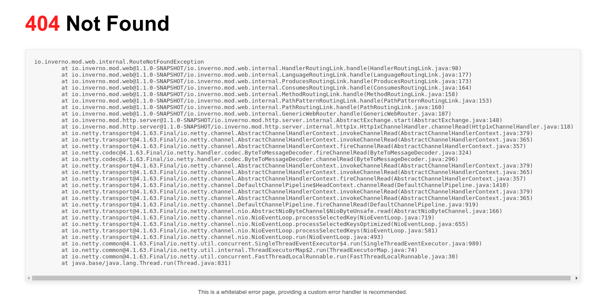
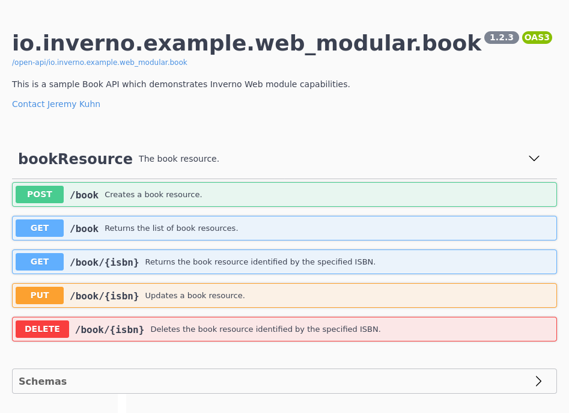

[inverno-tools-root]: https://github.com/inverno-io/inverno-tools

[webjars]: https://www.webjars.org/
[open-api]: https://www.openapis.org/
[swagger-ui]: https://swagger.io/tools/swagger-ui/
[form-urlencoded]: https://url.spec.whatwg.org/#application/x-www-form-urlencoded
[ndjson]: http://ndjson.org/
[yaml]: https://en.wikipedia.org/wiki/YAML

[rfc-7231-5.1.1]: https://tools.ietf.org/html/rfc7231#section-5.1.1
[rfc-7231-5.3]: https://tools.ietf.org/html/rfc7231#section-5.3
[rfc-7231-5.3.1]: https://tools.ietf.org/html/rfc7231#section-5.3.1
[rfc-7231-5.3.2]: https://tools.ietf.org/html/rfc7231#section-5.3.2
[rfc-7231-5.3.5]: https://tools.ietf.org/html/rfc7231#section-5.3.5
[rfc-7231-7.1.2]: https://tools.ietf.org/html/rfc7231#section-7.1.2

# Web

The Inverno *web* module provides extended functionalities on top of the *http-server* module for developing high-end Web and RESTfull applications.

It especially provides:

- advanced HTTP request routing and interception
- content negotiation
- automatic message payload conversion
- path parameters
- static handler for serving static resources
- version agnostic [WebJars][webjars] support
- smooth Web/REST controller development
- [OpenAPI][open-api] specifications generation using Web/REST controllers JavaDoc comments
- SwaggerUI integration
- an Inverno compiler plugin providing static validation of the routes and generation of Web router configurers

The *web* module composes the *http-server* module and therefore starts a HTTP server. Just like the *http-server* module, it requires a net service and a resource service as well as a list of [media type converters](#media-type-converter) for message payload conversion. Basic implementations of these services are provided by the *boot* module which provides `application/json`, `application/x-ndjson` and `text/plain` media type converters. Additional media type converters can surely be provided by implementing the `MediaTypeConverter` interface.

In order to use the Inverno *web* module, we should declare the following dependencies in the module descriptor:

```java
@io.inverno.core.annotation.Module
module io.inverno.example.app_web {
    requires io.inverno.mod.boot;
    requires io.inverno.mod.web;
}
```

We also need to declare these dependencies in the build descriptor:

Using Maven:

```xml
<project>
    <dependencies>
        <dependency>
            <groupId>io.inverno.mod</groupId>
            <artifactId>inverno-boot</artifactId>
        </dependency>
        <dependency>
            <groupId>io.inverno.mod</groupId>
            <artifactId>inverno-web</artifactId>
        </dependency>
    </dependencies>
</project>
```

Using Gradle:

```java
...
compile 'io.inverno.mod:inverno-boot:${VERSION_INVERNO_MODS}'
compile 'io.inverno.mod:inverno-web:${VERSION_INVERNO_MODS}'
...
```

## Routing

The *web* module defines an API for routing HTTP requests to the right handlers. 

A **router** is a server exchange handler as defined by the *http-server* module API which can be used as root handler or error handler in the HTTP server, its role is to route an exchange to a handler based on a set of rules applied to the exchange.

A **route** specifies the rules that an exchange must matched to be routed to a particular handler. A **route interceptor** specifies the rules that a route must match to be intercepted by a particular exchange interceptor.

A **route manager** is used to manage the routes in a router or, more explicitly, to list, create, enable or disable routes in a router. An **interceptor manager** is used to configure the route interceptors in an intercepted router.

> The module defines a high level SPI in `io.inverno.mod.spi` package that can be used as a base to implement custom routing implementations in addition to the provided Web routing implementations. Nevertheless, it is more of a guideline, one can choose a totally different approach to implement routing, in the end the HTTP server expects a `RootExchangeHandler<ExchangeContext, Exchange<ExchangeContext>>` what is done inside is completely opaque, the SPI only shows one way to do it.

A `WebRouter` is used to route a `WebExchange` to the right `WebExchangeHandler`, it implements `RootExchangeHandler` and it is typically used as root handler in the HTTP server.

An `ErrorRouter` is used to route an `ErrorWebExchange` to the right `ErrorWebExchangeHandler` when an exception is thrown during the normal processing of an exchange, it implements `ErrorExchangeHandler` and it is typically used as error handler in the HTTP server.

### Web exchange

The *web* module API extends the [server exchange API](#http-server-exchange-api) defined in the *http-server* module. It defines the server `WebExchangeHandler` to handle a server `WebExchange` composed of a `WebRequest`/`WebResponse` pair in a HTTP communication between a client and a server. These interfaces respectively extends the `ExchangeHandler`, `Exchange`, `Request` and `Response` interfaces defined in the *http-server* module. A Web exchange handler is typically attached to one or more Web routes defined in a `WebRouter`.

#### Path parameters

Path parameters are exposed in the `WebRequest`, they are extracted from the requested path by the [Web router](#web-router) when the handler is attached to a route matching a parameterized path as defined in a [URI builder](#uris).

For instance, if the handler is attached to a route matching `/book/{id}`, the `id` path parameter can be retrieved as follows:

```java
WebExchangeHandler<ExchangeContext> handler = exchange -> {
    exchange.request().pathParameters().get("id")
        .ifPresentOrElse(
            id -> {
                ...
            },
            () -> exchange.response().headers(headers -> headers.status(Status.NOT_FOUND)).body().empty()
        );
};
```

#### Request body decoder

The request body can be decoded based on the content type defined in the request headers.

```java
WebExchangeHandler<ExchangeContext> handler = exchange -> {
    Mono<Result> storeBook = exchange.request().body().get()
        .decoder(Book.class)
        .one()
        .map(book -> storeBook(book));
    exchange.response().body()
        .raw().stream(storeBook.map(result -> Unpooled.unreleasableBuffer(Unpooled.copiedBuffer(result.getMessage(), Charsets.DEFAULT))));
};
```

When invoking the `decoder()` method, a [media type converter](#media-type-converter) corresponding to the request content type is selected to decode the payload. The `content-type` header MUST be specified in the request, otherwise (400) bad request error is returned indicating an empty media type. If there is no converter corresponding to the media type, an (415) unsupported media type error is returned indicating that no decoder was found matching the content type.

A decoder is obtained by specifying the type of the object to decode in the `decoder()` method, the type can be a `Class<T>` or a `java.lang.reflect.Type` which allows to decode parameterized types at runtime bypassing type erasure. Parameterized Types can be built at runtime using the [reflection API](#reflection-api).

As you can see in the above example the decoder is fully reactive, a request payload can be decoded in a single object by invoking method `one()` on the decoder which returns a `Mono<T>` publisher or in a stream of objects by invoking method `many()` on the decoder which returns a `Flux<T>` publisher. 

Decoding multiple payload objects is indicated when a client streams content to the server. For instance, it can send a request with `application/x-ndjson` content type in order to send multiple messages in a single request. Since everything is reactive the server doesn't have to wait for the full request and it can process a message as soon as it is received. What is remarkable is that the code is largely unchanged.

```java
WebExchangeHandler<ExchangeContext> handler = exchange -> {
    Flux<Result> storeBook = exchange.request().body().get()
        .decoder(Book.class)
        .many()
        .map(book -> storeBook(book));
    exchange.response().body()
        .raw().stream(storeBook.map(result -> Unpooled.unreleasableBuffer(Unpooled.copiedBuffer(result.getMessage(), Charsets.DEFAULT))));
};
```

Conversion of a multipart form data request body is also supported, the payload of each part being decoded independently based on the content type of the part. For instance we can upload multiple books in multiple files in a `multipart/form-data` request and decode them on the fly as follows:

```java
WebExchangeHandler<ExchangeContext> handler = exchange -> {
    exchange.response()
        .body().raw().stream(Flux.from(exchange.request().body().get().multipart().stream())                          // 1
            .flatMap(part -> part.decoder(Book.class).one())                                                          // 2
            .map(book -> storeBook(book))                                                                             // 3
            .map(result -> Unpooled.unreleasableBuffer(Unpooled.copiedBuffer(result.getMessage(), Charsets.DEFAULT))) // 4
        );
};
```

In the previous example:

1. A stream of files is received in a `multipart/form-data` request (note that we assume all parts are file parts).
2. Each part is decoded to a `Book` object, the media type must be specified in the `content-type` header field of the part.
3. The book object so obtained is processed.
4. The result for each upload is returned to the client.

All this process is done in a reactive way, the first chunk of response can be sent before all parts have been processed.

#### Response body encoder

As for the request body, the response body can be encoded based on the content type defined in the response headers. Considering previous example we can do the following:

```java
WebExchangeHandler<ExchangeContext> handler = exchange -> {
    Mono<Result> storeBook = exchange.request().body().get()
        .decoder(Book.class)
        .one()
        .map(book -> storeBook(book));
    exchange.response()
        .headers(headers -> headers.contentType(MediaTypes.APPLICATION_JSON))
        .body()
            .encoder(Result.class)
            .one(storeBook);
};
```

When invoking the `encoder()` method, a [media type converter](#media-type-converter) corresponding to the response content type is selected to encode the payload. The `content-type` header MUST be specified in the response, otherwise a (500) internal server error is returned indicating an empty media type. If there is no converter corresponding to the media type, a (500) internal server error is returned indicating that no encoder was found matching the content type.

A single object is encoded by invoking method `one()` on the encoder or multiple objects can be encoded by invoking method `many()` on the encoder. Returning multiple objects in a stream is particularly suitable to implement progressive display in a Web application, for example to display search results as soon as some are available.

```java
WebExchangeHandler<ExchangeContext> handler = exchange -> {
    Flux<SearchResult> searchResults = ...;
    exchange.response()
        .headers(headers -> headers.contentType(MediaTypes.APPLICATION_X_NDJSON))
        .body()
            .encoder(SearchResult.class)
            .many(searchResults);
};
```

### Web route

A Web route specifies the routing rules and the exchange handler that shall be invoked to handle a matching exchange. It can combine the following routing rules which are matched in that order: the path, method and content type of the request, the media ranges and language ranges accepted by the client. For instance, a Web exchange is matched against the path routing rule first, then the method routing rule... Multiples routes can then match a given exchange but only one will be retained to actually process the exchange which is the one matching the highest routing rules.

If a route doesn't define a particular routing rule, the routing rule is simply ignored and matches all exchanges. For instance, if a route doesn't define any method routing rule, exchanges are matched regardless of the method.

The `WebRoutable` interface defines a fluent API for the definition of Web routes. The following is an example of the definition of a Web route which matches all exchanges, this is the simplest route that can be defined:

```java
routable
    .route()                                                   // 1
        .handler(exchange -> {                                 // 2
            exchange.response()
                .headers(headers -> 
                    headers.contentType(MediaTypes.TEXT_PLAIN)
                )
                .body()
                .encoder()
                .value("Hello, world!");
        });
```

1. A new `WebRouteManager` instance is obtained to configure a `WebRoute`
2. We only define the handler of the route as a result any exchange might be routed to that particular route unless a more specific route matching the exchange exists.

An exchange handler can be attached to multiple routes at once by providing multiple routing rules to the route manager, the following example actually results in 8 individual routes being defined:

```java
routable
    .route()
        .path("/doc")
        .path("/document")
        .method(Method.GET)
        .method(Method.POST)
        .consumes(MediaTypes.APPLICATION_JSON)
        .consumes(MediaTypes.APPLICATION_XML)
        .handler(exchange -> {
            ...
        });
```

The Web routable also allows to select all routes that matches the rules defined in a Web route manager using the `findRoutes()` method. The following example select all routes matching `GET` method:

```java
Set<WebRoute<ExchangeContext>> routes = router
    .route()
        .method(Method.GET)
        .findRoutes();
```

It is also possible to enable, disable or remove a set of routes in a similar way:

```java
// Disables all GET routes
routable
    .route()
        .method(Method.GET)
        .disable();

// Enables all GET routes
routable
    .route()
        .method(Method.GET)
        .enable();

// remove all GET routes
routable
    .route()
        .method(Method.GET)
        .remove();
```

Individual routes can also be enabled, disabled or removed as follows:

```java
// Disables all GET routes producing 'application/json'
routable
    .route()
        .method(Method.GET)
        .findRoutes()
        .stream()
        .filter(route -> route.getProduce().equals(MediaTypes.APPLICATION_JSON))
        .forEach(WebRoute::disable);

// Enables all GET routes producing 'application/json'
routable
    .route()
        .method(Method.GET)
        .findRoutes()
        .stream()
        .filter(route -> route.getProduce().equals(MediaTypes.APPLICATION_JSON))
        .forEach(WebRoute::enable);

// Removes all GET routes producing 'application/json'
routable
    .route()
        .method(Method.GET)
        .findRoutes()
        .stream()
        .filter(route -> route.getProduce().equals(MediaTypes.APPLICATION_JSON))
        .forEach(WebRoute::remove);
```

Routes can also be configured as blocks in reusable `WebRoutesConfigurer` by invoking `configureRoutes()` methods:

```java
WebRoutesConfigurer<ExchangeContext> public_routes_configurer = routable -> {
    routable
        .route()
        ...
};

WebRoutesConfigurer<ExchangeContext> private_routes_configurer = routable -> {
    routable
        .route()
        ...
};

routable
    .configureRoutes(public_routes_configurer)
    .configureRoutes(private_routes_configurer)
    .route()
    ...
```

#### Path routing rule

The path routing rule matches exchanges whose request targets a specific path or a path that matches against a particular pattern. The path or path pattern of a routing rule must be absolute (ie. start with `/`).

We can for instance define a route to handle all requests to `/bar/foo` as follows:

```java
routable
    .route()
        .path("/foo/bar")
        .handler(exchange -> {
            ...
        });
```

The route in the preceding example specifies an exact match for the exchange request path, it is also possible to make the route match the path with or without a trailing slash as follows:

```java
routable
    .route()
        .path("/foo/bar", true)
        .handler(exchange -> {
            ...
        });
```

A path pattern following the parameterized or path pattern [URIs notation](#uris) can also be specified to create a routing rule matching multiple paths. This also allows to specify [path parameters](#path-parameters) that can be retrieved from the `WebExchange`.

In the following example, the route will match all exchanges whose request path is `/book/1`, `/book/abc`... and store the extracted parameter value in path parameter `id`:

```java
routable
    .route()
        .path("/book/{id}")
        .handler(exchange -> {
            exchange.request().pathParameters().get("id")...
        });
```

A parameter is matched against a regular expression set to `[^/]*` by default which is why previous route does not match `/book/a/b`. Parameterized URIs allow to specify the pattern matched by a particular path parameter using `{[<name>][:<pattern>]}` notation, we can then put some constraints on path parameters value. For instance, we can make sure the `id` parameter is a number between 1 and 999:

```java
routable
    .route()
        .path("/book/{id:[1-9][0-9]{0,2}}")
        .handler(exchange -> {
            ...
        });
```

If we just want to match a particular path without extracting path parameters, we can omit the parameter name and simply write:

```java
routable
    .route()
        .path("/book/{}")
        .handler(exchange -> {
            ...
        });
```

#### Method routing rule

The method routing rule matches exchanges that have been sent with a particular HTTP method.

In order to handle all `GET` exchanges, we can do:

```java
routable
    .route()
        .method(Method.GET)
        .handler(exchange -> {
            ...
        });
```

#### Consume routing rule

The consume routing rule matches exchanges whose request body content type matches a particular media range as defined by [RFC 7231 Section 5.3.2][rfc-7231-5.3.2].

For instance, in order to match all exchanges with an `application/json` request payload, we can do:

```java
routable
    .route()
        .method(Method.POST)
        .consumes(MediaTypes.APPLICATION_JSON)
        .handler(exchange -> {
            ...
        });
```

We can also specify a media range to match, for example, all exchanges with a `*/json` request payload:

```java
routable
    .route()
        .method(Method.POST)
        .consumes("*/json")
        .handler(exchange -> {
            ...
        });
```

The two previous routes are different and as a result they can be both defined, a content negotiation algorithm is used to determine which route should process a particular exchange as defined in [RFC 7231 Section 5.3][rfc-7231-5.3].

Routes are sorted by consumed media ranges as follows:

- quality value is compared first as defined by [RFC7231 Section 5.3.1][rfc-7231-5.3.1], the default quality value is 1.
- type and subtype wildcards are considered after: `a/b` > `a/*` > `*/b` > `*/*`
- parameters are considered last, the most precise media range which is the one with the most parameters with values gets the highest priority (eg. `application/json;p1=a;p2=2` > `application/json;p1=b` > `application/json;p1`)

The first route whose media range matches the request's `content-type` header field is selected.

If we consider previous routes, an exchange with an `application/json` request payload will be matched by the first route while an exchange with a `text/json` request will be matched by the second route.

A media range can also be parameterized which allows for interesting setup such as:

```java
routable
    .route()
        .path("/document")
        .method(Method.POST)
        .consumes("application/json;version=1")
        .handler(exchange -> {
            ...
        });
    
routable
    .route()
        .path("/document")
        .method(Method.POST)
        .consumes("application/json;version=2")
        .handler(exchange -> {
            ...
        });

routable
    .route()
        .path("/document")
        .method(Method.POST)
        .consumes("application/json")
        .handler(exchange -> {
            ...
        });
```

In the above example, an exchange with a `application/json;version=1` request payload is matched by the first route, `application/json;version=2` request payload is matched by the second route and any other `application/json` request payload is matched by the third route.

If there is no route matching the content type of a request of an exchange matched by previous routing rules, a (415) unsupported media type error is returned.

> As described before, if no route is defined with a consume routing rule, exchanges are matched regardless of the request content type, content negotiation is then eventually delegated to the handler which must be able to process the payload whatever the format.

#### Produce routing rule

The produce routing rule matches exchanges based on the acceptable media ranges supplied by the client in the `accept` header field of the request as defined by [RFC 7231 Section 5.3.2][rfc-7231-5.3.2].

A HTTP client (eg. Web browser) typically sends a `accept` header to indicate the server which response media types are acceptable in the response. The best matching route is determined based on the media types produced by the routes matching previous routing rules.

We can for instance define the following routes:

```java
routable
    .route()
        .path("/doc")
        .produces(MediaTypes.APPLICATION_JSON)
        .handler(exchange -> {
            ...
        });
    
routable
    .route()
        .path("/doc")
        .produces(MediaTypes.TEXT_XML)
        .handler(exchange -> {
            ...
        });
```

Now let's consider the following `accept` request header field:

```plaintext
accept: application/json, application/xml;q=0.9, */xml;q=0.8
```

This field basically tells the server that the client wants to receive first an `application/json` response payload, if not available an `application/xml` response payload and if not available any `*/xml` response payload.

The content negotiation algorithm is similar as the one described in the [consume routing rule](#consume-routing-rule), it is simply reversed in the sense that it is the acceptable media ranges defined in the `accept` header field that are sorted and the route producing the media type matching the media range with the highest priority is selected.

Considering previous routes, a request with previous `accept` header field is then matched by the first route. 

A request with the following `accept` header field is matched by the second route:

```plaintext
accept: application/xml;q=0.9, */xml;q=0.8
```

The exchange is also matched by the second route with the following `accept` header field:

```plaintext
accept: application/json;q=0.5, text/xml;q=1.0
```

If there is no route producing a media type that matches any of the acceptable media ranges, then a (406) not acceptable error is returned.

> As described before, if no route is defined with a produce routing rule, exchanges are matched regardless of the acceptable media ranges, content negotiation is then eventually delegated to the handler which becomes responsible to return an acceptable response to the client. 

#### Language routing rule

Finally, the language routing rule matches exchanges based on the acceptable languages supplied by client in the `accept-language` header field of the request as defined by [RFC 7231 Section 5.3.5][rfc-7231-5.3.5].

A HTTP client (eg. Web browser) typically sends a `accept-language` header to indicate the server which languages are acceptable for the response. The best matching route is determined based on the language tags produced by the routes matching previous routing rules.

We can defines the following routes to return a particular resource in English or in French:

```java
router
    .route()
        .path("/doc")
        .language("en-US")
        .handler(exchange -> {
            ...
        });

router
    .route()
        .path("/doc")
        .language("fr-FR")
        .handler(exchange -> {
            ...
        });
```

The content negotiation is similar to the one described in the [produce routing rule](#produce-routing-rule) but using language ranges and language types instead of media ranges and media types. Acceptable language ranges are sorted as follows:

- quality value is compared first as defined by [RFC 7231 Section 5.3.1][rfc-7231-5.3.1], the default quality value is 1.
- primary and secondary language tags and wildcards are considered after: `fr-FR` > `fr` > `*`

The route whose produced language tag matches the language range with the highest priority is selected.

As for the produce routing rule, if there is no route defined with a language tag that matches any of the acceptable language ranges, then a (406) not acceptable error is returned. However, unlike the produce routing rule, a default route can be defined to handle such unmatched exchanges.

For instance, we can add the following default route to the router:

```java
router
    .route()
        .path("/doc")
        .handler(exchange -> {
            ...
        });
```

A request with the following `accept-language` header field is then matched by the default route:

```plaintext
accept-language: it-IT
```

### Web route interceptor

A Web route interceptor specifies the rules and the exchange interceptor that shall be applied to a matching route. It can combine the same rules as for the definition of a route: the path and method of the route, media range matching the content consumed by the route, media range and language range matching the media type and language produced by the route.

The `WebExchangeInterceptor` interface extends the `ExchangeInterceptor` interface defined in the *http-server* module. It can be applied to one or more routes.

The `WebInterceptable` interface defines a fluent API similar to the `WebRoutable` for the definition of Web interceptors. The following is an example of the definition of a Web route interceptor that is applied to routes matching `GET` methods and consuming `applicatio/json` payloads:

```java
interceptable.
    .intercept()
        .method(Method.GET)
        .consumes(MediaTypes.APPLICATION_JSON)
        .intercept(exchange -> {
            LOGGER.info("Intercepted!");
            return Mono.just(exchange);
        });
```

As for an exchange handler, an exchange interceptor can be applied to multiple routes at once by providing multiple rules to the route interceptor manager, the following example is used to apply a route interceptor to `/doc` and `/document` routes which consumes `application/json` or `application/xml` payloads:

```java
interceptable
    .intercept()
        .path("/doc")
        .path("/document")
        .consumes(MediaTypes.APPLICATION_JSON)
        .consumes(MediaTypes.APPLICATION_XML)
        .intercept(exchange -> {
            ...
        });
```

The list of exchange interceptors applied to a route can be obtained from a `WebRoute` instance:

```java
// Use a WebRoutable to find a WebRoute
WebRoute<ExchangeContext> route = ...

List<? extends ExchangeInterceptor<ExchangeContext, WebExchange<ExchangeContext>> routeInterceptors = route.getInterceptors();
```

In a similar way, it is possible to explicitly set exchange interceptors on a `WebRoute` instance:

```java
Set<WebRoute<ExchangeContext>> routes = router.getRoutes();

WebExchangeInterceptor<ExchangeContext> serverHeaderInterceptor = exchange -> {
    exchange.response()
        .headers(headers -> headers.set(Headers.NAME_SERVER, "Inverno Web Server");

    return Mono.just(exchange);
};

WebExchangeInterceptor<ExchangeContext> securityInterceptor = exchange -> {...};

routes.stream().forEach(route -> route.setInterceptors(List.of(serverHeaderInterceptor, securityInterceptor));
```

Route interceptors can also be configured as blocks in reusable `WebInterceptorsConfigurer` by invoking `configureInterceptors()` methods:

```java
WebInterceptorsConfigurer<ExchangeContext> security_interceptors_configurer = interceptable -> {
    interceptable
        .intercept()
        ...
};

WebInterceptorsConfigurer<ExchangeContext> tracing_interceptors_configurer = interceptable -> {
    interceptable
        .intercept()
        ...
};

interceptable
    .configureInterceptors(public_routes_configurer)
    .configureInterceptors(private_routes_configurer)
    .route()
    ...
```

The definition of an interceptor is very similar to the definition of a route, however there are some peculiarities. For instance, a route can only produce one particular type of content in one particular language that are matched by a route interceptor with matching media and language ranges.

For performance reasons, route interceptor's rules should not be evaluated each time an exchange is processed but once when a route is defined. Unfortunately, this is not always possible and sometimes some rules have to be evaluated when processing the exchange. This happens when the difference between the set of exhanges matched by a route and the set of exchanges matched by a route interceptor is not empty which basically means that the route matches more exchanges than the route interceptor.

In these situations, the actual exchange interceptor is wrapped in order to evaluate the problematic rule on each exchange. A typical example is when a route defines a path pattern (eg. `/path/*.jsp`) that matches the specific path of a route interceptor (eg. `/path/private.jsp`), the exchange interceptor must only be invoked on an exchange that matches the route interceptor's path. This can also happens with method and consumes rules.

> Path patterns are actually very tricky to match *offline*, the `WebInterceptedRouter` implementation uses the `URIPattern#includes()` to determine whether a given URIs set is included into another, when this couldn't be determine with certainty, the exchange interceptor is wrapped. Please refer to the [URIs](#uris) documentation for more information.

> Particular care must be taken when listing the exchange interceptor attached to a route as these are the actual interceptors and not the wrappers. If you set interceptors explicitly on a `WebRoute` instance, they will be invoked whenever the route is invoked.

When a route interceptor is defined with specific produce and language rules, it can only be applied on routes that actually specify matching produce and language rules. Since there is no way to determine which content type and language will be produced by an exchange handler, it is not possible to determine whether an exchange interceptor should be invoked prior to the exchange handler unless specified explicitly on the route. In such case, a warning will be logged to indicate that the interceptor is ignored for the route due to missing produce or language rules on the route.

### Web router

The `WebRouter` extends both `WebRoutable` and `WebInterceptable` interfaces. As such routes and route interceptors are defined on the `WebRouter` implementation exposed in the *web* module and wired to the *http-server* module to override the HTTP server's root handler. 

In addition to `configureRoutes()` and `configureInterceptors()` methods defined by `WebRoutable` and `WebInterceptable`, the `WebRouter` interface provides `configure()` methods that accept `WebRouterConfigurer` to fluently apply blocks of configuration.

```java
WebRouterConfigurer<ExchangeContext> configurer = ...
List<WebRouterConfigurer<ExchangeContext>> configurers = ...

router
    .configure(configurers)
    .configure(configurer)
    .route()
        .handler(exchange -> ...)
```

> Please refer to the [Web Server documentation](#web-server) to see in details how to configure Web server routes.

Route interceptors are only applied to routes defined on a `WebInterceptedRouter` which is obtained by defining one or more route interceptor on the web router. The following example shows how it works:

```java
router
    .route()
        .path("/public")
        .handler(exchange -> {...})
    .intercept()
        .interceptor(exchange -> {...})
    .route()
        .path("/private")
        .handler(exchange -> {...})
    .getRouter()
    .route()
        .path("/static/**")
        .handler(new StaticHandler(resourceService.getResource("file:/path/to/web-root/")))
```

In the preceding snippet, only `/private` route is intercepted, both `/public` and `/static/**` are not intercepted since they are defined on the Web router which is not intercepted. Note the call to  `getRouter()` method which returns the originating web router instance and basically *rollbacks* the interceptors configuration.

A Web intercepted router can also be used to apply interceptors to all routes previsously defined in a Web router.

```java
router
    .intercept()
        .method(Method.GET)
        .interceptor(exchange -> {...})
    .applyInterceptors()
```

In the previous example, all `GET` routes previsously defined in the Web router will be intercepted.

### Error web exchange

The *web* module API extends the [server exchange API](#http-server-exchange-api) defined in the *http-server* module and defines the server `ErrorWebExchangeHandler` to handle a server `ErrorWebExchange`. These interfaces respectively extends the `ExchangeHandler` and `Exchange` interfaces which are defined in the *http-server* module. An error Web exchange handler is typically attached to one or more error Web routes defined in an `ErrorWebRouter`.

The `ErrorWebExchange` provides a response body encoder which can be used to encode error response body based on the content type specified in the response headers. The usage is exactly the same as for the Web server exchange [response body encoder](#response-body-encoder).

```java
errorRouter
    .route()
        .error(IllegalArgumentException.class)
        .produces(MediaTypes.APPLICATION_JSON)
        .handler(errorExchange -> 
            errorExchange.response()
                .body()
                .encoder(Message.class)
                .value(new Message("IllegalArgumentException"))
        );
```

### Error router

An `ErrorWebRouter` routes an error exchange to an error exchange handler attached to an `ErrorWebRoute` by matching it against a combination of routing rules specified in the route. An error route can combine the following routing rules which are matched in that order: the type of the error, the media ranges and language ranges accepted by the client. For instance, the error router matches an error exchange against the error type routing rule first, then the produce routing rule... Multiples routes can then match a given exchange but only one will be retained to actually process the exchange which is the one matching the highest routing rules.

Unlike the `WebRouter`, the `ErrorWebRouter` only extends `WebRoutable` and doesn't extends `WebInterceptable`, as a result error web routes can't be intercepted.

> The choice to prevent error web route to be intercepted has been motivated by the fact that error web routes are usually invoked on errors thrown during the normal processing of an exchange ie. after the exchange handler and then route interceptors have been invoked.

If a route doesn't define a particular routing rule, the routing rule is simply ignored and matches all exchanges. For instance, if a route doesn't define any error type routing rule, it matches error exchanges regardless of the error.

The following is an example of an error route which matches all error exchanges and as a result handles all types of error:

```java
errorRouter
    .route()
        .handler(errorExchange -> 
            errorExchange.response()
                .headers(headers -> 
                    headers
                        .status(Status.INTERNAL_SERVER_ERROR)
                        .contentType(MediaTypes.TEXT_PLAIN)
                )
                .body()
                .empty()
        );
```

> An `ErrorWebRouter` is exposed in the *web* module and wired to the *http-server* module to override the HTTP server's error handler. It defines error routes to *whitelabel* error handlers for standard `HTTPexception` as defined by [HTTP base API](#http-base-api) and producing `application/json` or `text/html` payloads. It can be configured to override these routes or defines others using an `ErrorWebRouterConfigurer` as defined in the [Web Server documentation](#web-server).

The creation, activation, deactivation or removal of routes in an error router is done in the exact same way as for the [Web router](#web-router).

In the following example, we define an error route to handle `SomeCustomException` producing `text/html` response in English for the clients that accept it:

```java
errorRouter
    .route()
        .error(SomeCustomException.class)
        .produces(MediaTypes.TEXT_HTML)
        .language("en-US")
        .handler(errorExchange -> 
            ...
        );
```

Error routes can be queried as follows:

```java
Set<ErrorWebRoute> errorRoutes = errorRouter
    .route()
        .error(SomeCustomException.class)
        .findRoutes();
```

They can be enabled, disabled or removed as follows:

```java
// Disables all SomeCustomException routes
errorRouter
    .route()
        .error(SomeCustomException.class)
        .disable();

// Enables all SomeCustomException routes
errorRouter
    .route()
        .error(SomeCustomException.class)
        .enable();

// remove all SomeCustomException routes
errorRouter
    .route()
        .error(SomeCustomException.class)
        .remove();
```

Individual error routes are enabled, disabled or removed as follows:

```java
// Disables all SomeCustomException routes producing 'application/json'
router
    .route()
        .error(SomeCustomException.class)
        .findRoutes()
        .stream()
        .filter(route -> route.getProduce().equals(MediaTypes.APPLICATION_JSON))
        .forEach(WebRoute::disable);

// Enables all SomeCustomException routes producing 'application/json'
router
    .route()
        .error(SomeCustomException.class)
        .findRoutes()
        .stream()
        .filter(route -> route.getProduce().equals(MediaTypes.APPLICATION_JSON))
        .forEach(WebRoute::enable);

// Removes all SomeCustomException routes producing 'application/json'
router
    .route()
        .error(SomeCustomException.class)
        .findRoutes()
        .stream()
        .filter(route -> route.getProduce().equals(MediaTypes.APPLICATION_JSON))
        .forEach(WebRoute::remove);
```

#### Error type routing rule

The error type routing rule matches error exchanges whose error is of a particular type.

For instance, in order to handle all error exchanges whose error is an instance of `SomeCustomException`, we can do:

```java
errorRouter
    .route()
        .method(SomeCustomException.class)
        .handler(exchange -> {
            ...
        });
```

#### Produce routing rule

The produce routing rule, when applied to an error route behaves exactly the same as for a [Web route](#produce-routing-rule). It allows to define error handlers that produce responses of different types based on the set of media range accepted by the client.

This is particularly useful to returned specific error responses to a particular client in a particular context. For instance, a backend application might want to receive errors in a parseable format like `application/json` whereas a Web browser might want to receive errors in a human readable format like `text/html`.

#### Language routing rule

The language routing rule, when applied to an error route behaves exactly the same as for a [Web route](#language-routing-rule). It allows to define error handlers that produce responses with different languages based on the set of language range accepted by the client fallbacking to the default route when content negotiation did not give any match.

## Web Server

The *web* module composes the *http-server* module and as a result it requires a `NetService` and a `ResourceService`. A set of [media type converters](#media-type-converter) is also required for message payload conversion. All these services are provided by the *boot* module, so one way to create an application with a Web server is to create an Inverno module composing *boot* and *web* modules.

```java
@io.inverno.core.annotation.Module
module io.inverno.example.app_web {
    requires io.inverno.mod.boot;
    requires io.inverno.mod.web;
}
```

The resulting *app_web* module, thus created, can then be started as an application as follows:

```java
package io.inverno.example.app_web;

import io.inverno.core.v1.Application;

public class Main {

    public static void main(String[] args) {
        Application.with(new App_web.Builder()).run();
    }
}
```

The above example starts a Web server using default configuration which is a HTTP/1.x server with a Web router as root handler and an error router as error handler.

```plaintext
2021-04-14 11:00:18,308 INFO  [main] i.w.c.v.Application - Inverno is starting...


     ╔════════════════════════════════════════════════════════════════════════════════════════════╗
     ║                      , ~~ ,                                                                ║
     ║                  , '   /\   ' ,                                                            ║
     ║                 , __   \/   __ ,      _                                                    ║
     ║                ,  \_\_\/\/_/_/  ,    | |  ___  _    _  ___   __  ___   ___                 ║
     ║                ,    _\_\/_/_    ,    | | / _ \\ \  / // _ \ / _|/ _ \ / _ \                ║
     ║                ,   __\_/\_\__   ,    | || | | |\ \/ /|  __/| | | | | | |_| |               ║
     ║                 , /_/ /\/\ \_\ ,     |_||_| |_| \__/  \___||_| |_| |_|\___/                ║
     ║                  ,     /\     ,                                                            ║
     ║                    ,   \/   ,                                  -- ${VERSION_INVERNO_CORE} --                 ║
     ║                      ' -- '                                                                ║
     ╠════════════════════════════════════════════════════════════════════════════════════════════╣
     ║ Java runtime        : OpenJDK Runtime Environment                                          ║
     ║ Java version        : 16+36-2231                                                           ║
     ║ Java home           : /home/jkuhn/Devel/jdk/jdk-16                                         ║
     ║                                                                                            ║
     ║ Application module  : io.inverno.example.app_web                                           ║
     ║ Application version : 1.0.0-SNAPSHOT                                                       ║
     ║ Application class   : io.inverno.example.app_web.Main                                      ║
     ║                                                                                            ║
     ║ Modules             :                                                                      ║
     ║  ...                                                                                       ║
     ╚════════════════════════════════════════════════════════════════════════════════════════════╝


2021-04-14 11:00:18,313 INFO  [main] i.w.e.a.App_web - Starting Module io.inverno.example.app_web...
2021-04-14 11:00:18,313 INFO  [main] i.w.m.b.Boot - Starting Module io.inverno.mod.boot...
2021-04-14 11:00:18,494 INFO  [main] i.w.m.b.Boot - Module io.inverno.mod.boot started in 181ms
2021-04-14 11:00:18,494 INFO  [main] i.w.m.w.Web - Starting Module io.inverno.mod.web...
2021-04-14 11:00:18,495 INFO  [main] i.w.m.h.s.Server - Starting Module io.inverno.mod.http.server...
2021-04-14 11:00:18,495 INFO  [main] i.w.m.h.b.Base - Starting Module io.inverno.mod.http.base...
2021-04-14 11:00:18,499 INFO  [main] i.w.m.h.b.Base - Module io.inverno.mod.http.base started in 4ms
2021-04-14 11:00:18,570 INFO  [main] i.w.m.h.s.i.HttpServer - HTTP Server (nio) listening on http://0.0.0.0:8080
2021-04-14 11:00:18,570 INFO  [main] i.w.m.h.s.Server - Module io.inverno.mod.http.server started in 75ms
2021-04-14 11:00:18,571 INFO  [main] i.w.m.w.Web - Module io.inverno.mod.web started in 76ms
2021-04-14 11:00:18,571 INFO  [main] i.w.e.a.App_web - Module io.inverno.example.app_web started in 259ms

```

The Web router doesn't define any routes by default so if we hit the server, a (404) not found error is returned showing the error router in action:

```plaintext
$ curl -i -H 'accept: application/json' http://locahost:8080
HTTP/1.1 404 Not Found
content-type: application/json
content-length: 47

{"status":"404","path":"/","error":"Not Found"}
```

If you open `http://locahost:8080` in a Web browser, you should see the following (404) whitelabel error page:



### Configuration

The Web server configuration is done in the the *web* module configuration `WebConfiguration` which includes the *http-server* module configuration `HttpServerConfiguration`. As for the *http-server* module, the net service configuration can also be considered to set low level network configuration in the *boot* module. 

The following configuration can then be created in the *app_http* module:

Let's create the following configuration in the *app_web* module:

```java
package io.inverno.example.app_web;

import io.inverno.core.annotation.NestedBean;
import io.inverno.mod.boot.BootConfiguration;
import io.inverno.mod.configuration.Configuration;
import io.inverno.mod.web.WebConfiguration;

@Configuration
public interface App_webConfiguration {

    @NestedBean
    BootConfiguration boot();

    @NestedBean
    WebConfiguration web();
}
```

The Web server can then be configured. For instance, we can enable HTTP/2 over cleartext, TLS, HTTP compression... as described in the [http-server module documentation](#http-server-1).

```java
package io.inverno.example.app_web;

import io.inverno.core.v1.Application;

public class Main {

    public static void main(String[] args) {
        Application.with(new App_web.Builder()
            .setApp_webConfiguration(
                    App_webConfigurationLoader.load(configuration -> configuration
                        .web(web -> web
                            .http_server(server -> server
                                .server_port(8081)
                                .h2c_enabled(true)
                                .server_event_loop_group_size(4)
                            )
                        )
                    )
                )
        ).run();
    }
}
```

### Configuring the Web router

As explained before, a [Web router](#web-router) is used to route a request to the right handler based on a set of rules defined in a route. The *web* module provides a `WebRouter` bean which is wired to the *http-server* module to override the default root handler and handle all incoming requests to the server. Unlike the root handler in the *http-server* module, this bean is not overridable but it can be configured in order to define Web routes for the *app_web* module.

This can be done by defining a `WebRouterConfigurer` bean in the *app_web* module. A Web router configurer is invoked after the initialization of the Web router and more precisely after the default configuration has been applied.

Using what we've learned from the [Web routing documentation](#web-routing), routes can then be defined as follows:

```java
package io.inverno.example.app_web;

import io.inverno.core.annotation.Bean;
import io.inverno.mod.base.resource.MediaTypes;
import io.inverno.mod.http.server.ExchangeContext;
import io.inverno.mod.web.WebRouter;
import io.inverno.mod.web.WebRouterConfigurer;

@Bean
public class App_webWebRouterConfigurer implements WebRouterConfigurer<ExchangeContext> {

    @Override
    public void accept(WebRouter<ExchangeContext> router) {
        router
            .route()
                .path("/hello")
                .produces(MediaTypes.TEXT_PLAIN)
                .language("en-US")
                .handler(exchange -> exchange
                    .response()
                        .body()
                        .encoder(String.class)
                        .value("Hello!")
                )
            .route()
                .path("/hello")
                .produces(MediaTypes.TEXT_PLAIN)
                .language("fr-FR")
                .handler(exchange -> exchange
                    .response()
                        .body()
                        .encoder(String.class)
                        .value("Bonjour!")
                );
    }
}
```

Now we can test the application:

```plaintext
$ curl -i http://locahost:8080/
HTTP/1.1 404 Not Found
content-length: 0
```
```plaintext
$ curl -i http://locahost:8080/hello
HTTP/1.1 200 OK
content-type: text/plain
content-length: 6

Hello!
```
```plaintext
$ curl -i -H 'accept-language: fr' http://locahost:8080/hello
HTTP/1.1 200 OK
content-type: text/plain
content-length: 8

Bonjour!
```
```plaintext
$ curl -i -H 'accept: application/json' http://locahost:8080/hello
HTTP/1.1 406 Not Acceptable
content-type: application/json
content-length: 81

{"status":"406","path":"/hello","error":"Not Acceptable","accept":["text/plain"]}
```

The exchange context created by the HTTP server when processing an exchange is also provided by the web router configurer by implementing the `createContext()` method:

```java
public class App_webWebRouterConfigurer implements WebRouterConfigurer<SecurityContext> {

    @Override
    public void accept(WebRouter<SecurityContext> router) {
        router
            .intercept()
                .path("/private")
                .interceptor(new SecurityInterceptor()) // Populate the security context
            .route()
                .path("/private")
                .handler(exchange -> {
                    if(exchange.context().isAuthenticated()) {
                        exchange
                            .response()
                                .body()
                                .encoder(String.class)
                                .value("Private resource!");
                    }
                    else {
                        throw new UnauthorizedException();
                    }
                })
    }

    @Override
    public SecurityContext createContext() {
        return new SecurityContext();
    }
}
``` 

> The `WebRouter` interface extends `RootExchangeHandler` which defines the `createContext()` method used by the HTTP server to instantiate contexts, the Web router bean delegates to its single Web router configurer to provide context instances to the HTTP server. Although it is possible to use multiple Web router configurers to configure the Web router using the `configure()` methods, the Web router bean only accepts one configurer which is used to create the context.

### Configuring the error router

The *web* module also provides an error router bean wired to the *http-server* module to override the default error handler and handle all errors thrown when processing an exchange. As a reminder, an [error router](#error-router) is used to route an error exchange to the right error handler based on a set of rules defined in an error route.

As for the Web router, the error router can't be overridden, it is rather configured by defining an `ErrorWebRouterConfigurer` bean invoked after the initialization of the error router and more precisely after the default configuration has been applied which means default error routes remain although they can be overridden in the configurer.

The error router implemented in the *web* module provides default error routes for handling base `HttpException`, whitelabel error pages are returned in particular when a client request `text/html` responses. More generally, `Throwable` errors are also handled by default, returning a generic (500) internal server error.

Now let's assume, we have created a route which might throw a particular custom exception for which we want to return a particular response. For instance, we might have defined the following route in the `App_webWebRouterConfigurer`:

```java
@Bean
public class App_webWebRouterConfigurer implements WebRouterConfigurer<ExchangeContext> {

    @Override
    public void accept(WebRouter<ExchangeContext> router) {
        router
            ...
            .route()
                .path("custom_exception")
                .handler(exchange -> {
                    throw new SomeCustomException();
                });
    }
}
```

> Note that an exchange handler is defined to throw checked `HttpException` only which actually makes sense since a Http error is eventually what will be returned to the client. In our example, the `SomeCustomException` is then either unchecked or extends `HttpException`.

Now using what we've learned from the [error routing documentation](#error-routing), we can define an error route to handle that particular exception as follows:

```java
package io.inverno.example.app_web;

import io.inverno.core.annotation.Bean;
import io.inverno.mod.base.resource.MediaTypes;
import io.inverno.mod.http.base.Status;
import io.inverno.mod.web.ErrorWebRouter;
import io.inverno.mod.web.ErrorWebRouterConfigurer;

@Bean
public class App_webErrorWebRouterConfigurer implements ErrorWebRouterConfigurer {

    @Override
    public void accept(ErrorWebRouter errorRouter) {
        errorRouter
            .route()
                .error(SomeCustomException.class)
                .handler(errorExchange -> errorExchange
                    .response()
                    .headers(headers -> headers
                        .status(Status.BAD_REQUEST)
                        .contentType(MediaTypes.TEXT_PLAIN)
                    )
                    .body()
                    .encoder()
                    .value("A custom exception was raised")
                );
    }
}
```

Now if we hit `http://locahost:8080/custom_exception` we should receive a custom error:

```plaintext
$ curl -i http://locahost:8080/custom_exception
HTTP/1.1 400 Bad Request
content-type: text/plain
content-length: 29

A custom exception was raised
```

### Static handler

The `StaticHandler` is a specific `WebExchangeHandler<WebExchange>` implementation that can be used to define routes for serving static resources resolved with the [Resource API](#resource-api).

For instance, we can create a route to serve files stored in a `web-root` directory as follows:

```java
router
    .route()
        .path("/static/{path:.*}")                                 // 1
        .handler(new StaticHandler(new FileResource("web-root/"))) // 2
```

1. The path must be parameterized with a `path` parameter which can include `/`, for the static handler to be able to determine the relative path of the resource in the `web-root` directory
2. The base resource is defined directly as a `FileResource`, although it is also possible to use a `ResourceService` to be more flexible in terms of the kind of resource

The static handler relies on the resource abstraction to resolve resources, as a result, these can be located on the file system, on the class path, on the module path...

The static handler also looks for a welcome page when a directory resource is requested. For instance considering the following `web-root` directory:

```plaintext
web-root/
├── index.html
└── snowflake.svg
```

A request to `http://127.0.0.1/static/` would return the `index.html` file.

### 100-continue interceptor

The API provides the `ContinueInterceptor` class which can be used to automatically handles `100-continue` as defined by [RFC 7231 Section 5.1.1][rfc-7231-5.1.1].

```java
router
    .intercept()
        .interceptor(new ContinueInterceptor())
    .route()
    ...
```

### WebJars

The `WebJarsRoutesConfigurer` is a `WebRoutesConfigurer` implementation used to configure routes to WebJars static resources available on the module path or class path. Paths to the resources are version agnostic: `/webjars/{webjar_module}/{path:.*}` where `{webjar_module}` corresponds to the *modularized* name of the WebJar minus `org.webjars`. For example the location of the Swagger UI WebJar would be `/webjars/swagger.ui/`.

WebJars routes can be configured on the Web router as follows:

```java
package io.inverno.example.app_web;

import io.inverno.core.annotation.Bean;
import io.inverno.mod.base.resource.ResourceService;
import io.inverno.mod.http.server.ExchangeContext;
import io.inverno.mod.web.WebJarsRoutesConfigurer;
import io.inverno.mod.web.WebRouter;
import io.inverno.mod.web.WebRouterConfigurer;

@Bean
public class App_webWebRouterConfigurer implements WebRouterConfigurer<ExchangeContext> {

    private final ResourceService resourceService;

    public App_webWebRouterConfigurer(ResourceService resourceService) {
        this.resourceService = resourceService;
    }

    @Override
    public void accept(WebRouter<ExchangeContext> router) {
        router
            .configureRoutes(new WebJarsRoutesConfigurer(this.resourceService))
            ...
    }
}
```

Then we can declare WebJars dependencies such as the Swagger UI in the build descriptor:

```xml
<project>
    <dependencies>
        <dependency>
            <groupId>org.webjars</groupId>
            <artifactId>swagger-ui</artifactId>
        </dependency>
    </dependencies>
</project>
```

The Swagger UI should be accessible at `http://locahost:8080/webjars/swagger.ui/`.

Sadly WebJars are rarely modular JARs, they are not even named modules which causes several issues when dependencies are specified on the module path. That's why when an application is run or packaged using [Inverno tools][inverno-tools-root], such dependencies and WebJars in particular are *modularized*. A WebJar such as `swagger-ui` is modularized into `org.webjars.swagger.ui` module which explains why it is referred by its module name: `swagger.ui` in the WebJars resource path (the `org.webjars` part is omitted since the context is known).

When running a fully modular Inverno application, *modularized* WebJars modules must be added explicitly to the JVM using the `--add-modules` option, otherwise they are not resolved when the JVM starts. For instance:

```plaintext
$ java --add-modules org.webjars.swagger.ui ...
```

Hopefully, the Inverno Maven plugin adds unnamed modules by default when running or packaging an application, so you shouldn't have to worry about it. The following command automatically adds the unnamed modules when running the JVM:

```plaintext
$ mvn inverno:run
```

This can be disabled in order to manually control which modules should be added:

```plaintext
$ mvn inverno:run -Dinverno.exec.addUnnamedModules=false -Dinverno.exec.vmOptions="--add-modules org.webjars.swagger.ui"
```

> It might also be possible to define the dependency in the module descriptor, unfortunately since WebJars modules are unnamed, they are named against the name of the JAR file which is greatly unstable and can't be trusted, so previous approach is by far the safest. If you need to create a WebJar you should make it a named module with the `Automatic-Module-Name` attribute sets to `org.webjars.{webjar_module}` in the manifest file and with resources located under `META-INF/resources/webjars/{webjar_module}/{webjar_version}/`.

Note that when the application is run with non-modular WebJars specified on the class path, they can be accessed without any particular configuration as part of the UNNAMED module using the same path notation.

### OpenAPI specification

The `OpenApiRoutesConfigurer` is a `WebRoutesConfigurer` implementation used to configure routes to [OpenAPI specifications][open-api] defined in `/META-INF/inverno/web/openapi.yml` resources in application modules.

OpenAPI routes can be configured on the Web router as follows:

```java
package io.inverno.example.app_web;

import io.inverno.core.annotation.Bean;
import io.inverno.mod.base.resource.ResourceService;
import io.inverno.mod.http.server.ExchangeContext;
import io.inverno.mod.web.OpenApiRoutesConfigurer;
import io.inverno.mod.web.WebRouter;
import io.inverno.mod.web.WebRouterConfigurer;

@Bean
public class App_webWebRouterConfigurer implements WebRouterConfigurer<ExchangeContext> {

    private final ResourceService resourceService;

    public App_webWebRouterConfigurer(ResourceService resourceService) {
        this.resourceService = resourceService;
    }

    @Override
    public void accept(WebRouter<ExchangeContext> router) {
        router
            .configureRoutes(new OpenApiRoutesConfigurer(this.resourceService))
            ...
    }
}
```

The configurer will scan for OpenAPI specifications files `/META-INF/inverno/web/openapi.yml` in the application modules and configure the following routes:

- `/open-api` returning the list of available OpenAPI specifications in `application/json`
- `/open-api/{moduleName}` returning the OpenAPI specifications defined for the specified module name or (404) not found error if there is no OpenAPI specification defined in the module or no module with that name.

By default the configurer also configures these routes to display OpenAPI specifications in a [Swagger UI][swagger-ui] when accessed from a Web browser (ie. with `accept: text/html`) assuming the Swagger UI WebJar dependency is present:

```xml
<project>
    <dependencies>
        <dependency>
            <groupId>org.webjars</groupId>
            <artifactId>swagger-ui</artifactId>
        </dependency>
    </dependencies>
</project>
```

Swagger UI support can be disabled from the `OpenApiRoutesConfigurer` constructor:

```java
router
    .configureRoutes(new OpenApiRoutesConfigurer(this.resourceService, false))
    ...
```

> OpenAPI specifications are usually automatically generated by the Web Inverno compiler plugin for routes defined in a [Web controller](#web-controller) but you can provide manual or generated specifications using the tool of your choice, as long as it is not conflicting with the Web compiler plugin.

## Web Controller

The [Web router](#web-router) and [Web server](#web-server) documentations describe a *programmatic* way of defining the Web routes of a Web server but the *web* module API also provides a set of annotations for defining Web routes in a more declarative way. 

A **Web controller** is a regular module bean annotated with `@WebController` which defines methods annotated with `@WebRoute` describing Web routes. These beans are scanned at compile time by the Web Inverno compiler plugin in order to generate a single `WebRouterConfigurer` bean inside the module in order to configure the routes in the Web router.

For instance, we can create a book resource with basic CRUD operations, to do so we must define a `Book` model in a dedicated `*.dto` package, we'll see later why this matters:

```java
package io.inverno.example.app_web.dto;

public class Book {

    private String isbn;
    private String title;
    private String author;
    private int pages;
    
    // Constructor, getters, setters, hashcode, equals...
}
```

Now we can define a `BookResource` Web controller as follows:

```java
package io.inverno.example.app_web;

import java.util.Set;

import io.inverno.core.annotation.Bean;
import io.inverno.example.app_web.dto.Book;
import io.inverno.mod.base.resource.MediaTypes;
import io.inverno.mod.http.base.Method;
import io.inverno.mod.web.annotation.Body;
import io.inverno.mod.web.annotation.PathParam;
import io.inverno.mod.web.annotation.WebController;
import io.inverno.mod.web.annotation.WebRoute;

@Bean                                                                                          // 1
@WebController( path = "/book" )                                                               // 2
public class BookResource {

    @WebRoute( method = Method.POST, consumes = MediaTypes.APPLICATION_JSON )                  // 3
    public void create(@Body Book book) {                                                      // 4
        ...
    }
    
    @WebRoute( path = "/{isbn}", method = Method.PUT, consumes = MediaTypes.APPLICATION_JSON )
    public void update(@PathParam String isbn, @Body Book book) {
        ...
    }
    
    @WebRoute( method = Method.GET, produces = MediaTypes.APPLICATION_JSON )
    public Set<Book> list() {
        ...
    }
    
    @WebRoute( path = "/{isbn}", method = Method.GET, produces = MediaTypes.APPLICATION_JSON )
    public Book get(@PathParam String isbn) {
        ...
    }
    
    @WebRoute( path = "/{isbn}", method = Method.DELETE )
    public void delete(@PathParam String isbn) {
        ...
    }
}
```

Implementations details have been omitted for clarity, here is what's important:

1. A Web controller must be a module bean because it will be wired into the generated Web router configurer and used to invoke the right handler method attached to a Web route. Besides it is anyway convenient for implementation, a repository could be wired into the `BookResource` bean for instance.
2. The `@WebController` annotation tells the Web compiler plugin to process the bean as a Web controller. The controller root path can also be specified in the annotation, if not specified it defaults to `/` which is the root path of the Web server.
3. The `@WebRoute` annotation on a method tells the Web compiler plugin to define a route whose handler invokes that method. The set of routing rules (ie. path, method, consume, produce, language) describing the route are specified in the annotation.
4. Parameters and request body are specified as method parameters annotated with `@CookieParam`, `@FormParam`, `@HeaderParam`, `@PathParam`, `@QueryParam` and `@Body` annotations.

Some other contextual objects like the underlying `WebExchange` can also be injected in the Web controller method.

Assuming we have provided proper implementations to create, update, list, get and delete a book in a data store, we can compile the module. A new module bean `io.inverno.example.app_web.WebRouterConfigurer` implementing `WebRouterConfigurer` should have been generated in `target/generated-sources/annotations`. It basically configures the routes corresponding to the Web controller's annotated methods in the Web router. This class uses the APIs described before and it is perfectly readable and debuggable and above all it eliminates the overhead of resolving Web controllers or Web routes at runtime.

Now let's go back to the `Book` DTO, we said earlier that it must be created in a dedicated package, the reason is actually quite simple. Since above routes consume and produce `application/json` payloads, the `application/json` media type converter will be invoked to convert `Book` objects from/to JSON data. This converter uses an `ObjectMapper` object from module `com.fasterxml.jackson.databind` which uses reflection to instantiate the objects and populate them from a parsed JSON tree. Unfortunately or hopefully the Java modular system prevents unauthorized reflective access and as a result the `ObjectMapper` can't access the `Book` class unless we explicitly export the package containing DTOs to module `com.fasterxml.jackson.databind` in the module descriptor as follows:

```java
module io.inverno.example.app_web {
    ...    
    exports io.inverno.example.app_web.dto to com.fasterxml.jackson.databind;
}
```

Using a dedicated package for DTOs allows then to limit and control the access to the module classes.

> If you're not familiar with the Java modular system and used to Java 8<, you might find this a bit distressing but if you want to better structure and secure your applications, this is the way. 

We can now run the application and test the book resource:

```plaintext
$ curl -i http://locahost:8080/book
HTTP/1.1 200 OK
content-type: application/json
content-length: 2

[]
```
```plaintext
$ curl -i -X POST -H 'content-type: application/json' -d '{"isbn":"978-0132143011","title":"Distributed Systems: Concepts and Design","author":"George Coulouris, Jean Dollimore, Tim Kindberg, Gordon Blair","pages":1080}' http://locahost:8080/book
HTTP/1.1 200 OK
content-length: 0

```
```plaintext
$ curl -i http://locahost:8080/book
HTTP/1.1 200 OK
content-type: application/json
content-length: 163

[{"isbn":"978-0132143011","title":"Distributed Systems: Concepts and Design","author":"George Coulouris, Jean Dollimore, Tim Kindberg, Gordon Blair","pages":1080}]
```
```plaintext
$ curl -i http://locahost:8080/book/978-0132143011
HTTP/1.1 200 OK
content-type: application/json
content-length: 161

{"isbn":"978-0132143011","title":"Distributed Systems: Concepts and Design","author":"George Coulouris, Jean Dollimore, Tim Kindberg, Gordon Blair","pages":1080}
```

> If you carefully followed the *web* module documentation, you should have noticed that we have previously created a Web router configurer bean in the *app_web* module which is conflicting with the generated Web router configurer resulting in the following self-explanatory compilation error:
> 
> ```plaintext
> [ERROR] /home/jkuhn/Devel/git/frmk/io.inverno.example.app_web/src/main/java/module-info.java:[4,1] Multiple beans matching socket io.inverno.mod.web:webRouterConfigurer were found
>  - io.inverno.example.app_web:app_webWebRouterConfigurer of type io.inverno.example.app_web.App_webWebRouterConfigurer
>  - io.inverno.example.app_web:webRouterConfigurer of type io.inverno.example.app_web.WebRouterConfigurer
>  
>  Consider specifying an explicit wiring in module io.inverno.example.app_web (eg. @io.inverno.core.annotation.Wire(beans="io.inverno.example.app_web:app_webWebRouterConfigurer", into="io.inverno.mod.web:webRouterConfigurer") )
> ```
> 
> One way to resolve that conflict is to define an explicit wire in the module definition:
> 
> ```java
> @io.inverno.core.annotation.Module
> @io.inverno.core.annotation.Wire(beans="io.inverno.example.app_web:webRouterConfigurer", into="io.inverno.mod.web:webRouterConfigurer")
> module io.inverno.example.app_web {
>   ...
> }
> ```
>
> Such situation can also occur when you are composing multiple modules defining Web controller beans and thus exposing multiple Web router configurers in the module. Hopefully it is safe to resolve these conflicts by wiring the Web router configurer of the module composing the *web* module as it aggregates all Web router configurers annotated with `@WebRoutes`. Please look at [Composite Web module documentation](#composite-web-module) for further details.
> 
> In order to avoid such issues, it is also recommended for *programmatic* router configuration to rely as much as possible on `WebRoutesConfigurer` and `WebInterceptorsConfigurer` which are injected in the generated `WebRouterConfigurer`.

It is possible to separate the API from the implementation by defining the Web controller and the Web routes in an interface implemented in a module bean. For instance,

```java
package io.inverno.example.app_web;

import java.util.Set;

import io.inverno.example.app_web.dto.Book;
import io.inverno.mod.base.resource.MediaTypes;
import io.inverno.mod.http.base.Method;
import io.inverno.mod.web.annotation.Body;
import io.inverno.mod.web.annotation.PathParam;
import io.inverno.mod.web.annotation.WebController;
import io.inverno.mod.web.annotation.WebRoute;

@WebController(path = "/book")
public interface BookResource {

    @WebRoute(method = Method.POST, consumes = MediaTypes.APPLICATION_JSON)
    void create(@Body Book book);
    
    @WebRoute(path = "/{isbn}", method = Method.PUT, consumes = MediaTypes.APPLICATION_JSON)
    void update(@PathParam String isbn, @Body Book book);
    
    @WebRoute(method = Method.GET, produces = MediaTypes.APPLICATION_JSON)
    Set<Book> list();
    
    @WebRoute(path = "/{isbn}", method = Method.GET, produces = MediaTypes.APPLICATION_JSON)
    Book get(@PathParam String isbn);
    
    @WebRoute(path = "/{isbn}", method = Method.DELETE)
    void delete(@PathParam String isbn);
}
```

This provides better modularity allowing to define the API in a dedicated module which can later be used to implement various server and/or client implementations in different modules. Another advantage is that it allows to split a Web controller interface into multiple interfaces.

Generics are also supported, we can for instance create a generic `CRUD<T>` interface as follows:

```java
package io.inverno.example.app_web;

import java.util.Set;

import io.inverno.mod.base.resource.MediaTypes;
import io.inverno.mod.http.base.Method;
import io.inverno.mod.web.annotation.Body;
import io.inverno.mod.web.annotation.PathParam;
import io.inverno.mod.web.annotation.WebRoute;

public interface CRUD<T> {

    @WebRoute(method = Method.POST, consumes = MediaTypes.APPLICATION_JSON)
    void create(@Body T resource);
    
    @WebRoute(path = "/{id}", method = Method.PUT, consumes = MediaTypes.APPLICATION_JSON)
    void update(@PathParam String id, @Body T resource);
    
    @WebRoute(method = Method.GET, produces = MediaTypes.APPLICATION_JSON)
    Set<T> list();
    
    @WebRoute(path = "/{id}", method = Method.GET, produces = MediaTypes.APPLICATION_JSON)
    T get(@PathParam String id);
    
    @WebRoute(path = "/{id}", method = Method.DELETE)
    void delete(@PathParam String id);
}
```

And then create specific resources sharing the same interface:

```java
package io.inverno.example.app_web;

import java.util.Set;

import io.inverno.example.app_web.dto.Book;
import io.inverno.mod.web.annotation.WebController;

@WebController(path = "/book")
public interface BookResource extends CRUD<Book> {

    void create(Book book);
    
    void update(String id, Book book);
    
    Set<Book> list();
    
    Book get(String id);
    
    void delete(String id);
}
```

The book resource as we defined it doesn't seem very reactive, this statement is both true and untrue: the API and the Web server are fully reactive, as a result Web routes declared in the book resource Web controller are configured using a reactive API in the Web router configurer, nonetheless the methods in the Web controller are not reactive.

Luckily, we can transform previous interfaces to make them fully reactive:

```java
package io.inverno.example.app_web;

import io.inverno.mod.base.resource.MediaTypes;
import io.inverno.mod.http.base.Method;
import io.inverno.mod.web.annotation.Body;
import io.inverno.mod.web.annotation.PathParam;
import io.inverno.mod.web.annotation.WebRoute;
import reactor.core.publisher.Flux;
import reactor.core.publisher.Mono;

public interface CRUD<T> {

    @WebRoute(method = Method.POST, consumes = MediaTypes.APPLICATION_JSON)
    Mono<Void> create(@Body Mono<T> resource);
    
    @WebRoute(path = "/{id}", method = Method.PUT, consumes = MediaTypes.APPLICATION_JSON)
    Mono<Void> update(@PathParam String id, @Body Mono<T> resource);
    
    @WebRoute(method = Method.GET, produces = MediaTypes.APPLICATION_JSON)
    Flux<T> list();
    
    @WebRoute(path = "/{id}", method = Method.GET, produces = MediaTypes.APPLICATION_JSON)
    Mono<T> get(@PathParam String id);
    
    @WebRoute(path = "/{id}", method = Method.DELETE)
    Mono<Void> delete(@PathParam String id);
}
```

There is one remaining thing to do to make the book resource a proper REST resource. When creating a book we must return a 201 Created HTTP code with a `location` header as defined by [RFC7231 Section 7.1.2][rfc-7231-7.1.2]. This can be done by injecting the `WebExchange` in the `create()` method:

```java
public interface CRUD<T> {

    @WebRoute(method = Method.POST, consumes = MediaTypes.APPLICATION_JSON, produces = MediaTypes.APPLICATION_JSON)
    Mono<Void> create(@Body Mono<T> resource, WebExchange<?> exchange);
    ...
}
```

We can then do the following in the book resource implementation class:

```java
package io.inverno.example.app_web;

import io.inverno.core.annotation.Bean;
import io.inverno.example.app_web.dto.Book;
import io.inverno.mod.http.base.Status;
import io.inverno.mod.http.base.header.Headers;
import io.inverno.mod.web.WebExchange;
import reactor.core.publisher.Mono;

@Bean
public class BookResourceImpl implements BookResource {

    @Override
    public Mono<Void> create(Mono<Book> book, WebExchange<?> exchange) {
        ...
        exchange.response().headers(headers -> headers
            .status(Status.CREATED)
            .add(Headers.NAME_LOCATION, exchange.request().getPathBuilder().segment(b.getIsbn()).buildPath())
        );
        ...
    }
    ...
}
```

Now if we run the application and create a book resource we should get the following:

```plaintext
$ curl -i -X POST -H 'content-type: application/json' -d '{"isbn":"978-0132143011","title":"Distributed Systems: Concepts and Design","author":"George Coulouris, Jean Dollimore, Tim Kindberg, Gordon Blair","pages":1080}' http://locahost:8080/book
HTTP/1.1 201 Created
content-type: application/json
location: /book/978-0132143012
content-length: 0
```

### Web route

So far, we have described a concrete Web controller use case which should already give a good idea of what can be done with the *web* module. Now, let's examine in details how a Web route is declared in a Web controller.

A Web route or HTTP endpoint or REST endpoint... in short an HTTP request/response exchange is essentially defined by:

- an input, basically an HTTP request characterized by the following components: path, method, query parameters, headers, cookies, path parameters, request body
- a normal output, basically a successful HTTP response and more especially: status (2xx or 3xx), headers, response body
- a set of error outputs, basically unsuccessful HTTP responses and more especially: status (4xx or 5xx), headers, response body

Web routes are defined as methods in a Web controller which match this definition: the Web route input is defined in the parameters of the method, the Web route normal output is defined by the return type of the method and finally the exceptions thrown by the method define the Web route error outputs.

It then remains to bind the Web route semantic to the method, this is done using various annotations on the method and its parameters.

#### Routing rules

Routing rules, as defined in the [Web router documentation](#web-router), are specified in a single `@WebRoute` annotation on a Web controller method. It allows to define the paths, the methods, the consumed media ranges, the produced media types and the produced languages of the Web routes that route a matching request to the handler implemented by the method.

For instance, we can define multiple paths and/or multiple produced media types in order to expose a resource at different locations in various formats:

```java
@WebRoute( path = { "/book/current", "/book/v1" }, produces = { MediaTypes.APPLICATION_JSON, MediaTypes.APPLICATION_XML } )
Flux<T> list();
```

> Note that this exactly corresponds to the *web* module API

The `matchTrailingSlash` parameter can be used to indicate that the defined paths should be matched taking the trailing slash into account or not.

#### Parameter bindings

As stated above, a `@WebRoute` annotated method must be bound to the Web exchange. In particular, method parameters are bound to the various elements of the request using `@*Param` annotations defined in the *web* module API.

Such parameters can be of any type, as long as the parameter converter plugged into the *web* module can convert it, otherwise a `ConverterException` is thrown. The default parameter converter provided in the *boot* module is able to convert primitive and common types including arrays and collections. Please refer to the [HTTP server documentation](#extend-http-services) to learn how to extend the parameter converter to convert custom types.

In the following example, the value or values of query parameter `isbns` is converted to an array of strings:

```java
@WebRoute( path = { "/book/byIsbn" }, produces = { MediaTypes.APPLICATION_JSON } )
Flux<T> getBooksByIsbn(@QueryParam String[] isbns);
```

If the above route is queried with `/book/byIsbn?isbns=978-0132143011,978-0132143012,978-0132143013&isbns=978-0132143014` the `isbns` parameter is then: `["978-0132143011", "978-0132143012", "978-0132143013", "978-0132143014"]`.

A parameter defined like this is required by default and a `MissingRequiredParameterException` is thrown if one or more parameters are missing from the request but it can be declared as optional by defining it as an `Optional<T>`:

In the following example, query parameter `limit` is optional and no exception will be thrown if it is missing from the request:

```java
@WebRoute( path = { "/book" }, produces = { MediaTypes.APPLICATION_JSON } )
Flux<T> getBooks(@QueryParam Optional<Integer> limit);
```

##### Query parameter

Query parameters are declared using the `@QueryParam` annotation as follows:

```java
@WebRoute( path = { "/book/byIsbn" }, produces = { MediaTypes.APPLICATION_JSON } )
Flux<T> getBooksByIsbn(@QueryParam String[] isbns);
```

Note that the name of the method parameter actually specifies the name of the query parameter.

> This contrasts with other RESTful API, such as JAX-RS, which requires to specify the parameter name, again, in the annotation. Since the Web Inverno compiler plugin works at compile time, it has access to actual method parameter names defined in the source.

##### Path parameter

Path parameters are declared using the `@PathParam` annotation as follows:

```java
@WebRoute(path = "/{id}", method = Method.GET, produces = MediaTypes.APPLICATION_JSON)
Mono<T> get(@PathParam String id);
```

Note that the name of the method parameter must match the name of the path parameter of the route path defined in the `@WebRoute` annotation.

##### Cookie parameter

It is possible to bind cookie values as well using the `@cookieParam` annotation as follows:

```java
@WebRoute(method = Method.POST, consumes = MediaTypes.APPLICATION_JSON)
Mono<Void> create(@CookieParam String book_store, @Body Mono<T> book, WebExchange exchange);
```

In previous example, the route must be queried with a `book_store` cookie:

```plaintext
$ curl -i -X POST -H 'cookie: book_store=store1' -H 'content-type: application/json' -d '...' http://locahost:8080/book
...
```

##### Header parameter

Header field can also be bound using the `@HeaderParam` annotation as follows:

```java
@WebRoute(method = Method.GET, produces = MediaTypes.APPLICATION_JSON)
Flux<T> list(@HeaderParam Optional<Format> format);
```

In previous example, the `Format` type is an enumeration indicating how book references must be returned (eg. `SHORT`, `FULL`...), a `format` header may or may not be added to the request since it is declared as optional:

```plaintext
$ curl -i -H 'format: SHORT' http://locahost:8080/book
...
```

##### Form parameter

Form parameters are bound using the `@FormParam` annotation as follows:

```java
@WebRoute(method = Method.POST, consumes = MediaTypes.APPLICATION_X_WWW_FORM_URLENCODED)
Mono<Void> createAuthor(
    @FormParam String forename, 
    @FormParam Optional<String> middlename, 
    @FormParam String surname, 
    @FormParam LocalDate birthdate, 
    @FormParam Optional<LocalDate> deathdate, 
    @FormParam String nationality);
```

Form parameters are sent in a request body using `application/x-www-form-urlencoded` format as defined by [living standard][form-urlencoded]. They can be sent using a HTML form submitted to the server resulting in the following request body:

```plaintext
forename=Leslie,middlename=B.,surname=Lamport,birthdate=19410207,nationality=US
```

Previous route can then be queried as follows:

```plaintext
$ curl -i -X POST -H 'content-type:application/x-www-form-urlencoded' -d 'forename=Leslie,middlename=B.,surname=Lamport,birthdate=19410207,nationality=US' http://locahost:8080/author
```

Form parameters results from the parsing of the request body and as such, `@FormParam` annotations can't be used together with `@Body` on route method parameters.

#### Contextual parameters

A contextual parameter is directly related to the context into which an exchange is processed in the route method, it can be injected in the route method by specifying a method parameter of a supported contextual parameter type.

##### WebExchange

The current Web exchange can be injected by specifying a method parameter of a type assignable from `WebExchange`.

```java
@WebRoute(method = Method.POST, consumes = MediaTypes.APPLICATION_JSON)
Mono<Void> create(@Body Mono<T> resource, WebExchange<?> exchange) throws BadRequestException;
```

> The exchange gives a full access to the underlying request and response. Although it allows to manipulate the request and response bodies, this might conflict with the generated Web route and as a result the exchange should only be used to access request parameters, headers, cookies... or specify a specific response status, response cookies or headers...

The Web exchange also gives access to the exchange context, if a route handler requires a particular context type, it can be specified as a type parameter as follows:

```java
@WebRoute(method = Method.POST, consumes = MediaTypes.APPLICATION_JSON)
Mono<Void> create(@Body Mono<T> resource, WebExchange<SecurityContext> exchange) throws BadRequestException;
```

It is also possible to specify intersection types if multiple context types are expected:

```java
@WebRoute(method = Method.POST, consumes = MediaTypes.APPLICATION_JSON)
Mono<Void> create(@Body Mono<T> resource, WebExchange<TracingContext & SecurityContext> exchange) throws BadRequestException;
```

#### Exchange Context

The exchange context can also be injected directly by specifying a method parameter of a type assignable from `ExchangeContext`.

```java
@WebRoute(path = "/{id}", method = Method.GET, produces = MediaTypes.APPLICATION_JSON)
Mono<T> get(@PathParam String id, WebContext webContext);
```

As for the exchange, it is possible to specify intersection types using a type variable:

```java
@WebRoute(path = "/{id}", method = Method.GET, produces = MediaTypes.APPLICATION_JSON)
<E extends WebContext & InterceptorContext> Mono<T> get(@PathParam String id, E context);
```

The exchange context is basically provided by a single Web router configurer injected in the Web router bean. It is usually the configurer generated by the Web compiler. 

In order to generate the Web router configurer, the Web compiler scans Web controller beans, Web routes configurer beans, Web interceptor configurer beans and Web router configurer beans in order to collect all the required context types and generate a concrete implementation used to provide exchange context instances that comply with all the routes. As a result, whether a context type is specified in a formal parameter of `WebExchange`, `WebRoutesConfigurer`, `WebInterceptorsConfigurer` or `WebRouterConfigurer` or in a method parameter, it must be an interface otherwise the Web compiler will raise an error.

The Web compiler generates basic getter/setter implementations for the context. For instance, if a context type is defined as follows, the generated implementation will contain an instance variable that is returned and set using corresponding getter and setter methods:

```java
package io.inverno.example.app_web;

import io.inverno.mod.http.server.ExchangeContext;

public interface InterceptorContext extends ExchangeContext {

    String getInterceptorValue();

    void setInterceptorValue(String interceptorValue);
}
```

> In addition, the compiler generates an interface extending all the required context types. An advanced user can then also provide a specific global context implementation by extending the generated Web router configurer and overrides the `createContext()` method.

#### Request body

The request body can be bound to a route method parameter using the `@Body` annotation. Request body is automatically converted based on the media type declared in the `content-type` header field of the request as described in the [Web server exchange documentation](#request-body-decoder). The body parameter method can then be of any type as long as there is a media type converter for the media type specified in the request that can convert it.

In the following example, the request body is bound to parameter `book` of type `Book`, it is then converted from `application/json` into a `Book` instance:

```java
@WebRoute(method = Method.POST, consumes = MediaTypes.APPLICATION_JSON)
void create(@Body Book book);
```

Unlike parameters, the request body can be provided in a non-blocking/reactive way, the previous example can then be rewritten using a `Mono<T>`, a `Flux<T>` or more broadly a `Publisher<T>` as body parameter type as follows:

```java
@WebRoute(method = Method.POST, consumes = MediaTypes.APPLICATION_JSON)
Mono<Void> create(@Body Mono<Book> book);
```

A stream of objects can be processed when the media type converter supports it. For instance, the `application/x-ndjson` converter can emit converted objects each time a new line is encountered, this allows to process content without having to wait for the entire message resulting in better response time and reduced memory consumption. 

```java
@WebRoute(method = Method.POST, consumes = MediaTypes.APPLICATION_X_NDJSON)
Mono<Void> create(@Body Flux<Book> book);
```

> The `application/json` also supports such streaming capability by emitting converted objects while parsing a JSON array.

The `@Body` annotation can't be used together with the `@FormParam` annotation on route method parameters because the request body can only be consumed once.

##### Multipart form data

Multipart form data request body can be bound by defining a body parameter of type `Mono<WebPart>` if one part is expected, `Flux<WebPart>` if multiple parts are expected or more broadly of type `Publisher<WebPart>`.

We can then rewrite the example described in [Web server exchange documentation](#request-body-decoder) as follows:

```java
@WebRoute( path = "/bulk", method = Method.POST, consumes = MediaTypes.MULTIPART_FORM_DATA)
Flux<Result> createBulk(@Body Flux<WebPart> parts) {
    return parts
        .flatMap(part -> part.decoder(Book.class).one())
        .map(book -> storeBook(book));
}
```

> It is not possible to bind particular parts to a route method parameter. This design choice has been motivated by performance and resource consumption considerations. Indeed, this would require to consume and store the entire request body in memory before invoking the method. As a result, multipart data must still be handled *manually* using the *web* module API.

#### Response body

The response body is specified by the return type of the route method.

```java
@WebRoute(path = "/{id}", method = Method.GET, produces = MediaTypes.APPLICATION_JSON)
Book get(@PathParam String id);
```

As for the request body, the response body can be reactive if specified as a `Mono<T>`, a `Flux<T>` or more broadly as a `Publisher<T>`:

```java
@WebRoute(path = "/{id}", method = Method.GET, produces = MediaTypes.APPLICATION_JSON)
Mono<Book> get(@PathParam String id);
```

Depending on the media type converter, partial responses can be sent to the client as soon as they are complete. For instance a stream of responses can be sent to a client as follows:

```java
@WebRoute(path = "/", method = Method.GET, produces = MediaTypes.APPLICATION_X_NDJSON)
Stream<Book> list();
```

In the preceding example, as soon as a book is retrieved from a data store it can be sent to the client which can then process responses as soon as possible reducing the latency and resource consumption on both client and server. The response content type is `application/x-ndjson`, so each book is encoded in JSON before a newline delimiter to let the client detects partial responses as defined by [the ndjon format][ndjson].

##### Server-sent events

Server-sent events can be streamed in the response body when declared together with a server-sent event factory route method parameter. A server-sent event factory can be bound to a route method parameter using the `@SseEventFactory` annotation.

In the following example, we declare a basic server-sent events Web route producing events with a `String` message:

```java
@WebRoute(path = "/event", method = Method.GET)
Publisher<WebResponseBody.SseEncoder.Event<String>> getBookEvents(@SseEventFactory WebResponseBody.SseEncoder.EventFactory<String> events);
```

Server-sent event return type can be any of `Mono<WebResponseBody.SseEncoder.Event<T>>` if only one event is expected, `Flux<WebResponseBody.SseEncoder.Event<T>>` if multiple events are expected and more broadly `Publisher<WebResponseBody.SseEncoder.Event<T>>`.

By default, the media type of a server-sent event message is `text/plain` but it can be encoded using a specific media type converter as well by specifying a media type in the `@SseEventFactory` annotation. 

We can rewrite previous [SSE example](#server-sent-events) with a message of a custom type as follows:

```java
@WebRoute(path = "/event", method = Method.GET)
public Publisher<WebResponseBody.SseEncoder.Event<BookEvent>> getBookEvents(@SseEventFactory(MediaTypes.APPLICATION_JSON) WebResponseBody.SseEncoder.EventFactory<BookEvent> events) {
    return Flux.interval(Duration.ofSeconds(1))
        .map(seq -> events.create(
                event -> event
                    .id(Long.toString(seq))
                    .event("bookEvent")
                    .value(new BookEvent("some book event"))
            )
        );
}
```

### Composite Web module

The Web Inverno compiler plugin generates a single Web router configurer bean aggregating all route definitions specified in Web controllers beans in the module. When the module composes the *web* module, this bean is then plugged in the *web* module to configure the Web server router. 

Now if the module doesn't compose the *web* module, the Web router configurer bean is simply exposed by the module waiting for the module to be composed within other modules until a top module eventually composes the *web* module. 

This raises two issues: 

- First if multiple modules exposing web router configurers are composed together with the *web* module, we'll end up with dependency injection conflicts since multiple web router configurer beans can be wired to the *web* module. Selecting one of them with a `@Wire` annotation doesn't really solve the problem since we expect all routes to be configured in the Web server router.
- Then if such module is composed in another module defining other Web controllers, we still need to expose one Web router configurer providing all route definitions to a top module composing the *web* module.

In order to solve these issues, the Web Inverno compiler plugin aggregates all Web router configurer beans annotated with `@WebRoutes` into the generated Web router configurer of the module so that it can be used to configure all defined routes. This includes Web router configurer exposed in component modules as well as user defined Web router configurer beans within the module.

A generated Web router configurer is always annotated with a `@WebRoutes` annotation specifying the Web routes it configures. For instance, the Web router configurer generated for the module defining the book Web controller looks like:

```java
@WebRoutes({
    @WebRoute(path = { "/book/{id}" }, method = { Method.GET }, produces = { "application/json" }),
    @WebRoute(path = { "/book" }, method = { Method.POST }, consumes = { "application/json" }),
    @WebRoute(path = { "/book/{id}" }, method = { Method.PUT }, consumes = { "application/json" }),
    @WebRoute(path = { "/book" }, method = { Method.GET }, produces = { "application/json" }),
    @WebRoute(path = { "/book/{id}" }, method = { Method.DELETE })
})
@Bean
public final class WebRouterConfigurer implements io.inverno.mod.web.WebRouterConfigurer<WebExchange> {
    ...
}
```

This information is used by the compiler plugin to statically check that there is no conflicting routes when generating the Web router configurer.

Now let's imagine we have created a modular Web application with a *book* module defining the book Web controller, an *admin* module defining some admin Web controllers and a top *app* module composing these modules together with the *web* module.

The module descriptors for each of these modules should look like:

```java
@io.inverno.core.annotation.Module( excludes = { "io.inverno.mod.web" } )
module io.inverno.example.web_modular.admin {
    requires io.inverno.core;
    requires io.inverno.mod.web;

    exports io.inverno.example.web_modular.admin to io.inverno.example.web_modular.app;
}
```
```java
@io.inverno.core.annotation.Module( excludes = { "io.inverno.mod.web" } )
module io.inverno.example.web_modular.book {
    requires io.inverno.core;
    requires io.inverno.mod.web;
    
    exports io.inverno.example.web_modular.book to io.inverno.example.web_modular.app;
    exports io.inverno.example.web_modular.book.dto to com.fasterxml.jackson.databind;
}
```
```java
@io.inverno.core.annotation.Module
module io.inverno.example.web_modular.app {
    requires io.inverno.mod.boot;
    requires io.inverno.mod.web;
    
    requires io.inverno.example.web_modular.admin;
    requires io.inverno.example.web_modular.book;
}
```

The first thing to notice is that the *web* module is excluded from *admin* and *book* modules since we don't want to start a Web server in these modules, we only need the Web API to define Web controllers and generate Web router configurer beans. As a consequence, the *boot* module which provides converters and net service required to create and start the *web* module is also not required but the `io.inverno.core` module is still required. Finally we must export packages containing the generated module classes to the *app* module so it can compose them.

The *admin* and *book* modules should compile just fine resulting in two Web router configurer beans being generated and exposed in each module. But the compilation of *app* module should raise some dependency injection errors since multiple Web router configurer beans exist whereas only one can be wired to the *web* module. There are actually three Web configurer beans, how so? There are those exposed by the *admin* and *book* modules and one Web router configurer bean generated in the *app* module and aggregating the previous two. In order to solve the conflict, we should then define the following explicit wire in the *app* module:

```java
@io.inverno.core.annotation.Module
@io.inverno.core.annotation.Wire(beans="io.inverno.example.web_modular.app:webRouterConfigurer", into="io.inverno.mod.web:webRouterConfigurer")
module io.inverno.example.web_modular.app {
    ...
}
```

> One could rightfully argue that this explicit wiring is useless and cumbersome, but it is consistent with the IoC/DI core framework principles. Keeping things simple and explicit limits possible side effects induced by the fact that what's happening with *automatic* conflict resolution is often specific and might not be obvious. This is all the more true when such behavior is manually overridden.

The same principles applies if multiple modules like *admin* or *book* are cascaded into one another: the Web router configurer beans at a given level are aggregated in the Web router configurer bean in the next level.

### Automatic OpenAPI specifications

Besides facilitating the development of REST and Web resources in general, Web controllers also simplify documentation. The Web Inverno compiler plugin can be setup to generate [Open API][open-api] specifications from the Web controller classes defined in a module and their JavaDoc comments. 

> Writing JavaDoc comments is something natural when developing in the Java language, with this approach, a REST API can be documented just as you document a Java class or method, documentation is written once and can be used in both Java and other languages and technologies using the generated Open API specification.

In order to activate this feature the `inverno.web.generateOpenApiDefinition` annotation processor option must be enabled when compiling a Web module. This can be done on the command line: `java -Ainverno.web.generateOpenApiDefinition=true ...` or in the Maven compiler plugin configuration in the build descriptor:

```java
<project>
    <build>
        <pluginManagement>
            <plugins>
                <plugin>
                    <groupId>org.apache.maven.plugins</groupId>
                    <artifactId>maven-compiler-plugin</artifactId>
                    <configuration>
                        <compilerArgs combine.children="append">
                            <arg>-Ainverno.web.generateOpenApiDefinition=true</arg>
                        </compilerArgs>
                    </configuration>
                </plugin>
            </plugins>
        </pluginManagement>
    </build>
</project>
```

The compiler then generates an Open API specification in `META-INF/inverno/web/openapi.yml` for any module defining one or more Web controllers.

The previous [book resource](#web-controller) could then be documented as follows:

```java
/**
 * The book resource.
 */
@Bean
@WebController(path = "/book")
public class BookResource {
    
    /**
     * Creates a book resource.
     * 
     * @param book a book
     * @param exchange the web exchange
     * 
     * @return the book resource has been successfully created
     * @throws BadRequestException A book with the same ISBN reference already exist
     */
    @WebRoute(method = Method.POST, consumes = MediaTypes.APPLICATION_JSON)
    public Mono<Void> create(@Body Mono<Book> book, WebExchange exchange) throws BadRequestException { ... }
    
    /**
     * Updates a book resource.
     * 
     * @param isbn the reference of the book resource to update
     * @param book the updated book resource
     * 
     * @return the book resource has been successfully updated
     * @throws NotFoundException if the specified reference does not exist
     */
    @WebRoute(path = "/{isbn}", method = Method.PUT, consumes = MediaTypes.APPLICATION_JSON)
    public Mono<Void> update(@PathParam String isbn, @Body Mono<Book> book) throws NotFoundException { ... }
    
    /**
     * Returns the list of book resources.
     * 
     * @return a list of book resources
     */
    @WebRoute(method = Method.GET, produces = MediaTypes.APPLICATION_JSON)
    public Flux<Book> list();
    
    /**
     * Returns the book resource identified by the specified ISBN.
     * 
     * @param isbn an ISBN
     * 
     * @return the requested book resource
     * @throws NotFoundException if the specified reference does not exist
     */
    @WebRoute(path = "/{isbn}", method = Method.GET, produces = MediaTypes.APPLICATION_JSON)
    public Mono<Book> get(@PathParam String isbn) throws NotFoundException { ... }
    
    /**
     * Deletes the book resource identified by the specified ISBN.
     * 
     * @param isbn an ISBN
     * 
     * @return the book resource has been successfully deleted
     * @throws NotFoundException if the specified reference does not exist
     */
    @WebRoute(path = "/{isbn}", method = Method.DELETE)
    public Mono<Void> delete(@PathParam String isbn) { ... }
}
```

Note that just like the `javadoc` tool, the Web compiler plugin takes inheritance into account when resolving JavaDoc comments and as a result, it is possible to define JavaDoc comments in an interface and enrich or override them in the implementation classes.

By default, the normal HTTP status code responded by a route is assumed to be `200` but it is possible to specify a custom status code using the `@inverno.web.status` tag. For instance the book creation route which actually responds with a `201` status should be documented as follows:

```java
public class BookResource {

    /**
     * Creates a book resource.
     * 
     * @param book a book
     * @param exchange the web exchange
     * 
     * @return {@inverno.web.status 201} the book resource has been successfully created
     * @throws BadRequestException A book with the same ISBN reference already exist
     */
    @WebRoute(method = Method.POST, consumes = MediaTypes.APPLICATION_JSON)
    public Mono<Void> create(@Body Mono<Book> book, WebExchange exchange) throws BadRequestException { ... }
    
    ...
}
```

> Multiple `@return` statements can be specified if multiple response statuses are expected, however this might raise issues during the generation of the JavaDoc, you can bypass this by disabling the linter with `-Xdoclint:none` option.

This tag can also be used to specify error status code in `@throws` statements, but this is usually not necessary since the Web compiler plugin automatically detects status code for regular `HTTPException` such as `BadRequestException` (400) or `NotFoundException` (404).

The Web compiler plugin generates, per module, one Open API specification and one Web router configurer bean aggregating all routes from all Web controllers. As a result the general API documentation corresponds to the general documentation of the module and defined in the module descriptor JavaDoc comment.

For instance, we can describe the API exposed by the *book* module in the module descriptor including the API version which should normally match the module version:

```java
/**
 * This is a sample Book API which demonstrates Inverno Web module capabilities.
 * 
 * @author <a href="mailto:jeremy.kuhn@inverno.io">Jeremy Kuhn</a>
 * 
 * @version 1.2.3
 */
@io.inverno.core.annotation.Module( excludes = { "io.inverno.mod.web" } )
module io.inverno.example.web_modular.book {
    requires io.inverno.core;
    requires io.inverno.mod.web;
    
    exports io.inverno.example.web_modular.book to io.inverno.example.web_modular.app;
    exports io.inverno.example.web_modular.book.dto to com.fasterxml.jackson.databind;
}
```

These specifications can also be exposed in the Web server as described in the [Web server documentation](#web-server).

If we build and run the [modular book application](#composite-web-module) and access `http://locahost:8080/open-api` in a Web browser we should see a Swagger UI loaded with the Open API specifications of the *admin* and *book* modules:


It is also possible to target a single specification by specifying the module name in the URI, for instance `http://locahost:8080/open-api/io.inverno.example.web_modular.book`:



Finally, Open API specifications formatted in [YAML][yaml] can be retrieved as follows:

```plaintext
$ curl http://locahost:8080/open-api/io.inverno.example.web_modular.admin

openapi: 3.0.3
info:
    title: 'io.inverno.example.web_modular.admin'
    version: ''
...
```

### Web interceptors and routes configurer

Although the Web router can be configured programmatically by defining a `WebRouterConfigurer` bean, it is recommended to rather define `WebInterceptorsConfigurer` and `WebRoutesConfigurer` beans to configure respectively the interceptors and routes of a module. This will prevent conflicts with the `WebRouterConfigurer` bean generated by the Web compiler.

Web interceptors configurer beans, Web routes configurer beans and Web router configurer beans are all injected in the generated Web router configurer which configures the Web router first with the Web interceptors configurers, then the Web router configurers, then the Web routes configurers and finally the Web routes decalred in `@WebController` annotated beans.

Inside a module, Web routes interceptors are then typically defined in one or more `WebInterceptorsConfigurer` beans and apply to all the routes defined in the module whether they are defined in a Web routes configurer, a Web router configurer or a Web controller. 

This basically means that if a component module exposes a Web router configurer, its routes will be potentially intercepted by the interceptors defined in the composite module.

```java
package io.inverno.example.app_web;

import io.inverno.core.annotation.Bean;
import io.inverno.mod.web.*;
import org.apache.logging.log4j.LogManager;
import org.apache.logging.log4j.Logger;
import reactor.core.publisher.Mono;

@Bean(visibility = Bean.Visibility.PRIVATE)
public class App_webWebInterceptorsConfigurer implements WebInterceptorsConfigurer<InterceptorContext> {

    private Logger logger = LogManager.getLogger(this.getClass());

    @Override
    public void accept(WebInterceptable<InterceptorContext, ?> interceptable) {
        interceptable
            .intercept()
                .path("/hello")
                .interceptor(exchange -> {
                    logger.info("Smile, you've been intercepted");
                    return Mono.just(exchange);
                })
            ...
    }
}
```

> Although it is possible to define multiple `WebInterceptorsConfigurer` beans, it is recommended to have only one because the order in which they are injected in the Web router configurer is not guaranteed which might be problematic under certain circumstances.

Inside a module, Web routes should typically be defined in a declarative way in Web controllers or programmatically in one or more `WebRoutesConfigurer`.

```java
package io.inverno.example.app_web;

import io.inverno.core.annotation.Bean;
import io.inverno.mod.web.*;
import org.apache.logging.log4j.LogManager;
import org.apache.logging.log4j.Logger;
import reactor.core.publisher.Mono;

@Bean(visibility = Bean.Visibility.PRIVATE)
public class App_webWebRoutesConfigurer implements WebRoutesConfigurer<InterceptorContext> {

    private Logger logger = LogManager.getLogger(this.getClass());

    @Override
    public void accept(WebRoutable<InterceptorContext, ?> routable) {
        routable
            .configureRoutes(new WebJarsRoutesConfigurer(this.resourceService))
            .configureRoutes(new OpenApiRoutesConfigurer(this.resourceService, true))
            .route()
                .path("/hello")
                .method(Method.GET)
                .produces(MediaTypes.TEXT_PLAIN)
                .language("en-US")
                .handler(exchange -> exchange
                    .response()
                        .body()
                        .encoder(String.class)
                        .value("Hello!")
                )
            ...
    }
}
```

> Particular care must still be taken when defining Web routes configurer beans, Web interceptor configurer beans and Web router configurer beans in a module. Since the generated Web router configurer aggregates all these types of beans, they should always be defined as private beans so that the generated Web router configurer is the only bean exposed by the module. This is necessary to avoid duplicate definitions of routes and interceptors in composite modules.
